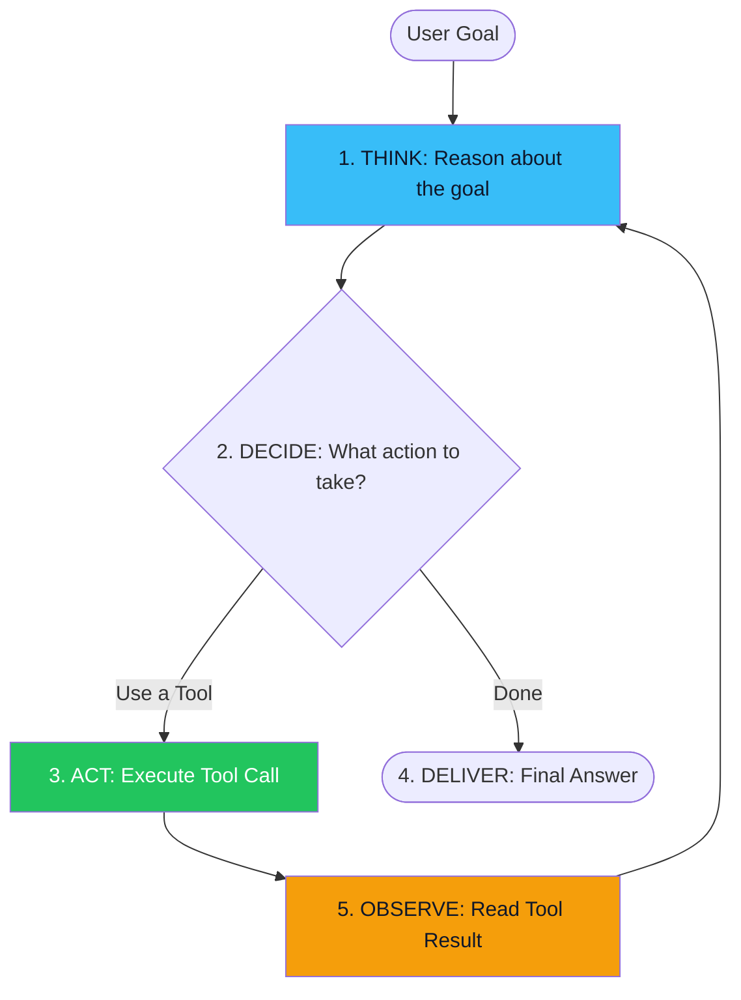

# 01. What is an AI Agent? 🤖
> **An agent is not a chatbot. It is an autonomous system that perceives, decides, and acts in a loop.**

---

## The Chatbot vs. The Agent

A **chatbot** is reactive. You send it a message, it generates a response. The interaction ends. If you ask it to "book me a flight to London," it will *tell you how* to book a flight. It cannot actually do it.

An **AI Agent** is proactive. Given the same request, a true agent would:
1. **Plan:** Break the task into sub-steps (search flights, compare prices, select the best).
2. **Act:** Call a flight search API tool.
3. **Observe:** Read the results.
4. **Reflect:** "Is this the cheapest option? Let me check another tool."
5. **Act Again:** Call a booking API to finalize the reservation.
6. **Report:** "I've booked your flight. Confirmation #LHR-2026. Here's the receipt."

The agent operated **autonomously** across multiple steps, using multiple external tools, making decisions, and correcting itself — all without the user having to guide each step.

## The Agent Loop (The Core Architecture)

Every agent, regardless of framework, operates on the same fundamental loop:

This loop can iterate as many times as necessary. A simple task might loop once (single tool call). A complex analytical task might loop 15 times across 5 different tools.

## The 5 Properties of an Agent

An AI system is considered "agentic" if it exhibits these properties:

| Property | Description | Example |
| :--- | :--- | :--- |
| **Autonomy** | Operates without step-by-step human guidance. | Decides which tools to use without being told. |
| **Reasoning** | Forms plans and logical chains of thought. | "To answer this, I first need X, then Y." |
| **Tool Use** | Interacts with external systems. | Calls APIs, queries databases, reads files. |
| **Memory** | Remembers context across the entire task. | Recalls the result of Step 1 when executing Step 5. |
| **Self-Correction** | Detects and recovers from its own errors. | "That API returned an error. Let me try a different query." |

## Levels of Agency

Not all agents are created equal. The industry uses a spectrum of agency:

- **Level 1:** A simple classifier that routes queries to the right tool (not truly agentic).
- **Level 2:** An LLM that can call tools in a single loop (basic ReAct).
- **Level 3:** An agent that reviews its own output, detects errors, and retries (Reflection).
- **Level 4:** Multiple specialized agents coordinating on a shared goal (Multi-Agent).
- **Level 5:** A fully autonomous system operating indefinitely with no human oversight (experimental, rarely deployed in production).

---
*Navigation: [📑 Table of Contents](README.md) | [Next: The ReAct Pattern →](02-react.md)*
