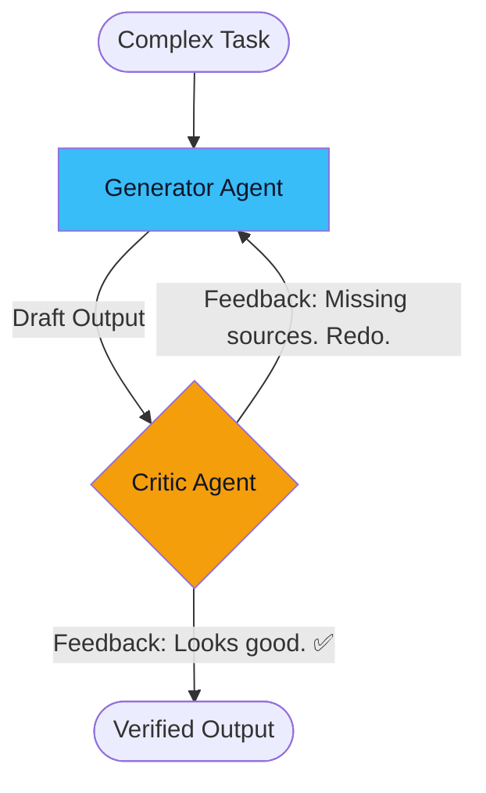
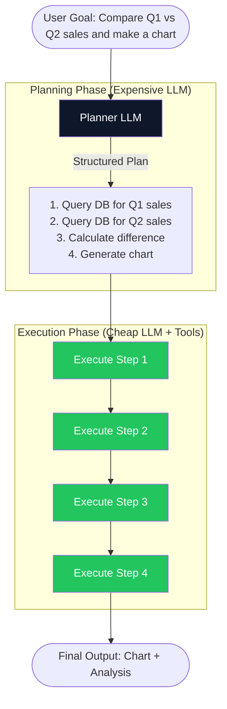

# 03. Advanced Patterns: Reflection & Plan-and-Execute 🧠
> **Boosting agent accuracy by 30% through self-critique and structured task decomposition.**

---

## Pattern 1: Reflection (Self-Critique)

Basic ReAct agents accept every tool result at face value and rush to a final answer. They never pause to ask: *"Wait, does this answer actually make sense?"*

**Reflection** adds a critical evaluation step. After the agent generates a draft answer or completes a set of actions, a "Critic" evaluates the work and provides feedback. If the feedback is negative, the agent iterates.

### Architecture

### Two Flavors of Reflection:

1. **Self-Reflection:** The *same* LLM is prompted twice — first to generate, then to critique its own output. Cheaper, but the model may be blind to its own biases.
2. **External Reflection:** A *second*, separate LLM (or a set of heuristic rules) evaluates the first model's output. More expensive, but catches errors the generator cannot see.

### When to Use:
- **Code Generation:** The agent writes code, then a critic checks it for bugs, performance issues, and security vulnerabilities before submitting.
- **Research Summarization:** The agent summarizes a long document, then a critic verifies that no key facts were omitted.

---

## Pattern 2: Plan-and-Execute

ReAct is "greedy" — it decides what to do one step at a time. For complex, multi-step tasks, this is dangerous. The agent might go down a rabbit hole for 10 expensive steps before realizing it started with the wrong approach.

**Plan-and-Execute** separates the architecture into two distinct modules:

1. **The Planner:** A powerful LLM (like GPT-4) that receives the user's complex goal and outputs a structured, numbered plan of sub-tasks *before any execution begins*.
2. **The Executor:** A cheaper, faster model (or tool-calling agent) that executes each sub-task one by one.

### Architecture

### Why it's Superior for Complex Tasks:
- **Cost Efficient:** The expensive Planner LLM is called only once. The cheap Executor handles the repetitive work.
- **Predictable:** The full plan is visible *before* execution, allowing human review or modification.
- **Recoverable:** If Step 3 fails, the Planner can be invoked again to re-plan from Step 3 onwards without restarting from scratch (**Plan Repair**).

---

## Pattern 3: Combining Patterns

In production, patterns are rarely used in isolation. The most robust architectures combine them:

*Example:* A financial analysis agent uses **Plan-and-Execute** to decompose the user's request into 5 sub-tasks. Each sub-task is executed by a **ReAct** loop that calls database tools. Before the final report is returned, a **Reflection** critic checks the math for errors.

---

> [!TIP]
> **The 80/20 Rule of Patterns**  
> For the vast majority of production use cases, **ReAct + Reflection** is sufficient. Only introduce Plan-and-Execute when tasks genuinely involve 5+ sequential steps with tool dependencies between them. Over-engineering the pattern adds latency without benefit for simple tasks.

---
*Navigation: [← Previous: ReAct](02-react.md) | [📑 Table of Contents](README.md) | [Next: Tool Use & Function Calling →](04-tool-use.md)*
