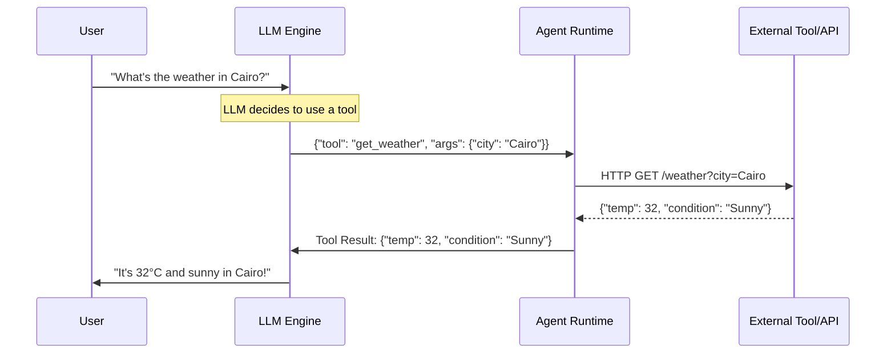
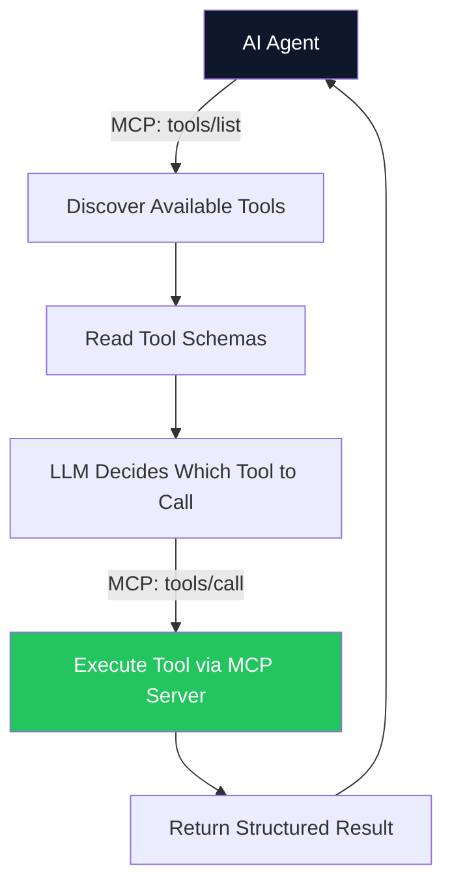

# 04. Tool Use & Function Calling 🔧
> **How agents bridge the gap between language and action through structured function interfaces.**

---

## The Core Mechanism: Function Calling

An LLM generates text. It cannot natively send an email, query a database, or browse the web. **Function Calling** (also called Tool Use) is the mechanism that bridges this gap.

Instead of generating a free-text response, the LLM is trained to output a **structured JSON object** representing a function call. The agent runtime intercepts this JSON, executes the actual function, and feeds the result back to the LLM.

### The Lifecycle of a Tool Call



### How the LLM Knows Which Tools Exist

Before the conversation starts, the agent runtime injects a **Tool Schema** into the LLM's system prompt (or uses the model's native function-calling API). This schema describes every available tool, its arguments, and their types.

```json
{
  "name": "get_weather",
  "description": "Retrieve the current weather for a city.",
  "parameters": {
    "type": "object",
    "properties": {
      "city": {
        "type": "string",
        "description": "City name, e.g. 'Cairo'"
      }
    },
    "required": ["city"]
  }
}
```

The LLM reads these schemas and autonomously decides which tool to call based on the user's intent. It also generates the correct argument values by extracting them from the conversation context.

## MCP: The Standardized Tool Layer

In the previous chapter (MCP), we covered how the **Model Context Protocol** standardizes tool discovery and execution. In an agentic context, MCP becomes the *infrastructure* layer through which agents discover, authenticate, and invoke tools across any system.



## Parallel vs. Sequential Tool Calls

Modern LLMs support calling multiple tools simultaneously when the results are independent:

- **Sequential:** "Get weather in Cairo, *then* use that temperature to calculate clothing recommendations." (Step 2 depends on Step 1).
- **Parallel:** "Get weather in Cairo AND get weather in London AND get weather in Tokyo." (All independent — call all three simultaneously to reduce latency by 3×).

## The Human-in-the-Loop (HITL) Gate

Not all tools are safe to run autonomously. A tool that reads data is low-risk. A tool that deletes a production database row is catastrophic if the LLM misinterprets the user's intent.

Production agent systems implement a **HITL gate**:

| Tool Risk Level | Behavior |
| :--- | :--- |
| 🟢 **Read-only** (search, list) | Auto-execute. No user confirmation needed. |
| 🟡 **Write** (create, update) | Show the user a preview: *"I'm about to send this email. Proceed?"* |
| 🔴 **Destructive** (delete, deploy) | Mandatory block. The agent cannot proceed without explicit human approval. |

---
*Navigation: [← Previous: Advanced Patterns](03-advanced-patterns.md) | [📑 Table of Contents](README.md) | [Next: Multi-Agent Orchestration →](05-multi-agent.md)*
