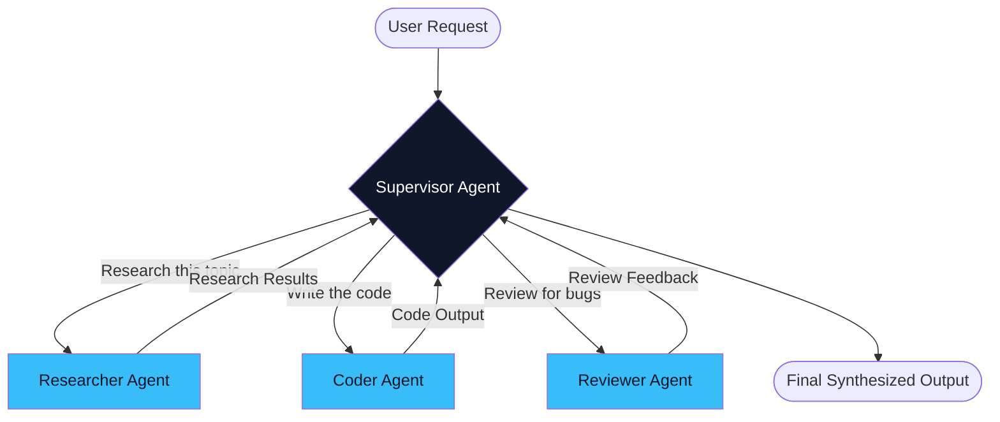
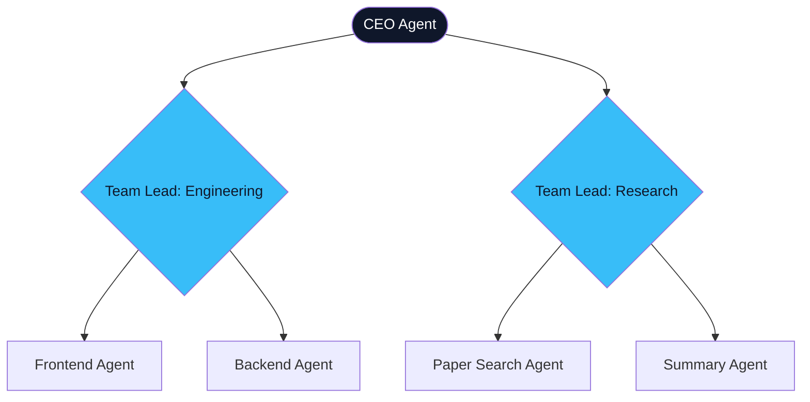
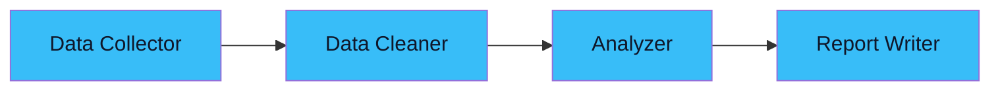

# 05. Multi-Agent Orchestration 👥
> **When one agent isn't enough: architecting teams of specialized agents.**

---

## Why Multiple Agents?

A single "god agent" that handles research, coding, data analysis, email writing, and project management simultaneously is a terrible idea in production. The system prompt becomes enormous, tool schemas conflict, and the reasoning quality degrades as context grows.

The solution is the same one human organizations use: **Specialization and Delegation.**

Instead of one overwhelmed generalist, you build a team of focused specialists, each with its own system prompt, tool access, and domain expertise.

## The Three Orchestration Topologies

### 1. Supervisor-Worker (The Most Common)

A central **Supervisor Agent** receives the user's request, decomposes it, routes sub-tasks to specialized **Worker Agents**, collects their outputs, and synthesizes the final response.



**Best For:** Complex tasks with clearly separable sub-domains (e.g., a content pipeline: research → write → edit → publish).

### 2. Hierarchical (Supervisor of Supervisors)

When the problem domain is too broad for a single supervisor, you create a hierarchy. A **Manager Agent** delegates to **Team Lead Agents**, each managing their own team of workers.



**Best For:** Enterprise-scale systems managing many domains simultaneously.

### 3. Sequential Pipeline (Deterministic)

No dynamic routing. Agents are arranged in a fixed chain. The output of Agent A becomes the input of Agent B. Highly predictable, easy to debug, and ideal when the workflow is well-understood.



**Best For:** ETL pipelines, document processing, content moderation workflows.

## The Coordination Overhead Problem

> [!WARNING]
> **Critical Lesson from Production (2025-2026)**  
> Multi-agent systems have **non-linear coordination costs**. Every time Agent A needs to communicate with Agent B, there is a latency penalty, a token cost, and a risk of information loss. Adding a 4th agent to a 3-agent system doesn't add 33% more capability — it can add 50% more coordination overhead.
>
> **The Rule:** Always start with the fewest agents possible. Only add a specialist when the single-agent approach demonstrably fails.

## State Management: The Shared Blackboard

When multiple agents collaborate, they must share a common memory space. This is typically implemented as a **Shared State** (or "Blackboard") — a mutable dictionary that all agents can read from and write to.

```python
# Conceptual shared state
state = {
    "user_query": "Analyze Q1 sales data and create a report",
    "research_results": None,     # Set by Researcher Agent
    "analysis_output": None,      # Set by Analyst Agent 
    "final_report": None,         # Set by Writer Agent
    "errors": [],                 # Any agent can append errors
}
```

The Supervisor reads the state after each worker finishes to decide the next step.

---
*Navigation: [← Previous: Tool Use](04-tool-use.md) | [📑 Table of Contents](README.md) | [Next: Frameworks: LangGraph vs CrewAI →](06-frameworks.md)*
