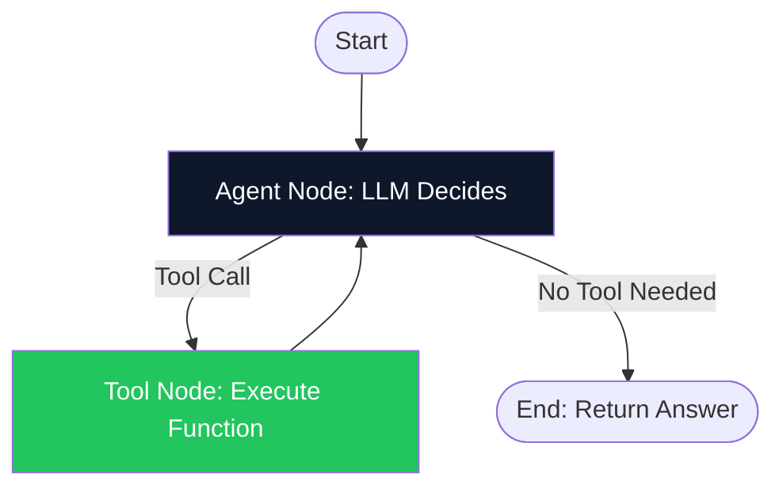
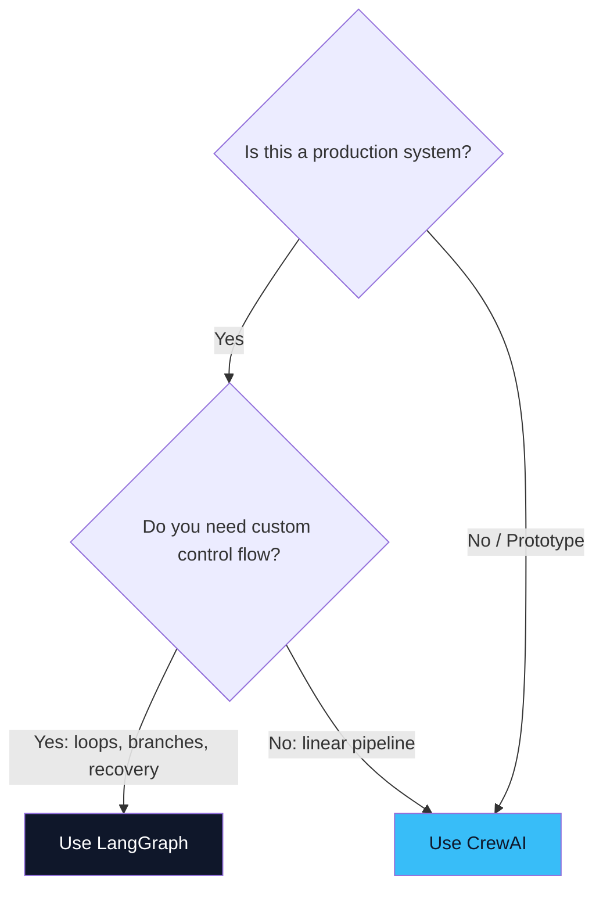

# 06. Frameworks: LangGraph vs CrewAI ⚙️
> **The two dominant frameworks for building agents in 2026, compared head-to-head.**

---

## Why Use a Framework?

Building raw agent loops in plain Python is possible but painful. You must manually handle:
- State persistence across tool calls.
- Retry logic on tool failures.
- Infinite loop detection (an agent stuck calling the same tool forever).
- Human-in-the-loop checkpoints.
- Streaming and observability.

Frameworks solve all of this out-of-the-box, letting you focus on the business logic.

## LangGraph: The State Machine Approach

**LangGraph** (by LangChain) models your agent as a **directed graph** (a state machine). Nodes are functions (an LLM call, a tool call, a decision function). Edges define the flow between them.

### Core Concepts:
- **State:** A TypedDict/Pydantic model that flows through the graph. Every node reads and writes to this shared state.
- **Nodes:** Python functions that perform work (call an LLM, run a tool, transform data).
- **Edges:** Connections between nodes. Can be static (always go A → B) or conditional (if X, go to B; if Y, go to C).
- **Checkpointing:** LangGraph can automatically save state after every node execution. If the process crashes, you restart from the last checkpoint, not from scratch.

### Architecture Visualization:

### Best For:
- Complex, production workflows requiring fine-grained control.
- Workflows with conditional branching, loops, and error recovery.
- Systems where you need **time-travel debugging** (replay execution from any checkpoint).

## CrewAI: The Role-Based Team Approach

**CrewAI** takes a fundamentally different philosophy. Instead of graphs and nodes, you define **Agents** (with roles, goals, and backstories) and **Tasks** (with descriptions and expected outputs). CrewAI then orchestrates them using predefined process types.

### Core Concepts:
- **Agent:** A persona with a specific role (e.g., "Senior Data Analyst"), goal, backstory, and allowed tools.
- **Task:** A specific job to be done, assigned to a specific agent.
- **Crew:** A team of agents working together on a set of tasks.
- **Process:** The orchestration strategy — `sequential` (one-by-one) or `hierarchical` (manager delegates).

### Best For:
- Rapid prototyping and experimentation.
- Workflows where role definition is natural (research → write → review).
- Teams that prefer a high-level, declarative API over low-level graph construction.

## Head-to-Head Comparison

| Feature | LangGraph | CrewAI |
| :--- | :--- | :--- |
| **Paradigm** | Stateful directed graph (state machine) | Role-based agent teams |
| **Control Level** | 🔧 Very fine-grained (node/edge level) | 🎯 High-level (role/task level) |
| **Learning Curve** | Steeper (graph theory concepts) | Gentler (human-team analogy) |
| **State Management** | Explicit, typed state with checkpointing | Implicit, managed by framework |
| **Debugging** | Excellent (LangSmith, time-travel replay) | Good (logging, task output inspection) |
| **Production Readiness** | ✅ Enterprise-grade (fault tolerance, persistence) | 🟡 Maturing (better for prototypes) |
| **Flexibility** | Unlimited (any topology) | Constrained (sequential or hierarchical) |
| **Best For** | Complex, durable, high-stakes workflows | Quick team-based workflow prototyping |

## The Decision Framework

---

> [!TIP]
> **The Practical Advice**  
> Start every new project with **CrewAI** to validate the idea in 2 hours. Once you've proven the concept works, migrate to **LangGraph** for production deployment, where you'll need checkpointing, human-in-the-loop gates, and enterprise observability.

---
*Navigation: [← Previous: Multi-Agent](05-multi-agent.md) | [📑 Table of Contents](README.md) | [Next: Production Guardrails →](07-production.md)*
