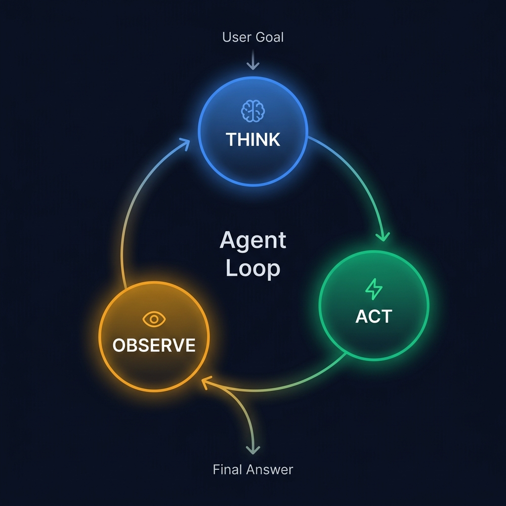

<div align="center">

# 🔄 Part 2: The Core Loop — ReAct (Reason + Act)

**The foundational pattern every AI agent is built on: thinking out loud before every action.**

`⏱ 10 min read` · `📊 Intermediate` · `🤖 Agentic AI Masterclass 2/7`

</div>

---

## 📌 Quick Summary

> **ReAct** is the design pattern where an LLM interleaves **Thought** (internal reasoning) with **Action** (tool calls) and **Observation** (reading tool results). It was a breakthrough because it forces the model to explain *why* it's calling a tool before calling it — making agents transparent, debuggable, and grounded in real data.

---

## 🔬 The Detective Analogy

> 🔍 **Think of a detective solving a case:**
>
> A bad detective jumps to conclusions: *"It was the butler!"* (No evidence, no reasoning.)
>
> A good detective **thinks → acts → observes** in a loop:
> 1. 🧠 *"The victim was poisoned. I need to check who had access to the kitchen."* (THINK)
> 2. 🔍 *Searches the security camera footage.* (ACT)
> 3. 👁️ *"Footage shows the maid entering the kitchen at 3 PM."* (OBSERVE)
> 4. 🧠 *"Interesting, but I also need to check the butler's alibi."* (THINK)
> 5. 🔍 *Interviews the butler.* (ACT)
> 6. 👁️ *"Butler was at the hardware store — receipt confirms."* (OBSERVE)
> 7. 🧠 *"The maid had access, the butler didn't. Case closed."* (FINAL ANSWER)
>
> ReAct agents work exactly like this — they **reason before every action**.

---

## 🎬 A Complete ReAct Example

Let's trace a real agent solving: *"What is the population of the capital of Egypt?"*

<div align="center">



</div>

### The Full Trace:

---

> 🧠 **Thought 1:** The user asked about "the capital of Egypt." I don't know the current population with certainty. Let me first confirm which city is the capital, then look up its population.

> ⚡ **Action 1:** `search("capital of Egypt")`

> 👁️ **Observation 1:** "The capital of Egypt is Cairo (القاهرة), established in 969 AD."

---

> 🧠 **Thought 2:** Good — Cairo is the capital. Now I need Cairo's current population. Let me search for that specifically.

> ⚡ **Action 2:** `search("population of Cairo 2026")`

> 👁️ **Observation 2:** "Greater Cairo's metropolitan population is approximately 22.5 million as of 2026, making it the largest city in Africa and the Arab world."

---

> 🧠 **Thought 3:** I now have both pieces of information. The capital is Cairo, and its population is ~22.5 million. I can answer the user's question.

> ✅ **Final Answer:** "The capital of Egypt is **Cairo**, with a metropolitan population of approximately **22.5 million** — the largest city in both Africa and the Arab world."

---

### Why This Works So Well:

| Phase | Color | Purpose |
|:--|:--|:--|
| 🧠 **Thought** | Blue | The LLM **explains its reasoning** — what it knows, what it doesn't, and what it plans to do next. This is internal only — no tool is called. |
| ⚡ **Action** | Green | The LLM **calls a specific tool** with specific arguments. This is the only step that interacts with the outside world. |
| 👁️ **Observation** | Amber | The **tool result** is fed back into the LLM's context. The LLM reads it and decides what to do next. |

---

## 🧑‍💻 The Prompt Template Under the Hood

ReAct isn't magic — it's a carefully structured system prompt:

```
You are a helpful assistant with access to the following tools:

1. search(query: str) - Search the web for current information
2. calculator(expression: str) - Evaluate mathematical expressions
3. get_weather(city: str) - Get current weather data

When answering the user, follow this EXACT format:

Thought: [Explain your reasoning — what do you know and what do you need?]
Action: tool_name(arguments)

After receiving the tool's output, you'll see:
Observation: [The tool's result]

Continue this Thought → Action → Observation loop until you have 
enough information. Then respond with:

Thought: I now have everything I need.
Final Answer: [Your complete response to the user]
```

The LLM is trained to follow this format. The agent runtime parses the output, extracts the tool call, executes it, and injects the observation back into the context.

---

## ✅ Why ReAct is Powerful

1. **Transparency:** You can see *exactly why* the agent made each decision by reading the thought trace. This is critical for debugging — when the agent fails, you can pinpoint which thought led to the wrong action.

2. **Grounding:** The agent's answers are derived from real-time tool outputs, not hallucinated from training data. If the LLM's parametric memory says Cairo has 18 million people, but the search tool returns 22.5 million, the agent uses the tool's data.

3. **Adaptability:** If a tool returns an error or unexpected result, the agent can reason about the failure and try a different approach — because it *thinks* before every action.

---

## ❌ Limitations of Pure ReAct

ReAct is the foundation, but it has real weaknesses in production:

| Limitation | What Goes Wrong | Solution (next articles) |
|:--|:--|:--|
| **No self-correction** | If the LLM misinterprets a result, it doesn't catch its own error | Add **Reflection** (Part 3) |
| **Greedy planning** | ReAct decides one step at a time with no foresight — it might go down a rabbit hole | Use **Plan-and-Execute** (Part 3) |
| **Expensive** | Each think-act-observe cycle costs tokens. A 10-step task might consume 50K+ tokens | Use cheaper models for execution steps |
| **No parallelism** | Steps are strictly sequential — can't search 3 things simultaneously | Framework-level optimization |

> [!TIP]
> **The 80/20 rule:** ReAct alone handles ~80% of production agent tasks perfectly well. Only add Reflection or Plan-and-Execute when you observe specific failure modes like the ones above.

---

<div align="center">

| Navigation | |
|:--|:--|
| ⬅️ **Previous** | [Part 1: What is an Agent?](01-introduction.md) |
| 📑 **Table of Contents** | [Agentic AI Masterclass Home](README.md) |
| ➡️ **Next** | [Part 3: Advanced Patterns →](03-advanced-patterns.md) |

</div>

---
<div align="center">
<sub>Part of the <a href="../README.md">AI Engineering Wiki</a> · Created by Youssef Ashraf · 2026</sub>
</div>
