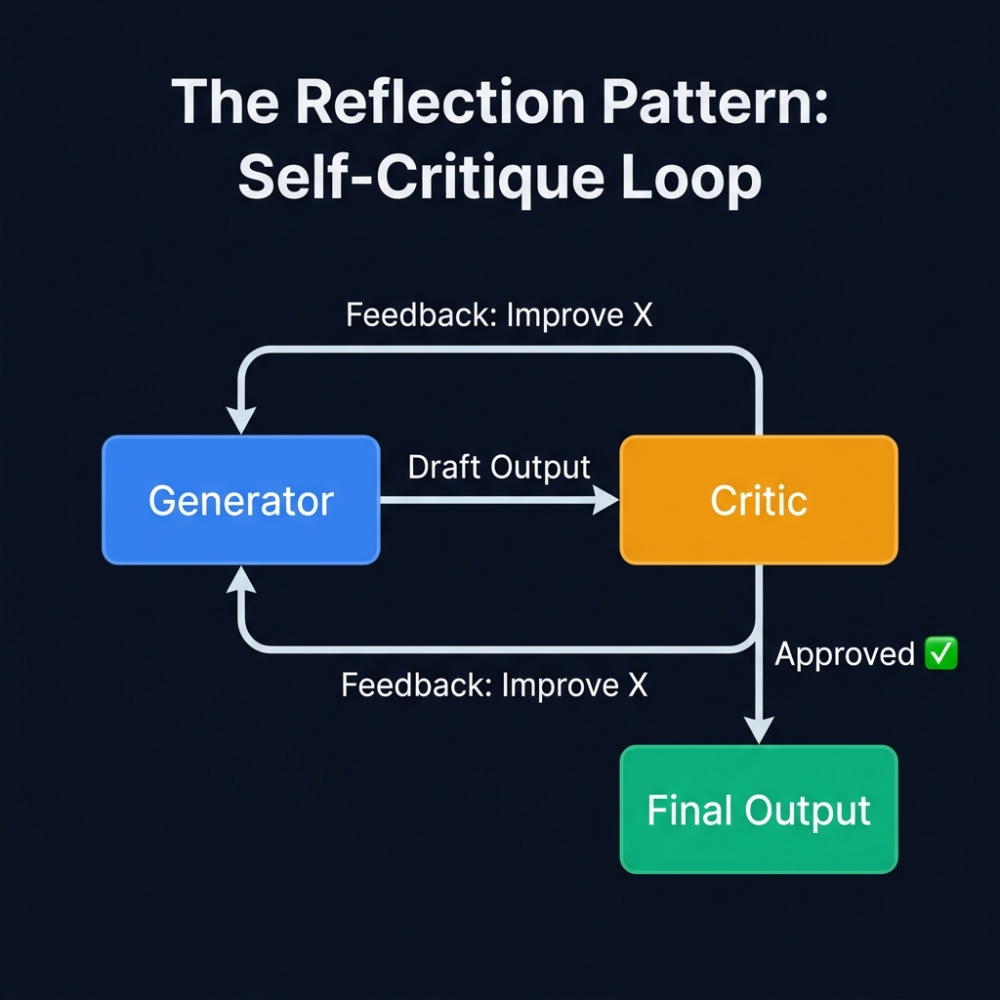
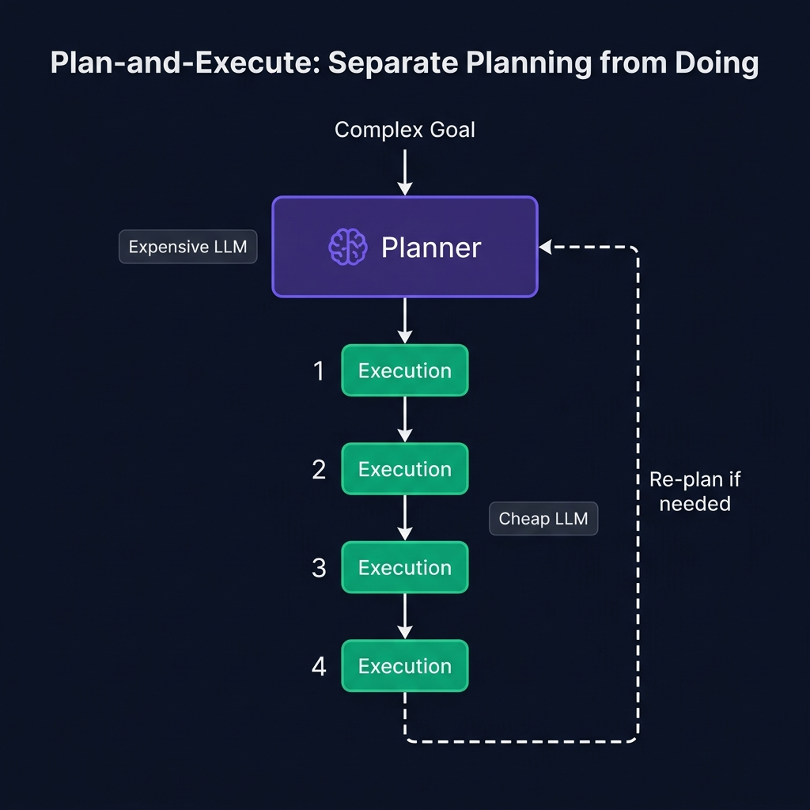

<div align="center">

# 🧠 Part 3: Advanced Patterns — Reflection & Plan-and-Execute

**Two patterns that boost agent accuracy by 30%+ through self-critique and structured task decomposition.**

`⏱ 12 min read` · `📊 Advanced` · `🤖 Agentic AI Masterclass 3/7`

</div>

---

## 📌 Quick Summary

> ReAct agents rush forward without looking back. **Reflection** adds a "quality check" step where the agent critiques its own output before finalizing. **Plan-and-Execute** separates thinking from doing — a smart planner creates the roadmap, then a cheap executor follows it step by step. In production, these patterns are combined for maximum reliability.

---

## 🔎 Pattern 1: Reflection (Self-Critique)

### The Problem with Pure ReAct

A basic ReAct agent is like a student who turns in their paper without proofreading. They might have made mistakes — wrong data, missing analysis, logical gaps — but they never look back. The answer goes straight to the user, errors and all.

**Reflection** fixes this by adding a **Critic** step.

### How It Works

<div align="center">



</div>

### The Two Flavors:

| Flavor | How It Works | Pros | Cons |
|:--|:--|:--|:--|
| **Self-Reflection** | The *same LLM* is prompted twice — first to generate, then to critique its own work | Cheap (1 model) | Can be blind to its own biases |
| **External Critique** | A *different LLM* or a set of rules evaluates the output | Catches more errors | More expensive (2 models) |

### Real-World Example: Code Generation

Here's what Reflection looks like in practice for a coding agent:

> **Step 1 — Generator:**
> ```python
> def fibonacci(n):
>     if n <= 1:
>         return n
>     return fibonacci(n-1) + fibonacci(n-2)
> ```
>
> **Step 2 — Critic:**
> ❌ *"This implementation has O(2^n) time complexity. For n > 40, it will be unusably slow. Use dynamic programming or memoization."*
>
> **Step 3 — Generator (Retry):**
> ```python
> from functools import lru_cache
>
> @lru_cache(maxsize=None)
> def fibonacci(n):
>     if n <= 1:
>         return n
>     return fibonacci(n-1) + fibonacci(n-2)
> ```
>
> **Step 4 — Critic:**
> ✅ *"Good — O(n) time, O(n) space with memoization. Approved."*

Without Reflection, the user would have received the slow O(2^n) version. Reflection caught and fixed the performance bug automatically.

---

## 📋 Pattern 2: Plan-and-Execute

### The Problem with Greedy Decision-Making

ReAct is **greedy** — it decides one step at a time with no foresight. For complex, multi-step tasks, this is dangerous:

Imagine asking an agent: *"Compare Q1 vs Q2 sales, identify the top 3 products, and create a chart."*

A greedy ReAct agent might:
1. Query Q1 sales... wait for result
2. Realize it needs to also query Q2... query again
3. Realize it chose the wrong metrics... re-query
4. Start building a chart... realize the data format is wrong
5. ...10 expensive steps later, finally produce a mediocre result

### The Solution: Plan First, Execute Second

<div align="center">



</div>

### How Plan-and-Execute Works:

1. **Planning Phase (expensive model):** A powerful LLM (like GPT-4 or Claude) receives the user's complex goal and decomposes it into a numbered, structured plan of sub-tasks
2. **Execution Phase (cheap model):** A smaller, cheaper model (like GPT-4o-mini) handles each sub-task one by one, using tools as needed
3. **Re-planning (if needed):** If Step 3 fails, the Planner is called again to create a revised plan from Step 3 onwards — no need to restart from scratch

### Example Plan Output:

```
User Goal: "Compare Q1 vs Q2 sales and create a chart"

📋 PLAN:
  Step 1: Query database for Q1 sales totals by product
  Step 2: Query database for Q2 sales totals by product
  Step 3: Calculate percentage change for each product
  Step 4: Identify top 3 products by absolute growth
  Step 5: Generate a bar chart comparing Q1 vs Q2 for the top 3
```

### Why This is Superior:

| Advantage | Explanation |
|:--|:--|
| **Cost-Efficient** | The expensive Planner LLM is called once. The cheap Executor handles the repetitive tool calls. |
| **Predictable** | The full plan is visible before execution. A human can review and approve it. |
| **Recoverable** | If Step 3 fails (e.g., division by zero), the Planner can re-plan from Step 3 without restarting the entire task (**Plan Repair**). |
| **Transparent** | You can see the agent's explicit plan upfront, not just watch it stumble forward. |

---

## 🔗 Combining Patterns: The Production Recipe

In production, patterns are rarely used in isolation. The most robust agents combine them:

```
┌──────────────────────────────────────────────────────────┐
│                                                          │
│   Complex Goal ──→ [PLAN-AND-EXECUTE creates steps]      │
│                         │                                │
│                    Each step ──→ [REACT loop executes]    │
│                                      │                   │
│                           Output ──→ [REFLECTION checks] │
│                                      │                   │
│                              ✅ Approved → Next step     │
│                              ❌ Rejected → Re-execute    │
│                                                          │
│   All steps done ──→ Final Output to User                │
│                                                          │
└──────────────────────────────────────────────────────────┘
```

**Example:** A financial analysis agent:
1. **Plan-and-Execute** decomposes the request into 5 sub-tasks
2. Each sub-task uses a **ReAct** loop to call database tools
3. Before the final report is returned, a **Reflection** critic checks the math for errors

> [!TIP]
> **The 80/20 rule:** For most production use cases, **ReAct + Reflection** is sufficient and fast. Only introduce Plan-and-Execute when tasks involve **5+ sequential steps** with dependencies between them. Over-engineering adds latency.

---

<div align="center">

| Navigation | |
|:--|:--|
| ⬅️ **Previous** | [Part 2: ReAct](02-react.md) |
| 📑 **Table of Contents** | [Agentic AI Masterclass Home](README.md) |
| ➡️ **Next** | [Part 4: Tool Use & Function Calling →](04-tool-use.md) |

</div>

---
<div align="center">
<sub>Part of the <a href="../README.md">AI Engineering Wiki</a> · Created by Youssef Ashraf · 2026</sub>
</div>
