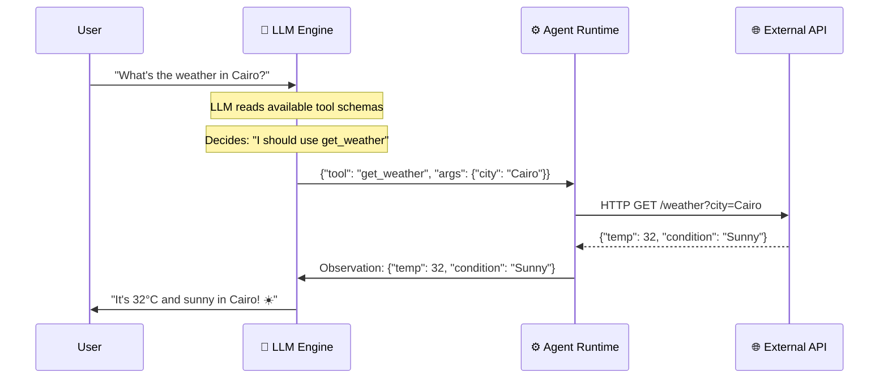

<div align="center">

# 🔧 Part 4: Tool Use & Function Calling

**How agents bridge the gap between language and action — turning words into real-world operations.**

`⏱ 10 min read` · `📊 Intermediate` · `🤖 Agentic AI Masterclass 4/7`

</div>

---

## 📌 Quick Summary

> An LLM generates text — it can't natively send emails, query databases, or search the web. **Function Calling** is the bridge: the LLM outputs a structured JSON object describing *which tool* to call and *with what arguments*, the runtime executes it, and the result feeds back into the conversation. **MCP** standardizes this entire interaction.

---

## 🎮 The Video Game Controller Analogy

> 🎮 **An LLM without tools is like a gamer without a controller.** They can describe exactly what they want to happen in the game — *"Jump over the lava pit, grab the coin, then dodge left"* — but nothing actually happens on screen.
>
> **Function calling gives the LLM a controller.** Now when it says "jump," the character actually jumps. The LLM's thoughts become real-world actions.

---

## ⚡ The Function Calling Lifecycle

Here's exactly what happens when an agent uses a tool:



### The Key Insight:
The LLM never directly touches the API. It outputs a **structured JSON description** of what it wants to do. The **Agent Runtime** (the middleware between the LLM and the tools) parses this JSON, calls the actual API, and returns the result.

---

## 📋 How the LLM Knows What Tools Are Available

Before the conversation starts, the runtime injects **Tool Schemas** into the LLM's context. These schemas describe every tool's purpose, arguments, and types:

```json
{
  "name": "get_weather",
  "description": "Get the current weather for any city worldwide. Returns temperature, conditions, and humidity.",
  "parameters": {
    "type": "object",
    "properties": {
      "city": {
        "type": "string",
        "description": "City name (e.g., 'Cairo', 'London', 'Tokyo')"
      }
    },
    "required": ["city"]
  }
}
```

The LLM reads this schema and understands:
- 📝 There's a tool called `get_weather`
- 📋 It needs a `city` argument (string, required)
- 🎯 It's useful when the user asks about weather

When the user asks *"What's the weather in Cairo?"*, the LLM matches this intent to the `get_weather` tool and generates the correct function call.

---

## 🔌 MCP: The Standardized Tool Layer

In [Part 2 of the MCP series](../MCP/02-architecture.md), we covered how MCP standardizes tool discovery and execution. In an agentic context, MCP becomes the **infrastructure layer** through which agents find, authenticate, and invoke tools:

1. **Discovery:** Agent connects to MCP Server → `tools/list` → gets all available tool schemas
2. **Decision:** LLM reads schemas, user asks a question, LLM picks the right tool
3. **Execution:** Agent sends `tools/call` via MCP → Server executes → returns result
4. **Integration:** Result flows back to the LLM for processing

This means your agent can connect to **any MCP server in the ecosystem** (GitHub, PostgreSQL, Slack, etc.) and instantly gain access to its tools — zero custom integration code.

---

## ⚡ Parallel vs Sequential Tool Calls

Modern LLMs can call multiple tools simultaneously when the calls are independent:

### Sequential (Result Depends on Previous Step):
```
Step 1: search("capital of Egypt")       → "Cairo"
Step 2: get_population("Cairo")          → "22.5 million"
        ↑ This step NEEDS Step 1's result
```

### Parallel (Independent Calls):
```
Step 1a: get_weather("Cairo")           ─┐
Step 1b: get_weather("London")          ─┤ All run simultaneously!
Step 1c: get_weather("Tokyo")           ─┘
                                         → 3x faster than sequential
```

> [!TIP]
> **Parallel tool calling reduces latency linearly.** If each API call takes 500ms, three sequential calls take 1.5s. Three parallel calls take 500ms. Always design your tool schemas to enable parallelism where possible.

---

## 🚦 The Human-in-the-Loop (HITL) Gate

Not all tools are safe to run autonomously. The HITL gate is a critical production pattern:

| Risk Level | Tool Example | Agent Behavior |
|:--|:--|:--|
| 🟢 **Read-Only** | `search_issues`, `get_weather`, `list_files` | ✅ Auto-execute. No confirmation needed. |
| 🟡 **Write** | `send_email`, `create_file`, `update_record` | ⚠️ Show preview: *"I'm about to send this email. Proceed?"* |
| 🔴 **Destructive** | `delete_table`, `deploy_to_production`, `revoke_access` | 🛑 **Mandatory block.** Agent cannot proceed without explicit human approval. |

### Why HITL Matters:
Imagine an agent misinterprets *"clean up the test data"* as *"delete the production database."* Without HITL, irreversible damage occurs before anyone notices. With HITL, the agent shows: *"I'm about to run `DROP TABLE users`. Approve?"* — and you catch the catastrophe.

---

<div align="center">

| Navigation | |
|:--|:--|
| ⬅️ **Previous** | [Part 3: Advanced Patterns](03-advanced-patterns.md) |
| 📑 **Table of Contents** | [Agentic AI Masterclass Home](README.md) |
| ➡️ **Next** | [Part 5: Multi-Agent Orchestration →](05-multi-agent.md) |

</div>

---
<div align="center">
<sub>Part of the <a href="../README.md">AI Engineering Wiki</a> · Created by Youssef Ashraf · 2026</sub>
</div>
