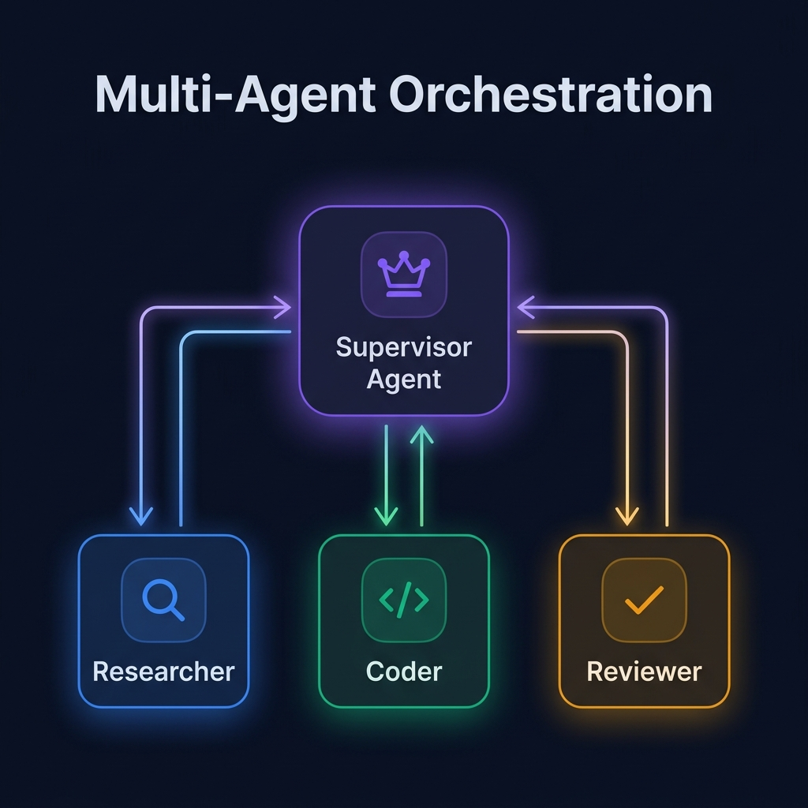

<div align="center">

# 👥 Part 5: Multi-Agent Orchestration

**When one agent isn't enough: building teams of specialized agents that collaborate like a well-run company.**

`⏱ 12 min read` · `📊 Advanced` · `🤖 Agentic AI Masterclass 5/7`

</div>

---

## 📌 Quick Summary

> A single "god agent" that handles everything — research, coding, analysis, email — performs poorly at scale. The solution is **specialization**: build a team of focused agents, each with their own role, tools, and expertise, coordinated by a supervisor. This mirrors how human organizations work.

---

## 🏢 Why Multi-Agent? The Department Store Analogy

> 🏢 Imagine a department store where **one person** is the cashier, the shelf stocker, the security guard, the customer service rep, AND the janitor. They'd be overwhelmed, slow, and terrible at everything.
>
> Now imagine a store with **specialized departments**: dedicated cashiers, a security team, customer service reps who know their department. Each person is excellent at their specific job, and a **floor manager** coordinates the whole operation.
>
> Multi-agent AI works exactly like this.

---

## 🗺️ The Three Orchestration Topologies

### 1. 👔 Supervisor-Worker — *The Most Common*

A central **Supervisor Agent** receives the user's request, breaks it into sub-tasks, delegates each to a specialized **Worker Agent**, collects their outputs, and synthesizes the final response.

<div align="center">



</div>

**Example — Content Pipeline:**

```
User: "Write a blog post about MCP"

Supervisor thinks: "I need research, then writing, then review."

├── Researcher Agent (tools: web_search, read_docs)
│   → Returns: key facts, statistics, quotes
│
├── Writer Agent (tools: create_document)
│   → Returns: first draft of the blog post
│
└── Reviewer Agent (tools: grammar_check, fact_check)
    → Returns: edited final version with corrections

Supervisor synthesizes: Final polished blog post delivered to user ✅
```

**Best For:** Complex tasks with clearly separable sub-domains.

---

### 2. 🏛️ Hierarchical — *Supervisor of Supervisors*

When the problem domain is too broad for a single supervisor, you add layers:

```
                    ┌─────────────────┐
                    │   CEO Agent     │
                    │  (Top-Level)    │
                    └───┬─────────┬───┘
                        │         │
              ┌─────────▼──┐  ┌──▼──────────┐
              │ Engineering │  │  Research    │
              │ Team Lead   │  │  Team Lead   │
              └──┬──────┬───┘  └──┬───────┬──┘
                 │      │         │       │
              ┌──▼┐  ┌──▼┐    ┌──▼┐   ┌──▼┐
              │FE │  │BE │    │Lit│   │Sum│
              │Dev│  │Dev│    │Rev│   │Bot│
              └───┘  └───┘    └───┘   └───┘
```

The CEO Agent delegates to Team Leads, who delegate to specialized Workers. Each level adds coordination but also isolation — if the Engineering team crashes, the Research team continues.

**Best For:** Enterprise-scale systems managing many domains.

---

### 3. ⛓️ Sequential Pipeline — *Deterministic Flow*

No dynamic routing. Agents are arranged in a fixed linear chain. Output from Agent A becomes input for Agent B. Highly predictable, easy to debug.

```
[Data Collector] → [Data Cleaner] → [Analyzer] → [Report Writer]
     ↓                   ↓               ↓              ↓
  Raw data          Clean data       Analysis        Final PDF
```

**Best For:** ETL pipelines, document processing, content moderation — workflows where the order never changes.

---

## ⚖️ Comparison of Topologies

| Feature | 👔 Supervisor-Worker | 🏛️ Hierarchical | ⛓️ Sequential |
|:--|:--|:--|:--|
| **Complexity** | ⭐⭐ Medium | ⭐⭐⭐ High | ⭐ Low |
| **Flexibility** | High (dynamic routing) | Very high | Low (fixed order) |
| **Debuggability** | Medium | Hard | Easy |
| **Predictability** | Medium | Low | Very high |
| **Best for** | Most tasks | Enterprise scale | Fixed pipelines |

---

## 🧠 State Management: The Shared Blackboard

When multiple agents collaborate, they need shared memory. This is implemented as a **Shared State** (or "Blackboard") — a data structure that all agents can read from and write to.

```python
# Conceptual shared state
state = {
    "user_query": "Analyze Q1 sales and create a report",
    "plan": ["1. Query sales", "2. Analyze", "3. Write report"],
    "current_step": 2,
    "research_results": { ... },    # Written by Researcher Agent
    "analysis_output": { ... },     # Written by Analyst Agent
    "final_report": None,           # Will be written by Writer Agent
    "errors": [],                   # Any agent can append errors
}
```

The Supervisor reads the state after each worker finishes to decide the next step.

---

## ⚠️ The Coordination Overhead Problem

> [!WARNING]
> **Critical lesson from production (2025-2026):** Multi-agent systems have **non-linear coordination costs**. Every time Agent A needs to communicate with Agent B, there's:
> - ⏱️ **Latency penalty** (500ms-2s per inter-agent message)
> - 💰 **Token cost** (each message consumes LLM tokens)
> - 🔀 **Information loss** (context gets compressed between agents)
>
> Adding a 4th agent to a 3-agent system doesn't add 33% more capability — it can add **50% more coordination overhead**.
>
> **The rule:** Always start with the **fewest agents possible**. Only add a specialist when the single-agent approach demonstrably fails for that sub-task.

---

<div align="center">

| Navigation | |
|:--|:--|
| ⬅️ **Previous** | [Part 4: Tool Use](04-tool-use.md) |
| 📑 **Table of Contents** | [Agentic AI Masterclass Home](README.md) |
| ➡️ **Next** | [Part 6: Frameworks: LangGraph vs CrewAI →](06-frameworks.md) |

</div>

---
<div align="center">
<sub>Part of the <a href="../README.md">AI Engineering Wiki</a> · Created by Youssef Ashraf · 2026</sub>
</div>
