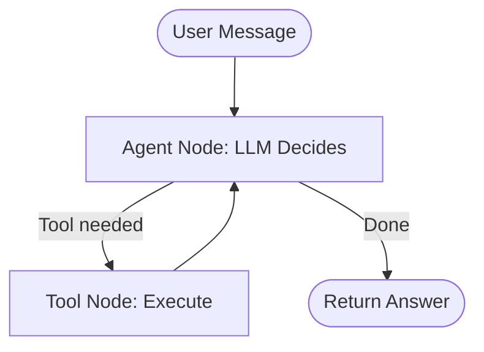

<div align="center">

# ⚙️ Part 6: Frameworks — LangGraph vs CrewAI

**The two dominant frameworks for building agents in 2026, compared head-to-head with practical guidance on when to use each.**

`⏱ 10 min read` · `📊 Intermediate` · `🤖 Agentic AI Masterclass 6/7`

</div>

---

## 📌 Quick Summary

> Building agents from scratch is painful — you'd have to handle state, retries, loops, and human approvals manually. **LangGraph** (stateful graph/state machine) gives you fine-grained control for production. **CrewAI** (role-based teams) gives you rapid prototyping with a human-team metaphor. Start with CrewAI to validate ideas, migrate to LangGraph for production.

---

## 🤔 Why Use a Framework at All?

If you build a raw agent loop in plain Python, you must manually handle these:

| Problem | What Goes Wrong Without a Framework |
|:--|:--|
| **State Persistence** | Agent crashes mid-task → all progress lost |
| **Infinite Loops** | Agent keeps calling the same tool forever → burns $100 in tokens |
| **Error Recovery** | Tool returns 500 error → agent panics and halts |
| **Human Approval** | No way to pause for user confirmation before destructive actions |
| **Debugging** | No way to replay or inspect what the agent did at Step 5 |

Frameworks solve all of this, letting you focus on the actual business logic.

---

## 🔷 LangGraph: The State Machine Approach

**LangGraph** (by LangChain) models your agent as a **directed graph**. Nodes are functions. Edges are connections. State flows through the graph.

### Core Concepts:

| Concept | What It Is | Example |
|:--|:--|:--|
| **State** | A typed dictionary that flows through the graph | `{"messages": [...], "plan": [...], "result": None}` |
| **Nodes** | Python functions that do work | Call LLM, run a tool, transform data |
| **Edges** | Connections between nodes (static or conditional) | "If tool call needed → go to Tools node. Else → go to End." |
| **Checkpointing** | Auto-saves state after every node | If process crashes, restart from last checkpoint |

### Visualization:



### When LangGraph Shines:
- ✅ Complex workflows with loops, branches, and conditionals
- ✅ **Time-travel debugging:** Replay execution from any checkpoint
- ✅ **Durable execution:** Resume from failures without restarting
- ✅ Production systems where reliability > speed-of-development

---

## 🟦 CrewAI: The Role-Based Team Approach

**CrewAI** takes a completely different philosophy. Instead of graphs and nodes, you define **Agents** (with human-like roles) and **Tasks** (with descriptions). You assemble them into a **Crew**.

### Core Concepts:

| Concept | What It Is | Example |
|:--|:--|:--|
| **Agent** | A persona with a role, goal, and backstory | "Senior Data Analyst with 10 years of experience" |
| **Task** | A specific job assigned to a specific agent | "Analyze Q1 sales data and identify trends" |
| **Crew** | A team of agents working together | Analyst + Writer + Reviewer |
| **Process** | The orchestration strategy | `sequential` (one by one) or `hierarchical` (manager delegates) |

### Code Example:
```python
from crewai import Agent, Task, Crew

# Define agents with roles
researcher = Agent(
    role="Senior Research Analyst",
    goal="Find the latest and most relevant information on the given topic",
    backstory="You're a 15-year veteran researcher known for thorough analysis.",
    tools=[search_tool, web_scraper]
)

writer = Agent(
    role="Technical Writer",
    goal="Write clear, engaging technical articles",
    backstory="You've written for O'Reilly and Manning publications.",
    tools=[create_document]
)

# Define tasks
research_task = Task(
    description="Research the topic of AI Agents in production for 2026",
    agent=researcher,
    expected_output="A comprehensive research brief with key findings"
)

write_task = Task(
    description="Write a 2000-word article based on the research",
    agent=writer,
    expected_output="A polished article ready for publication"
)

# Assemble the crew
crew = Crew(agents=[researcher, writer], tasks=[research_task, write_task])
result = crew.kickoff()
```

### When CrewAI Shines:
- ✅ **Rapid prototyping:** Go from idea to working demo in 30 minutes
- ✅ Natural "team" analogy makes it intuitive for non-engineers
- ✅ Quick exploration of whether a multi-agent approach works
- ✅ Non-critical applications where perfect reliability isn't required

---

## 📊 Head-to-Head Comparison

| Feature | 🔷 LangGraph | 🟦 CrewAI |
|:--|:--|:--|
| **Mental model** | State machine / directed graph | Human team with roles |
| **Control level** | 🔧 Very fine-grained (node/edge) | 🎯 High-level (role/task) |
| **Learning curve** | Steeper (graph theory concepts) | Gentler (team analogy) |
| **State management** | Explicit, typed, checkpointed | Implicit, managed by framework |
| **Error recovery** | ✅ Excellent (resume from checkpoint) | ⚠️ Basic (retry whole task) |
| **Debugging** | ✅ Time-travel replay via LangSmith | ⚠️ Logging and task output inspection |
| **Flexibility** | Unlimited topologies | Sequential or hierarchical only |
| **Production-ready** | ✅ Enterprise-grade | ⚠️ Maturing (better for prototypes) |
| **Time to prototype** | Hours to days | Minutes to hours |

---

## 🧭 The Decision Guide

```
START HERE:
  │
  ├── "Is this a production system with real users?"
  │     ├── YES → "Do you need custom control flow (loops, branches)?"
  │     │     ├── YES → 🔷 Use LangGraph
  │     │     └── NO  → "Is it a simple linear pipeline?"
  │     │           ├── YES → 🟦 CrewAI (sequential process)
  │     │           └── NO  → 🔷 LangGraph (safer for edge cases)
  │     │
  │     └── NO → "Are you prototyping or exploring?"
  │           └── YES → 🟦 Use CrewAI (fastest to validate ideas)
```

> [!TIP]
> **The practical advice:** Start every new project with **CrewAI** to validate the idea in 2 hours. Once proven, migrate to **LangGraph** for production — where you need checkpointing, HITL gates, and enterprise observability.

---

<div align="center">

| Navigation | |
|:--|:--|
| ⬅️ **Previous** | [Part 5: Multi-Agent](05-multi-agent.md) |
| 📑 **Table of Contents** | [Agentic AI Masterclass Home](README.md) |
| ➡️ **Next** | [Part 7: Production Guardrails →](07-production.md) |

</div>

---
<div align="center">
<sub>Part of the <a href="../README.md">AI Engineering Wiki</a> · Created by Youssef Ashraf · 2026</sub>
</div>
