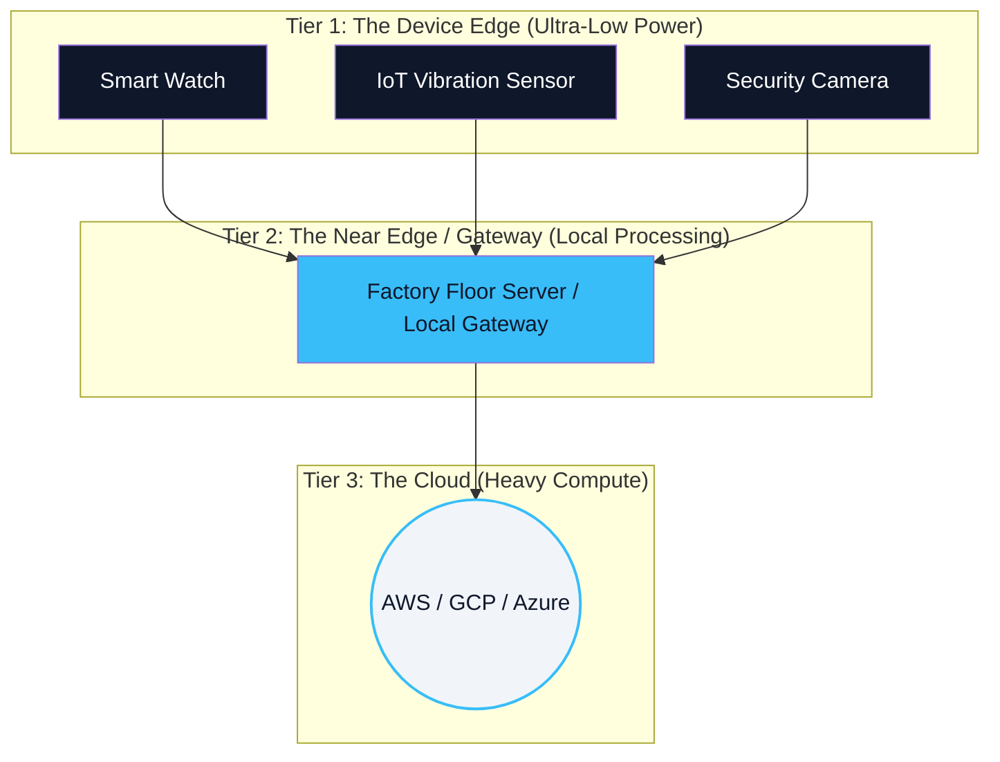

# 01. What is Edge AI? 🌐
> **The paradigm shift from centralized intelligence to on-device autonomy.**

---

## The Cloud Paradigm (The Old Way)

For the past decade, Artificial Intelligence has lived almost exclusively in "The Cloud." Enormous data centers packed with tens of thousands of power-hungry NVIDIA H100 GPUs execute the math required to run models like ChatGPT. 

In this model, your smartphone or IoT sensor is explicitly "dumb." It acts merely as an interface. You speak a command, the device records your audio, uploads it 1,000 miles away to a server, the server transcribes and processes the command, generates a text response, sends the text back 1,000 miles, and your phone speaks the answer to you.

## The Edge Paradigm (The New Reality)

**Edge AI** fundamentally reverses this architecture. Instead of moving the massive amount of messy data to the brain in the cloud, we compress the brain and push it down directly to where the data is generated: **The Edge of the Network.**

"The Edge" refers to physical devices in the real world: your Apple Watch, a Tesla's forward-facing camera, a factory-floor vibration sensor, or a smart thermostat.

### The 3-Tier Edge Architecture

In production, Edge AI rarely operates in total isolation. It typically falls into a 3-tier computing hierarchy:

* **Tier 1 (Device Edge / TinyML):** Sensors perform microsecond inferencing locally (e.g., detecting a sudden fall, recognizing a wake word like "Hey Siri"). If nothing important happens, they simply delete the data. They consume milliwatts of power.
* **Tier 2 (Near Edge):** A localized server acting as a hub for hundreds of Tier 1 sensors. It processes heavier AI workloads like analyzing 10 simultaneous 4K video feeds.
* **Tier 3 (Cloud):** Only highly aggregated, highly compressed meta-events are sent to the cloud for long-term storage and massive dataset model retraining. The cloud manages the "Fleet."

## The Driving Force: "Data Gravity"

Why moving to the Edge is inevitable? Because of **Data Gravity**.
A single autonomous car generates roughly 4,000 GB of data *per day*. A factory with 1,000 HD cameras generates petabytes of video. It is physically impossible, and financially devastating, to upload all of this raw data over 5G networks to a cloud server just to run an AI model over it.

We must put the intelligence precisely where the data is born.

---
*Navigation: [📑 Table of Contents](README.md) | [Next: Why Edge? The 4 Pillars →](02-cloud-vs-edge.md)*
