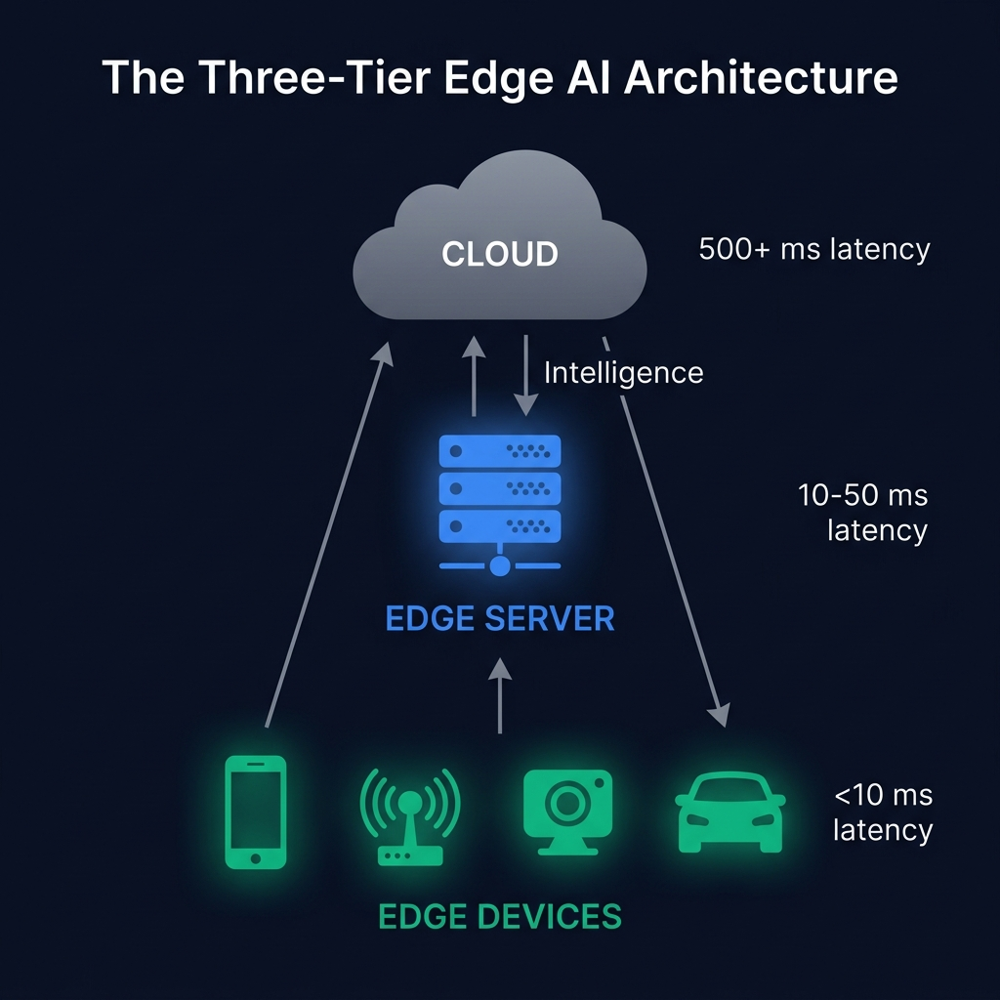

# 📱 Part 1: What is Edge AI?

**Moving intelligence from the cloud to your pocket — and why it's the next trillion-dollar shift in computing.**

`⏱ 8 min read` · `📊 Beginner` · `📱 Edge AI Masterclass 1/8`

---

## 📌 Quick Summary

> **Edge AI** runs machine learning models directly on local devices (smartphones, cameras, sensors, cars) instead of sending data to the cloud. This eliminates network latency, protects privacy, works offline, and enables real-time decisions in under 10 milliseconds — something cloud AI physically cannot do.

---

## 🍕 The Pizza Delivery Analogy

> 🍕 **Cloud AI** is like ordering pizza delivery. You're hungry → you call the pizza shop → they make your pizza → a driver brings it to you. Takes 30-45 minutes. If the restaurant is closed or the road is blocked, you get nothing.
>
> **Edge AI** is like having a pizza oven in your kitchen. You're hungry → you make the pizza right there → eat in 10 minutes. No delivery, no waiting, no dependency on the restaurant being open. You're always covered.
>
> **That's the core idea.** Edge AI moves the "kitchen" (ML model) to where the "hunger" (data) is, instead of shipping raw ingredients (data) across town (the internet) to a centralized kitchen (cloud).

---

## 🏗️ The Three-Tier Architecture

| Tier | Where | Latency | Examples |
|:--|:--|:--|:--|
| ☁️ **Cloud** | Remote data center | 100-500+ ms | GPT-4 API, training large models, batch analytics |
| 🏢 **Edge Server** | On-premises/nearby | 10-50 ms | Factory floor server, hospital local cluster, 5G base stations |
| 📱 **Edge Device** | In your hand/pocket | <10 ms | Smartphone, smart camera, drone, autonomous car ECU |

---

## 🔥 The Five Pillars of "Why Edge AI?"

### 1. ⚡ Latency — *Milliseconds Matter*
A self-driving car at 60 mph travels 27 meters per second. A 200ms cloud roundtrip means the car has traveled 5.4 meters before it even *receives* the decision to brake. Edge AI processes locally in <10ms (0.27 meters). That's the difference between a near-miss and a collision.

### 2. 🔒 Privacy — *Data Never Leaves the Device*
When your iPhone processes FaceID locally, your biometric data never travels to any server. If Apple processed it in the cloud, a data breach could expose millions of facial scans. Edge AI provides **privacy by architecture**, not by policy.

### 3. 📶 No Network Required — *Works Offline*
A smart security camera using Edge AI continues detecting intruders even when the WiFi goes down. A cloud-dependent camera becomes a very expensive paperweight.

### 4. 💰 Cost — *No Cloud Bills*
Every API call to GPT-4 costs money. Edge AI runs on hardware you've already paid for. For high-volume use cases (100,000 inferences/day at a factory), edge processing saves 90%+ compared to cloud APIs.

### 5. 📊 Bandwidth — *Don't Ship Raw Data*
A single 4K security camera generates ~25 GB/day. 100 cameras = 2.5 TB/day of raw video you'd need to upload. Edge AI processes the video locally and sends only the relevant alerts (kilobytes), not the raw footage (terabytes).

---

## 📊 Edge AI By the Numbers (2026)

| Metric | Value |
|:--|:--|
| Global Edge AI market | $65 billion (projected $200B by 2030) |
| Devices with on-device ML | 8+ billion (smartphones, IoT, wearables) |
| ML tasks running on-device | 85%+ (vs 15% in cloud) |
| Typical edge model size | 5-500 MB (vs 100-700 GB for cloud models) |
| Average inference latency | 5-15 ms (vs 100-500 ms cloud) |

---

## ❌ When NOT to Use Edge AI

| Scenario | Why Cloud is Better |
|:--|:--|
| Training large models | Requires massive GPU clusters — impossible on edge devices |
| Tasks needing GPT-4-level reasoning | Edge models are smaller and less capable |
| Batch processing of historical data | Cloud scales horizontally, edge doesn't |
| Prototype development | Faster to iterate with cloud APIs |

> [!NOTE]
> **Edge AI doesn't replace cloud AI.** In most architectures, they complement each other. The edge handles real-time, latency-sensitive tasks. The cloud handles training, complex reasoning, and batch analytics. We'll explore this in [Part 2](02-cloud-vs-edge.md).

---

| Navigation | |
|:--|:--|
| 📑 **Table of Contents** | [Edge AI Masterclass Home](README.md) |
| ➡️ **Next** | [Part 2: Cloud vs Edge →](02-cloud-vs-edge.md) |

---

Part of the <a href="../README.md">AI Engineering Wiki</a> · Created by Youssef Ashraf · 2026

