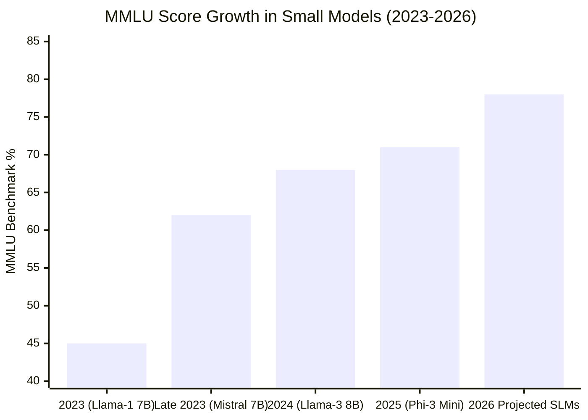

# 03. Small Language Models (SLMs) 🧠
> **Giant reasoning power heavily compressed for localized execution.**

---

## The Shift from LLMs to SLMs

For years, the industry followed the "Scaling Law": to make a model smarter, just add more parameters. We went from GPT-2 (1.5 Billion parameters) to GPT-3 (175 Billion) to modern MoE (Mixture of Expert) models utilizing over a Trillion parameters. 

These massive LLMs require huge GPU clusters just to load into VRAM. They physically cannot fit on a smartphone with 8GB of unified memory.

Enter **Small Language Models (SLMs)**. Starting heavily in 2024, researchers discovered that if you train a very small neural network almost exclusively on incredibly high-quality, "textbook grade" data (instead of scraping the messy entire internet), a tiny model can outperform a massive, poorly-trained model in reasoning tasks.

## Defining the Ecosystem

An SLM is generally defined as a language model containing **less than 10 Billion parameters**. Commonly, they sit in the 1B to 7B range.

### The Heavyweights of the SLM Arena (2025/2026)

| Model Family | Creator | Parameter Range | Key Characteristic |
| :--- | :--- | :--- | :--- |
| **Phi-3** | Microsoft | 3.8B (Mini) | The undisputed king of "textbook" training. The 3.8B model routinely beats massive 13B models in complex logical reasoning benchmarks (MMLU). Fits easily on iPhones. |
| **Gemma** | Google | 2B, 7B | Built from the same architecture as Gemini. Incredible instruction-following capabilities. Highly optimized for Android deployment. |
| **Llama 3 (Tiny/8B)** | Meta | 8B | The open-weight champion. While the 8B pushes the definition of "small," aggressive quantization allows it to run beautifully on Macbook Airs and high-end Snapdragon phones. |
| **Mistral / Mixtral** | Mistral | 7B | Known for unparalleled efficiency and speed, offering immense performance per watt. |

## Parameter Efficiency vs Performance (MMLU)

The standard metric for measuring logic and knowledge is the **MMLU** (Massive Multitask Language Understanding) benchmark. 

Just a few years ago, a 7B parameter model was considered "dumb." Today's SLMs hit MMLU scores exceeding 65-70%. To put that in perspective, GPT-3.5 (the original ChatGPT model that changed the world) scored around 70%—but required a massive server. Today, you get that exact same reasoning power running natively on a battery-powered device entirely offline. 

## Why SLMs are Revolutionizing Apps

1. **RAG on the Desktop/Phone:** You can embed a Vector Database locally on an app, and embed an SLM. The user can chat with thousands of private PDFs directly on their laptop mid-flight with zero internet connection, in complete privacy.
2. **Infinite Generation:** When inference costs hit zero (because you own the hardware), you can have an AI read every single file on your computer continuously in the background to index it without paying a $5,000 AWS bill.
3. **Agentic Workflows at the Edge:** Multiple SLMs can run simultaneously on an Apple M3 chip or Snapdragon Elite. One SLM watches the screen, one listens to audio, and one writes code—all locally.

---

> [!NOTE]
> **The Limitation**  
> SLMs are amazing at logic and reasoning, but they lack "World Knowledge." An 8 Billion parameter model does not have the "hard drive space" to memorize the population of every city in Brazil, whereas GPT-4 does. SLMs are highly dependent on **RAG** (Retrieval-Augmented Generation) to inject facts into their prompts before they reason.

---
*Navigation: [← Previous: Cloud vs Edge](02-cloud-vs-edge.md) | [📑 Table of Contents](README.md) | [Next: Model Optimization & Compression →](04-optimization.md)*
