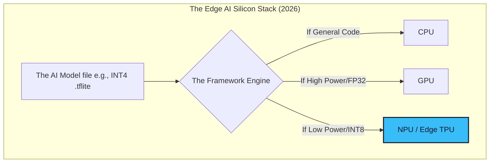

# 05. Hardware Accelerators & Frameworks ⚙️
> **CPU vs GPU vs NPU vs TPU: The battle for silicon dominance at the Edge.**

---

## The Hardware Evolution

Historically, code ran on the **CPU** (Central Processing Unit). A CPU is like a brilliant scientist who can solve *any* complex problem, but operates sequentially (one step at a time).

Neural networks are massive matrices requiring millions of simultaneous, simple multiplication operations. 

We shifted to the **GPU** (Graphics Processing Unit). A GPU is like an army of 10,000 average workers. They can't do complex calculus, but they can multiply 10,000 basic numbers at the exact same millisecond (Parallel Processing). 

But GPUs consume massive amounts of electricity. A desktop GPU draws 300 Watts. You cannot put that in a battery-powered security camera.

## Enter the NPU / TPU (Dedicated AI Silicon)

To run neural networks on edge devices running on 5-Watt batteries, the industry created **ASICs** (Application-Specific Integrated Circuits) strictly designed for AI operations.

*   **NPU (Neural Processing Unit):** Built natively into modern phone chips (Apple's Neural Engine, Snapdragon's Hexagon NPU). They consume almost zero battery while calculating INT8 matrices incredibly fast.
*   **TPU (Tensor Processing Unit):** Google's proprietary architecture. The Edge TPU (Coral) can perform 4 Trillion Operations Per Second (TOPS) while consuming only 2 Watts.

### Visualizing the Inference Stack

---

## The Software Frameworks

You cannot just take a Python script running `import torch` and put it on a microcontroller. Standard PyTorch is bloated. 

To run models on the Edge, you must compile your model using specialized, ultra-lightweight C++ runtime frameworks.

| Framework | Best Used For | Target Hardware |
| :--- | :--- | :--- |
| **llama.cpp** | The reigning champion of running local LLMs on consumer laptops and phones. Uses pure C/C++ without bulky dependencies. | Apple M-Series (Metal), Android, Windows Desktop (CPU/GPU). |
| **TensorFlow Lite (TFLite)** | Classical Computer Vision and Audio detection. Powers millions of legacy Android apps. | Edge TPUs, Android NPUs, Raspberry Pi. |
| **ONNX Runtime** | The universal translator. You export models from PyTorch into ONNX format for maximum cross-platform compatibility. | Cross-platform (Windows, Linux, Web browsers). |
| **OpenVINO** | Intel's hyper-optimized inference engine. Pushes x86 processors to their absolute limits limit. | Intel Core CPUs, Intel Integrated Graphics. |

## The GGUF Format

If you are deploying LLMs locally in 2026, you are likely using files ending in `.gguf`. 

**GGUF (GPT-Generated Unified Format)** is a file format created by the `llama.cpp` team. It packs the entire neural network structure, the quantized weights (INT4/INT8), and the prompt configuration into ONE single, easily distributable file. You can literally drag and drop a 4GB `.gguf` file onto an offline iPhone and start chatting with it.

---
*Navigation: [← Previous: Model Optimization](04-optimization.md) | [📑 Table of Contents](README.md) | [Next: TinyML & Deployment Pipeline →](06-tinyml.md)*
