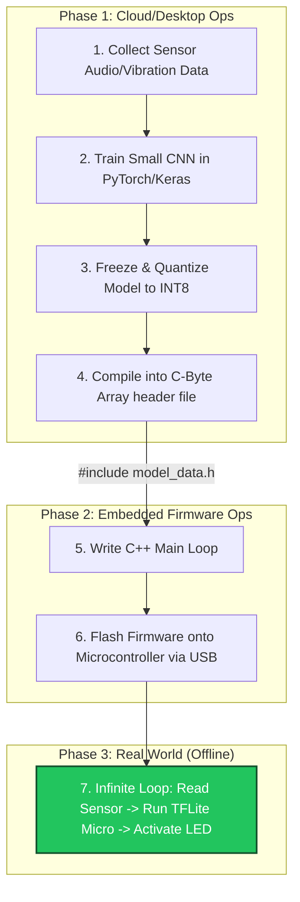

# 06. TinyML: Inference on Microcontrollers 🔬
> **Running deep learning models on chips smaller than a coin, consuming less than 1 milliwatt.**

---

## What is TinyML?

We discussed Edge AI (running an 8B param LLM on an iPhone). **TinyML** takes this to the extreme physical limit.

Imagine a vibration sensor bolted to the side of a massive factory turbine. It has no screen, no operating system, 256 Kilobytes of RAM (not Megabytes, *Kilobytes*), and runs on a watch battery that must last for 5 years.

TinyML is the engineering discipline of deploying micro-neural networks (usually 10KB to 200KB in file size) directly onto these bare-metal **Microcontrollers (MCUs)**.

## The Microcontroller Targets

These are not CPUs. They do not run Linux. They run raw C code in a continuous loop.

*   **ARM Cortex-M:** The absolute industry standard for TinyML. Powers billions of invisible devices.
*   **ESP32:** Beloved by makers and IoT engineers. Costing around $4, it features native Wi-Fi/Bluetooth and enough RAM to run small classification models.
*   **Arduino Nano 33 BLE Sense:** The standard prototyping board equipped with a microphone, accelerometer, and motion sensors specifically built to test TinyML audio/gesture models.

## The TinyML Deployment Pipeline

Deploying an AI to a factory sensor is an entirely different workflow from deploying a web app.

### The Magic: TensorFlow Lite for Microcontrollers (TFLite Micro)

You cannot load a Python script onto a 256KB chip. 

TFLite Micro is a highly optimized execution engine written in pure C++ 11. It takes zero dependencies—it doesn't even use dynamic memory allocation (`malloc`), because allocating memory on the fly on a tiny chip can cause catastrophic system crashes.

1. You train your model in high-level Python.
2. You compile the model into a `.tflite` format.
3. A script converts that file into a massive array of hexadecimal numbers inside a `.cc` or `.h` header file.
4. You compile that text file directly into the physical firmware of the chip. The model *becomes* the software.

## The Power Constraint (mW vs Watts)

Why do we go through this pain? **Power consumption.**

A standard GPU inferencing a model burns **300 Watts**.
A Raspberry Pi processing a camera feed burns **5 Watts**.
A TinyML Cortex-M4 chip listening for glass breaking burns **0.001 Watts (1 Milliwatt)**.

This implies the sensor can listen to its environment 24/7/365 for years without ever being plugged into a wall. It only activates its Wi-Fi antenna (which burns massive power) *if* the neural network detects an anomaly. 

---
*Navigation: [← Previous: Hardware Accelerators](05-hardware.md) | [📑 Table of Contents](README.md) | [Next: Security & Privacy →](07-security-use-cases.md)*
