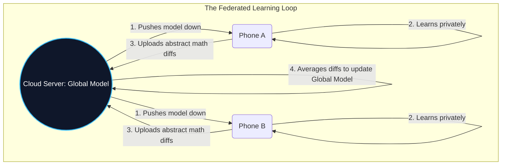

# 07. Security & Privacy at the Edge 🛡️
> **Securing physically exposed AI hardware and enforcing absolute data sovereignty.**

---

## The Physical Threat Model

In Cloud AI, your security model focuses on network firewalls and API keys. The hardware itself sits safely behind multi-million dollar physical security in an AWS data center.

In Edge AI, the threat model is completely inverted. The device is bolted to a streetlight, sitting in a factory, or in a consumer's pocket. A bad actor can physically unscrew it, take it to a lab, and attempt to extract the neural network weights (IP theft) or manipulate the training data.

## 1. Protecting the Model (Hardware Root of Trust)

Enterprises spend millions training specialized models. If you flash an unprotected `.tflite` file onto an IoT device, a competitor can simply copy the file off the device via the USB port.

### Secure Enclaves & HRoT
Modern edge silicon uses a **Hardware Root of Trust (HRoT)**. 
- The AI model is encrypted before it leaves the developer's laptop.
- The encrypted model is flashed onto the device.
- The only decrypt key exists permanently burned into a microscopic, tamper-proof **Secure Enclave** on the device's chip.
- If an attacker tries to copy the file, they just get a useless encrypted binary. The device only decrypts the model inside the Secure Enclave's protected RAM precisely at the exact millisecond of inference.

## 2. Protecting the Data (Federated Learning)

How do you train an AI on data so sensitive that it's illegal to look at? (For example, typing behavior on a smartphone keyboard, or localized hospital patient diagnostics).

Enter **Federated Learning**. The golden rule of Federated Learning is: *Bring the model to the data, not the data to the model.*

1. A central cloud server sends a generic, "empty" model down to 10,000 edge devices (e.g., cell phones).
2. Each phone trains the model *locally* based on the user's private typing habits over a week. The data never leaves the phone.
3. At night, the phone does not upload the data. It only uploads the **"Mathematical Gradients"** (the abstract numerical "lessons" the model learned).
4. The cloud server averages these 10,000 mathematical lessons to build a smarter, global version of the model, completely blind to the raw private data.

## 3. Differential Privacy

Even abstract mathematical gradients can sometimes be reverse-engineered by a brilliant attacker to guess a single user's input. 

**Differential Privacy** is mathematically injecting a specific amount of "statistical noise" (random garbage data) into the model's math before it uploads to the cloud. The noise is calibrated so perfectly that when 10,000 users' math is averaged in the cloud, the noise mathematically cancels itself out, leaving the accurate global lesson—but if an attacker intercepts an individual user's specific upload, the noise makes it impossible to confidently identify their data.

---

> [!CAUTION]
> **Adversarial Physical Attacks**  
> If an attacker puts a specific, invisible sticker on a stop sign in the real world, it can cause the car's Edge AI to classify the stop sign as a 60 MPH speed limit sign. Because the Edge operates in the messy physical world, evaluating models for real-world visual adversarial robustness is critical to life safety.

---
*Navigation: [← Previous: TinyML](06-tinyml.md) | [📑 Table of Contents](README.md) | [Next: Real-World Use Cases & Future Trends →](08-use-cases.md)*
