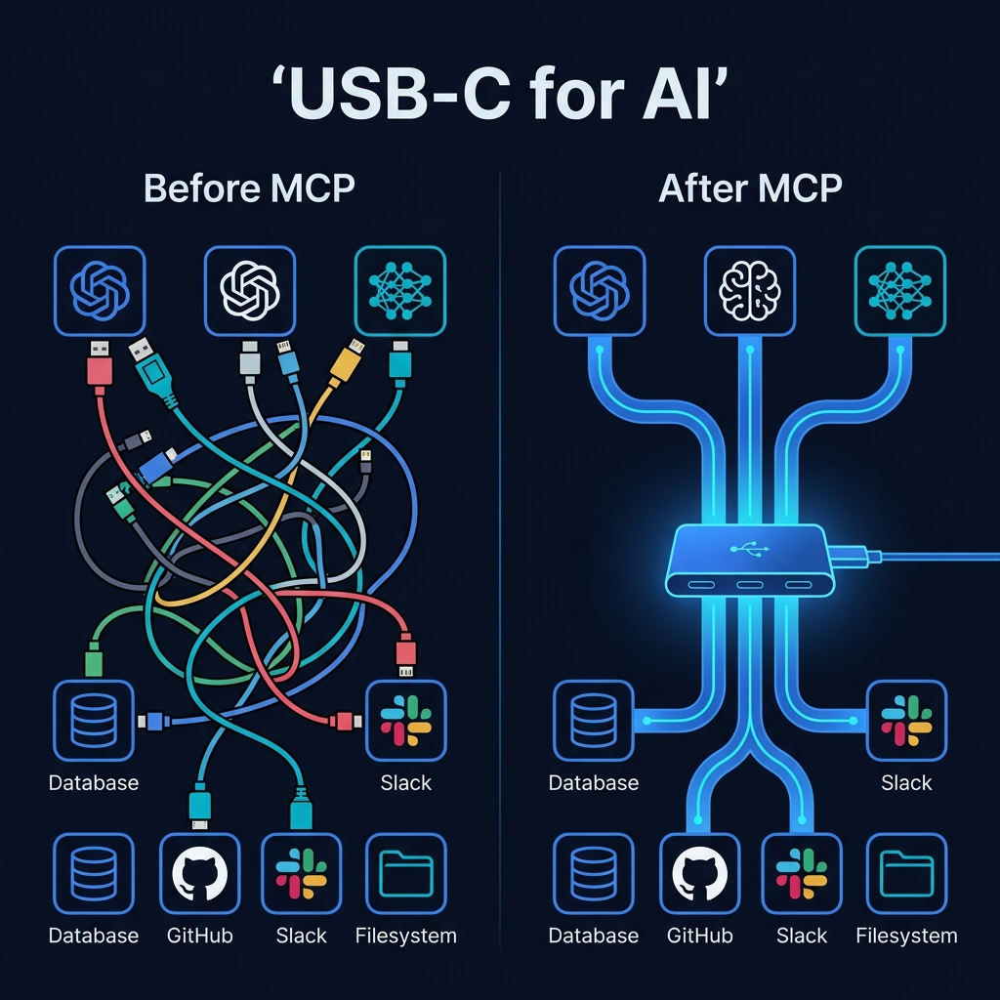

# 🔌 Part 1: What is MCP? — The Problem It Solves

**The one protocol that eliminates the chaos of AI tool integration forever.**

`⏱ 8 min read` · `📊 Beginner` · `🔌 MCP Masterclass 1/7`

---

## 📌 Quick Summary

> **MCP (Model Context Protocol)** is an open standard that lets any AI model connect to any external tool through a single, universal interface — like USB-C for AI. Instead of building custom integrations for every tool-model combination, you build once and it works everywhere.

---

## 🤔 The Problem: Why Does MCP Need to Exist?

Let's start with a real scenario that every AI engineer has faced.

### The N×M Integration Nightmare

Imagine you're building an AI coding assistant — something like Cursor or GitHub Copilot. You want your AI to be actually *useful*, so it needs to:

| Capability | External System |
|:--|:--|
| 📁 Read and write files | Local Filesystem |
| 🐙 Search issues and create PRs | GitHub API |
| 🗄️ Query production data | PostgreSQL Database |
| 💬 Send notifications | Slack API |

So you write 4 custom integrations. Each one has its own authentication, error handling, data format, and retry logic. That's **weeks of work** just for plumbing.

Now your boss says: *"We also need to support Google's Gemini and Anthropic's Claude, not just OpenAI."*

Suddenly you need:

> **4 tools × 3 AI providers = 12 custom connectors** 😱

Each connector is a unique snowflake of code. When GitHub changes their API, you fix it in 3 places. When you add a new tool, you write 3 new integrations. This is the **N×M integration problem**, and it was the #1 engineering bottleneck in AI development before 2024.

### Visualizing the Chaos

---

## 💡 The Solution: MCP as "USB-C for AI"

Remember the dark ages of phone chargers? Every manufacturer had a different cable — Micro-USB, Lightning, proprietary barrel jacks. You'd be at a friend's house with a dead phone and *nobody* had the right cable.

Then **USB-C** arrived. One cable. Every device. Charging, data, video, audio — all through one universal port.

**MCP is that moment for AI.**

It's an open-standard protocol created by Anthropic that defines a single universal interface for connecting AI applications to external tools and data. The magic?

> 🔑 **Write a tool connector once → Every MCP-compatible AI app can use it instantly.**
>
> Claude, GPT, Gemini, Cursor, VS Code, your custom chatbot — they all speak MCP. When you build an MCP server for your database, *every single one of them* can query your data without any additional code.

### The Math Speaks for Itself

| Scenario | Without MCP | With MCP |
|:--|:--|:--|
| 3 AI providers + 4 tools | **12** custom integrations | **3 clients + 4 servers = 7** components |
| 5 AI providers + 10 tools | **50** custom integrations | **5 clients + 10 servers = 15** components |
| 10 AI providers + 20 tools | **200** custom integrations | **10 clients + 20 servers = 30** components |

The savings grow *quadratically*. At enterprise scale, MCP reduces integration work by **80-90%**.

---

## 📜 A Brief History

| When | What Happened |
|:--|:--|
| **Nov 2024** | Anthropic releases MCP as an open-source specification alongside a few reference servers |
| **Early 2025** | OpenAI, Google DeepMind, and Microsoft adopt MCP in their products |
| **Mid 2025** | Streamable HTTP transport replaces the original SSE approach; OAuth 2.1 added for enterprise security |
| **2026** | MCP donated to the **Agentic AI Foundation** (Linux Foundation). Now the vendor-neutral industry standard with 500+ community servers |

---

## ❌ What MCP is NOT (Common Misconceptions)

Let's clear up the three biggest misunderstandings:

### Misconception 1: *"MCP is an API"*
**No.** APIs are the tools themselves (GitHub's REST API, Stripe's payment API). MCP is a **protocol** — a contract that standardizes *how AI discovers and uses* those APIs. Think of it this way: HTTP is a protocol, Google.com is a website that uses it. MCP is the protocol, a GitHub MCP Server is a tool that speaks it.

### Misconception 2: *"MCP replaces function calling"*
**No.** MCP **builds on top of** function calling. Function calling is the raw mechanism (LLM outputs JSON → runtime executes function). MCP adds the standardized discovery layer ("What functions exist?"), transport layer ("How do messages travel?"), and security layer ("Who is allowed to call what?").

### Misconception 3: *"MCP only works with Claude"*
**Absolutely not.** MCP is completely **model-agnostic**. An MCP server doesn't even know which LLM is calling it. It receives a JSON-RPC message and returns a JSON-RPC response — the server has zero awareness of the model behind the request.

---

## 🧠 The Mental Model

Before we dive into architecture in the next article, here's the simplest way to think about MCP:

> **Without MCP:** Every AI app is like a smartphone with a proprietary charger. You need a different cable for every combination of phone and accessory.
>
> **With MCP:** Every AI app has a USB-C port. Plug in any accessory (tool), and it just works. The phone doesn't care who made the accessory. The accessory doesn't care who made the phone.

This is the power of a well-designed protocol. And in the next article, we'll open the hood and see exactly how MCP's three-layer architecture makes this magic possible.

---

| Navigation | |
|:--|:--|
| 📑 **Table of Contents** | [MCP Masterclass Home](README.md) |
| ➡️ **Next Article** | [Part 2: Core Architecture →](02-architecture.md) |

---

Part of the <a href="../README.md">AI Engineering Wiki</a> · Created by Youssef Ashraf · 2026

