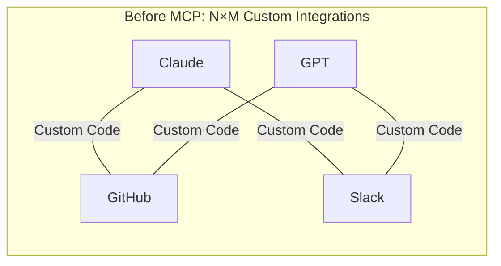
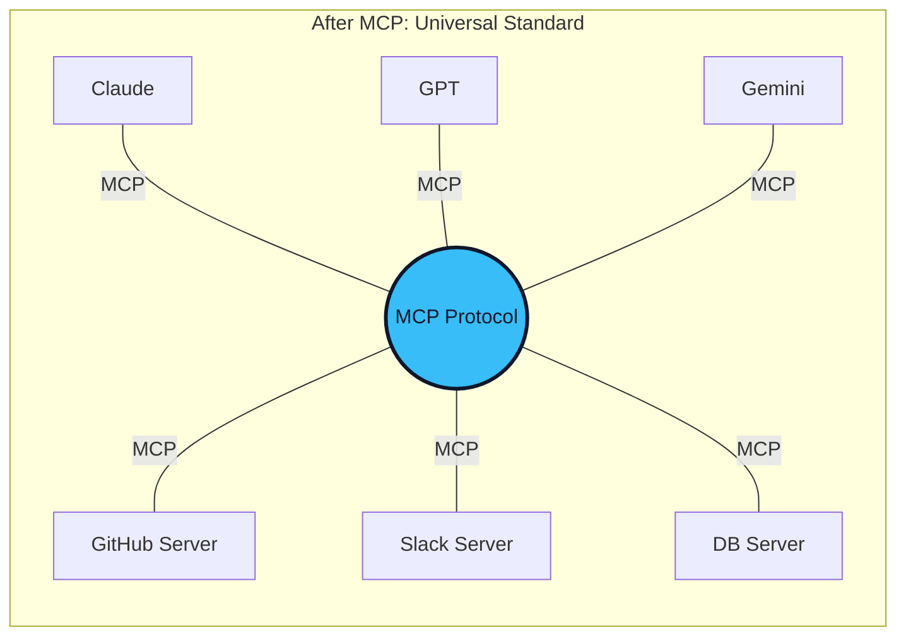

# 01. What is MCP? The Problem It Solves 🔌
> **Before MCP, every AI tool integration was a custom, fragile bridge. MCP is the universal adapter.**

---

## The "N×M" Integration Problem

Imagine you are building an AI-powered coding assistant. You want it to:
1. Read files from your **local filesystem**.
2. Search issues on **GitHub**.
3. Query your company's **PostgreSQL** database.
4. Send messages to **Slack**.

Without a standard, you must write 4 completely separate, custom integrations. Now imagine you support 3 different LLM providers (OpenAI, Anthropic, Google). You now need `4 tools × 3 providers = 12` custom connectors. Each one has its own authentication flow, data format, and error handling.

This is the **N×M integration problem**, and it was the single biggest engineering bottleneck in AI application development before MCP.

## The USB-C Analogy

Remember when every phone manufacturer had a different charging cable? Micro-USB, Lightning, proprietary barrel jacks. Then **USB-C** arrived: one universal port that works for charging, data, video, and audio across every manufacturer.

**MCP is USB-C for AI.**

It is an open-standard protocol that defines a single, universal interface for AI applications to connect to any external data source or tool. Write a tool connector once, and every MCP-compatible AI application (Claude, GPT, Gemini, Cursor, VS Code) can use it instantly.

## Who Created MCP?

MCP was introduced by **Anthropic** (the creators of Claude) in November 2024 as an open-source specification. By 2025, it had been adopted by OpenAI, Google DeepMind, Microsoft, Amazon, and hundreds of tool vendors. In 2026, it was donated to the **Agentic AI Foundation** under the Linux Foundation, cementing it as the vendor-neutral industry standard.

## What MCP is NOT

| Common Misconception | Reality |
| :--- | :--- |
| "MCP is an API" | MCP is a **protocol** (a contract). APIs are the tools themselves. MCP standardizes how AI *discovers and uses* those APIs. |
| "MCP replaces function calling" | MCP **builds on top of** function calling. It standardizes the discovery, schema, and transport layer around it. |
| "MCP only works with Claude" | MCP is **model-agnostic**. Any LLM provider can implement it. |

---
*Navigation: [📑 Table of Contents](README.md) | [Next: Core Architecture →](02-architecture.md)*
