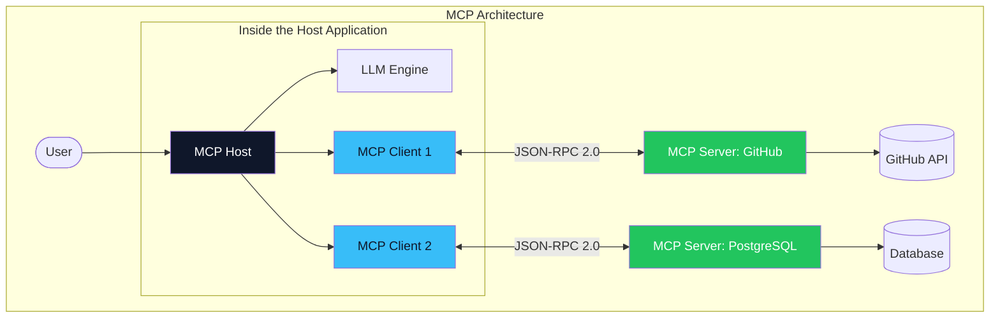
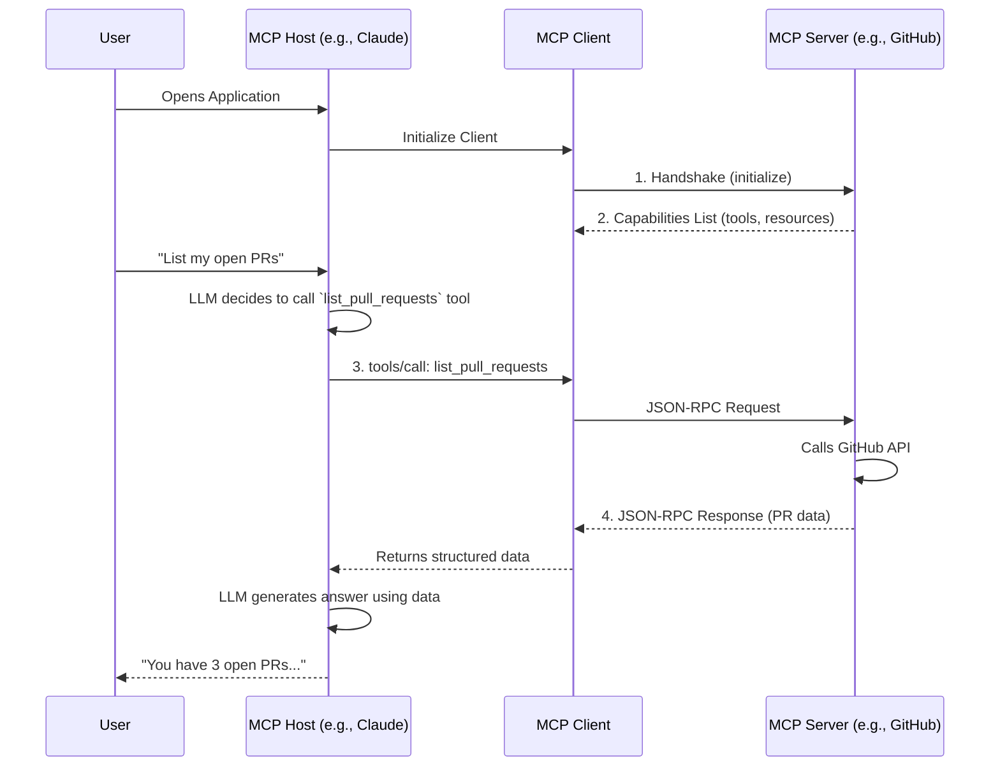

# 02. Core Architecture: Hosts, Clients & Servers 🏗️
> **The three-layer design that makes MCP scalable, secure, and model-agnostic.**

---

## The Three Pillars of MCP

MCP's architecture is built on three cleanly separated components. Understanding the distinction between them is critical; confusing them is the number one mistake developers make.

### 1. The MCP Host (The Orchestrator)

The **Host** is the AI application the user actually interacts with. Examples include Claude Desktop, Cursor IDE, VS Code with Copilot, or your own custom AI chatbot.

**Responsibilities:**
- Manages the user conversation and the LLM.
- Spawns and manages one or more MCP Clients.
- Enforces security policies (deciding which servers a client is allowed to connect to).
- Coordinates context flow: decides what information from which server gets injected into the LLM's prompt.

### 2. The MCP Client (The Connector)

The **Client** lives *inside* the Host. There is always a strict **1:1 relationship** between a Client and a Server. If the Host needs to connect to GitHub AND Slack, it creates two separate Client instances.

**Responsibilities:**
- Initiates the connection handshake with the server.
- Handles protocol negotiation and capability discovery ("What tools do you offer?").
- Serializes/deserializes JSON-RPC messages.
- Manages the lifecycle of the connection (connect, reconnect, disconnect).

### 3. The MCP Server (The Capability Provider)

The **Server** is a lightweight, standalone program that wraps an external system (GitHub, a database, a filesystem, a weather API) and exposes its capabilities in the MCP-standard format.

**Responsibilities:**
- Exposes **Tools** (functions), **Resources** (data), and **Prompts** (templates).
- Receives JSON-RPC requests from the client, executes the underlying action, and returns structured results.
- Is completely **AI-agnostic**: the server does not know or care which LLM model is calling it.

## The Connection Lifecycle

## The JSON-RPC 2.0 Foundation

All MCP communication uses **JSON-RPC 2.0** as its wire protocol. This is a lightweight, stateless messaging standard that defines three message types:

| Message Type | Direction | Purpose | Example |
| :--- | :--- | :--- | :--- |
| **Request** | Client → Server | Invoke a method | `{"method": "tools/call", "params": {"name": "search_issues"}}` |
| **Response** | Server → Client | Return results | `{"result": {"issues": [...]}}` |
| **Notification** | Either direction | Fire-and-forget events | `{"method": "notifications/progress", "params": {"percent": 50}}` |

---

> [!TIP]
> **The Mental Model**  
> Think of the Host as a **CEO**, the Client as a **Secretary**, and the Server as an **External Consultant**. The CEO (Host) tells the Secretary (Client) to call the Consultant (Server) for specific expertise. The Consultant does the work and reports back through the Secretary.

---
*Navigation: [← Previous: What is MCP?](01-introduction.md) | [📑 Table of Contents](README.md) | [Next: The Three Primitives →](03-primitives.md)*
