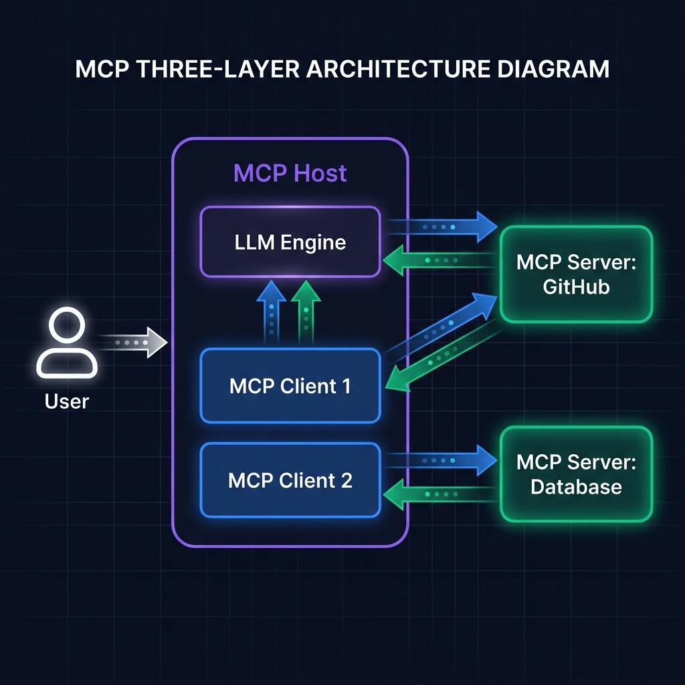
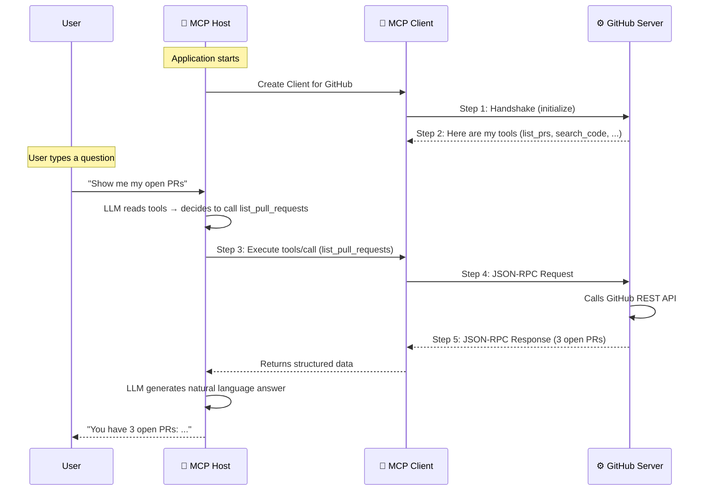

<div align="center">

# 🏗️ Part 2: Core Architecture — Hosts, Clients & Servers

**The three-layer design that makes MCP scalable, secure, and model-agnostic.**

`⏱ 12 min read` · `📊 Intermediate` · `🔌 MCP Masterclass 2/7`

</div>

---

## 📌 Quick Summary

> MCP has exactly three components: the **Host** (the AI app you see), the **Client** (the invisible connector inside it), and the **Server** (the external tool wrapper). Confusing them is the #1 mistake developers make.

---

## 🏢 The Corporate Analogy — Build Your Mental Model First

Before looking at any diagram, let's nail the mental model with an analogy that actually sticks.

> 🏢 **Think of a large corporation:**
>
> - The **Host** is the **CEO**. They talk to the customer (user), set the strategy (manage the LLM), and make all the big decisions. They never call external consultants directly.
>
> - The **Client** is the **Executive Secretary**. They live inside the CEO's office. Their only job is to manage the relationship with *one specific* external consultant. Need two consultants? You hire two secretaries.
>
> - The **Server** is the **External Consultant**. They sit in their own office across town, are experts in one specific domain (databases, GitHub, Slack), and have no idea about the company's internal politics. They receive a call from the secretary, do their work, and send back results.

This analogy is precise — every detail maps to the real architecture. Let's see it.

---

## 🎯 The Three Pillars of MCP

<div align="center">



</div>

### 1. 🧠 The MCP Host — *"The Orchestrator"*

The Host is the AI application the user actually sees and interacts with.

**Real-world examples:** Claude Desktop, Cursor IDE, VS Code with Copilot, Windsurf, or your own custom AI chatbot.

**What it does:**
- 🎙️ **Manages the conversation:** Receives user messages, maintains chat history
- 🧠 **Runs the LLM:** Hosts the language model that generates responses and decides which tools to use
- 🔗 **Creates Clients:** Spawns an MCP Client for each external server it needs
- 🛡️ **Enforces security:** Decides which servers are allowed and what data flows to the LLM

> [!IMPORTANT]
> **The Host is the gatekeeper.** When a Server returns data, the Host decides *how* to feed it to the LLM — as a system prompt injection, a tool result, or structured context. The Server has zero control over this.

---

### 2. 🔗 The MCP Client — *"The Invisible Connector"*

The Client lives **inside** the Host. The user never sees it, never configures it directly, and never interacts with it. It's the behind-the-scenes machinery.

**The golden rule:**

> 🔑 **There is always a strict 1:1 relationship between a Client and a Server.**
>
> If the Host needs to connect to GitHub *and* Slack *and* PostgreSQL, it creates **three separate Client instances**. If the GitHub connection crashes, the Slack and PostgreSQL clients continue working independently.

**What it does:**
- 🤝 **Handshake:** Initiates the connection and negotiates capabilities ("What tools do you offer?")
- 📦 **Serialization:** Translates between the Host's internal format and JSON-RPC messages
- 🔄 **Lifecycle management:** Handles connect, reconnect, retry, and graceful disconnect

---

### 3. ⚙️ The MCP Server — *"The Specialist"*

The Server is a lightweight, standalone program that wraps one specific external system and exposes its capabilities in MCP's standard format.

**Real-world examples:** A GitHub MCP server, a PostgreSQL MCP server, a Filesystem MCP server.

**What it does:**
- 📋 **Advertises capabilities:** Tells the Client what Tools, Resources, and Prompts it offers
- ⚡ **Executes requests:** Receives JSON-RPC calls, performs the underlying API/database operation, returns structured results
- 🤷 **Stays ignorant:** Has absolutely no idea which LLM or which Host is calling it. It's completely **model-agnostic**

> [!TIP]
> **Why is model-agnosticism so important?** Because it means you can build a GitHub MCP server *once*, and it works with Claude, GPT, Gemini, Llama, or any future model that speaks MCP. Zero code changes required.

---

## 🔄 The Connection Lifecycle — What Actually Happens

When you open Claude Desktop and ask *"Show me my open PRs"*, here's what happens behind the scenes in under 2 seconds:



### Step-by-Step Breakdown:

| Step | What Happens | Who's Involved |
|:--|:--|:--|
| **1. Handshake** | Client introduces itself to Server: *"Hi, I'm MCP v1.0. What can you do?"* | Client → Server |
| **2. Discovery** | Server responds with a complete manifest of its Tools, Resources, and Prompts | Server → Client |
| **3. User Request** | User asks a question. The LLM autonomously decides which tool to call | User → Host |
| **4. Tool Execution** | Client sends a structured JSON-RPC request to the Server | Client → Server |
| **5. Result Return** | Server executes the real API call, returns data. LLM generates a human answer | Server → Host → User |

---

## 📡 JSON-RPC 2.0 — The Wire Protocol

All MCP communication uses **JSON-RPC 2.0** — a lightweight, industry-standard messaging format. Every message is a simple JSON object with three possible shapes:

### 📤 Request (Client → Server)
```json
{
  "jsonrpc": "2.0",
  "id": 42,
  "method": "tools/call",
  "params": {
    "name": "list_pull_requests",
    "arguments": {
      "repo": "YoussefAshraf711/Wiki",
      "state": "open"
    }
  }
}
```

### 📥 Response (Server → Client)
```json
{
  "jsonrpc": "2.0",
  "id": 42,
  "result": {
    "content": [{
      "type": "text",
      "text": "Found 3 open PRs:\n1. Add MCP article..."
    }]
  }
}
```

### 📢 Notification (Either Direction)
```json
{
  "jsonrpc": "2.0",
  "method": "notifications/progress",
  "params": { "percent": 50, "message": "Processing..." }
}
```

> [!NOTE]
> **Why JSON-RPC instead of REST?** REST is designed for CRUD operations on *resources* (GET /users, POST /orders). MCP is designed for *action execution* (call a function, run a query). JSON-RPC naturally models method calls, and its bidirectional notification support is essential for streaming progress updates during long-running tool operations.

---

## ❌ Top 3 Mistakes Developers Make

### Mistake 1: Putting logic in the Client
- ❌ **Wrong:** *"I'll add the GitHub API logic in the Client since it connects to GitHub"*
- ✅ **Right:** The Client contains **zero business logic**. It's purely a message transport layer. All GitHub API logic goes in the **Server**. The Client just passes JSON-RPC messages back and forth.

### Mistake 2: One Server for everything
- ❌ **Wrong:** Building one mega-Server that handles GitHub + Slack + Database + Filesystem
- ✅ **Right:** One Server per system. 4 systems = 4 separate servers. This enables independent deployment, focused security scopes, and reusability.

### Mistake 3: Making the Server model-aware
- ❌ **Wrong:** Adding `if model == "claude": ...` checks inside your Server
- ✅ **Right:** The Server is completely model-agnostic. It receives JSON-RPC and returns JSON-RPC. It doesn't know and doesn't care which LLM made the request. This is what makes MCP universal.

---

<div align="center">

| Navigation | |
|:--|:--|
| ⬅️ **Previous** | [Part 1: What is MCP?](01-introduction.md) |
| 📑 **Table of Contents** | [MCP Masterclass Home](README.md) |
| ➡️ **Next** | [Part 3: The Three Primitives →](03-primitives.md) |

</div>

---
<div align="center">
<sub>Part of the <a href="../README.md">AI Engineering Wiki</a> · Created by Youssef Ashraf · 2026</sub>
</div>
