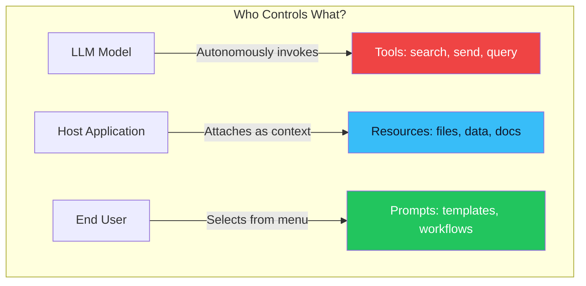

# 03. The Three Primitives: Tools, Resources & Prompts 🧰
> **Every MCP server exposes capabilities through exactly three types of primitives.**

---

## Why Three Primitives?

When an MCP Client connects to a Server and asks "What can you do?", the Server responds with a structured list of its capabilities. These capabilities are always categorized into one of three types. Each type has a fundamentally different purpose and a different interaction model.

## 1. Tools (Model-Controlled Actions) 🔧

**Tools** are executable functions that the AI model can **invoke** to perform actions or retrieve computed results. They are the most powerful and most commonly used primitive.

When the LLM reads the user's prompt, it autonomously decides which tool to call and with what arguments. The server executes the function and returns the result.

### Examples:
```json
{
  "name": "search_github_issues",
  "description": "Search for issues in a GitHub repository by keyword.",
  "inputSchema": {
    "type": "object",
    "properties": {
      "repo": { "type": "string", "description": "owner/repo format" },
      "query": { "type": "string", "description": "Search keywords" }
    },
    "required": ["repo", "query"]
  }
}
```

**Key Characteristics:**
- The **LLM decides** when and how to call a tool (model-controlled).
- Tools can have **side effects** (sending an email, creating a file, deleting a database row).
- Always require **user approval** for dangerous operations (Human-in-the-Loop).

## 2. Resources (Application-Controlled Data) 📄

**Resources** are read-only data sources that the MCP server exposes. They are conceptually similar to files on a filesystem — each resource has a URI and contains content (text, JSON, images).

Unlike tools, resources are typically selected by the **Host Application** or the **User**, not by the LLM autonomously.

### Examples:
```
file:///project/src/main.py      → Source code file
db://analytics/monthly-report    → Database report
github://repo/issues/42          → A specific GitHub issue
```

**Key Characteristics:**
- Read-only (no side effects).
- Selected by the **application or user** (application-controlled), not the model.
- Can be static (a config file) or dynamic (live database query).
- Support subscriptions for real-time updates.

## 3. Prompts (User-Controlled Templates) 💬

**Prompts** are pre-built, reusable prompt templates that the server author designs for specific workflows. They help users structure complex interactions without writing prompts from scratch.

### Example:
```json
{
  "name": "code_review",
  "description": "Perform a thorough code review on a file.",
  "arguments": [
    { "name": "file_path", "description": "Path to the code file to review", "required": true }
  ]
}
```

When the user selects this prompt template (e.g., from a slash-command menu), the server fills in the template with the arguments and sends a fully formed, expert-level prompt to the LLM.

**Key Characteristics:**
- **User-controlled** — typically surfaced as slash commands or menu options.
- Guide the LLM toward a specific, structured workflow.
- Can dynamically include Resources as embedded context.

## Interaction Model Summary



| Primitive | Controlled By | Can Modify Data? | Discovery Method |
| :--- | :--- | :--- | :--- |
| **Tools** | The LLM (model-controlled) | ✅ Yes (side effects) | `tools/list` |
| **Resources** | The Application (app-controlled) | ❌ No (read-only) | `resources/list` |
| **Prompts** | The User (user-controlled) | ❌ No (templates only) | `prompts/list` |

---

> [!WARNING]
> **Tool Safety**  
> Because tools can perform destructive actions (deleting files, sending emails, executing code), production MCP hosts MUST implement a **Human-in-the-Loop (HITL)** confirmation before executing any tool marked as having side effects. Never allow the LLM to autonomously execute destructive tools without user consent.

---
*Navigation: [← Previous: Architecture](02-architecture.md) | [📑 Table of Contents](README.md) | [Next: Transport Layers →](04-transport.md)*
