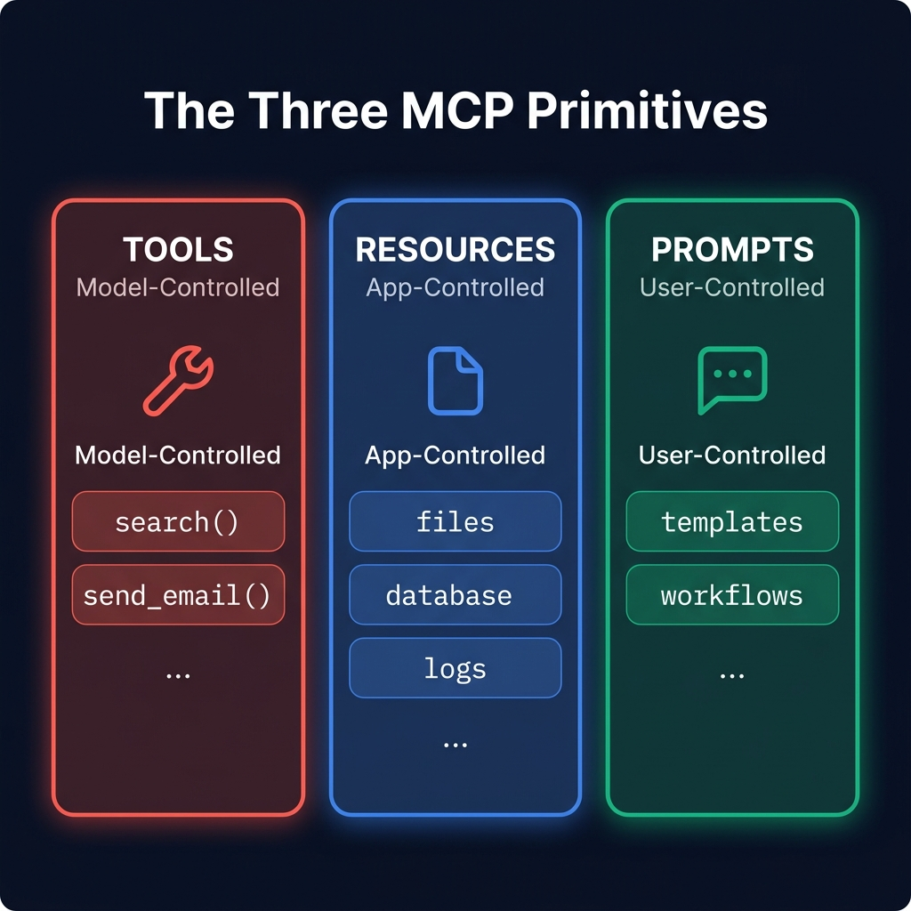

<div align="center">

# 🧰 Part 3: The Three Primitives — Tools, Resources & Prompts

**Every MCP server speaks through exactly three types of capabilities. Master them and you master MCP.**

`⏱ 10 min read` · `📊 Intermediate` · `🔌 MCP Masterclass 3/7`

</div>

---

## 📌 Quick Summary

> When an MCP Client connects to a Server and asks *"What can you do?"*, the Server responds with a structured list organized into three categories: **Tools** (actions the LLM can execute), **Resources** (data the app can read), and **Prompts** (templates the user can select). Each type has a fundamentally different controller and purpose.

---

## 🍽️ The Restaurant Analogy

Before diving into specs, let's build an intuition that sticks:

> 🍽️ **Think of an MCP Server as a restaurant:**
>
> - **Tools** 🔧 are the **kitchen staff**. You (the LLM) tell them exactly what to cook: *"Make me a Caesar salad with extra croutons."* They execute the task and bring you the result. *You* decide what to order and when.
>
> - **Resources** 📄 are the **menu and daily specials board**. The restaurant (application) puts them on display for you to read. They're informational — you can look at the menu, but you can't change it.
>
> - **Prompts** 💬 are the **chef's tasting menu**. The chef (server author) designed a curated experience for you. You (the user) just pick it from the list and let the expert guide the flow.

---

## The Three Primitives at a Glance

<div align="center">



</div>

---

## 1. 🔧 Tools — *Model-Controlled Actions*

Tools are the **star of the show**. They are executable functions that the LLM can autonomously decide to invoke based on the user's request. When you hear "MCP" in a production context, 90% of the time people are talking about Tools.

### How It Works:

1. **Discovery:** During the handshake, the Server tells the Client: *"I have a tool called `search_github_issues`. Here's its input schema."*
2. **Decision:** When a user asks a question, the LLM reads the available tool schemas and decides: *"I should call `search_github_issues` with query='MCP bug'."*
3. **Execution:** The runtime sends a `tools/call` JSON-RPC request to the Server. The Server runs the actual GitHub API call and returns the results.

### Example Tool Schema:

```json
{
  "name": "search_github_issues",
  "description": "Search for issues in a GitHub repository by keyword and state.",
  "inputSchema": {
    "type": "object",
    "properties": {
      "repo": {
        "type": "string",
        "description": "Repository in owner/repo format (e.g., 'facebook/react')"
      },
      "query": {
        "type": "string",
        "description": "Search keywords"
      },
      "state": {
        "type": "string",
        "enum": ["open", "closed", "all"],
        "description": "Filter by issue state"
      }
    },
    "required": ["repo", "query"]
  }
}
```

### Key Properties:

| Property | Detail |
|:--|:--|
| **Who controls it?** | The LLM autonomously decides when and how to call it |
| **Can it modify data?** | ✅ Yes — tools can create files, send emails, delete records |
| **Side effects?** | ✅ Yes — this is why Human-in-the-Loop (HITL) confirmation is critical for destructive tools |
| **Discovery method** | `tools/list` JSON-RPC call |

> [!WARNING]
> **Tools are powerful and dangerous.** A tool like `delete_database_table` has irreversible side effects. Production MCP hosts MUST implement confirmation dialogs before executing any tool the LLM marks as destructive. Never give an LLM unchecked access to destructive tools.

---

## 2. 📄 Resources — *Application-Controlled Data*

Resources are **read-only data** that the MCP Server exposes for the application (or user) to browse and inject into the LLM's context. Think of them as files on a virtual filesystem — each has a URI and content.

### Difference from Tools:
The critical distinction: Resources are NOT chosen by the LLM autonomously. They are selected by the **Host application** or the **user** — similar to how you manually attach a file to an email.

### Example Resources:
```
file:///project/src/main.py        →  Source code file content
db://analytics/monthly-report      →  Database query results
github://react/issues/42           →  A specific GitHub issue
config://app/settings              →  Application configuration
```

### Key Properties:

| Property | Detail |
|:--|:--|
| **Who controls it?** | The Host application or the user (not the LLM) |
| **Can it modify data?** | ❌ No — strictly read-only |
| **Side effects?** | ❌ None — safe to call at any time |
| **Discovery method** | `resources/list` JSON-RPC call |
| **Real-time updates?** | ✅ Supports subscriptions — the Server can notify the Client when a resource changes |

### When to Use Resources vs. Tools:
- **Use a Resource** when: You need the LLM to have *context* — background information that enriches its responses (docs, configs, schema definitions).
- **Use a Tool** when: You need the LLM to *do something* — execute an action that produces a specific result (search, calculate, send).

---

## 3. 💬 Prompts — *User-Controlled Templates*

Prompts are **pre-built, expert-designed templates** that the server author creates for specific workflows. They guide the user toward structured interactions without having to craft complex prompts manually.

### Real-World Example:

Imagine a Code Review MCP Server exposes this prompt:

```json
{
  "name": "code_review",
  "description": "Perform a thorough code review on a file, checking for bugs, performance, and security issues.",
  "arguments": [
    {
      "name": "file_path",
      "description": "Path to the code file to review",
      "required": true
    },
    {
      "name": "focus_area",
      "description": "What to focus on: 'security', 'performance', or 'all'",
      "required": false
    }
  ]
}
```

In the user interface, this might appear as a slash command: `/code_review`. When the user selects it, they fill in the file path, and the Server generates a comprehensive, expert-level prompt that the LLM follows.

### Key Properties:

| Property | Detail |
|:--|:--|
| **Who controls it?** | The user selects from a menu (slash commands, UI buttons) |
| **Can it modify data?** | ❌ No — it only generates a prompt for the LLM |
| **Discovery method** | `prompts/list` JSON-RPC call |

---

## 📊 The Complete Comparison

| | 🔧 Tools | 📄 Resources | 💬 Prompts |
|:--|:--|:--|:--|
| **Controlled by** | 🤖 The LLM | 💻 The Application | 👤 The User |
| **Modifies data?** | ✅ Yes (side effects) | ❌ No (read-only) | ❌ No (template only) |
| **Dangerous?** | ⚠️ Can be — needs HITL | ✅ Always safe | ✅ Always safe |
| **Analogy** | Kitchen staff executing orders | Menu on the wall | Chef's tasting menu |
| **Most common?** | ⭐ By far the most used | Moderate | Least used |

---

## 💡 When to Use What — A Decision Tree

```
📋 "I need the LLM to DO something (search, send, create, delete)"
     → Use a TOOL 🔧

📋 "I need the LLM to KNOW something (context, data, config)"
     → Use a RESOURCE 📄

📋 "I want to give users a STRUCTURED WORKFLOW (code review, analysis)"
     → Use a PROMPT 💬
```

---

<div align="center">

| Navigation | |
|:--|:--|
| ⬅️ **Previous** | [Part 2: Core Architecture](02-architecture.md) |
| 📑 **Table of Contents** | [MCP Masterclass Home](README.md) |
| ➡️ **Next** | [Part 4: Transport Layers →](04-transport.md) |

</div>

---
<div align="center">
<sub>Part of the <a href="../README.md">AI Engineering Wiki</a> · Created by Youssef Ashraf · 2026</sub>
</div>
