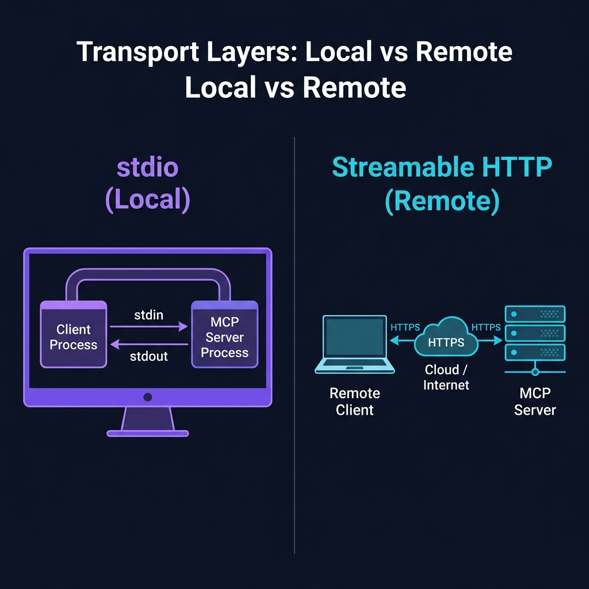

<div align="center">

# 🚀 Part 4: Transport Layers — stdio vs Streamable HTTP

**How data physically travels between the MCP Client and Server — whether they're on the same laptop or across the world.**

`⏱ 8 min read` · `📊 Intermediate` · `🔌 MCP Masterclass 4/7`

</div>

---

## 📌 Quick Summary

> MCP defines *what* messages look like (JSON-RPC 2.0). The **Transport Layer** defines *how* those messages physically travel. MCP supports two transports: **stdio** for local tools (blazing fast, zero network) and **Streamable HTTP** for remote/cloud tools (enterprise-grade, multi-user).

---

## 📬 The Postal Analogy

> 📬 **Think of sending a letter:**
>
> - **stdio** is like handing a note to your colleague **sitting next to you in the same office**. You pass it directly — no envelope, no postage, no delivery service. It arrives instantly.
>
> - **Streamable HTTP** is like sending a **FedEx package** across the country. It gets wrapped in a secure envelope (HTTPS/TLS), routed through the postal network (internet), and delivered to a specific address (URL endpoint). It takes a little longer, but it works from anywhere in the world.

---

## The Two Transports Compared

<div align="center">



</div>

---

## 1. 📟 stdio — The Local Express Lane

**stdio** (Standard Input/Output) is the default transport for local development. The MCP Host launches the Server as a **child process** on the same machine. Messages flow through the process's stdin (input) and stdout (output) — the same mechanism Unix pipes have used for 50 years.

### How It Works:

```
┌─────────────────────────────────────────┐
│              Your Machine               │
│                                         │
│  ┌──────────────┐    ┌───────────────┐  │
│  │   MCP Host   │    │  MCP Server   │  │
│  │ (e.g. Claude)│    │ (e.g. GitHub) │  │
│  │              │    │               │  │
│  │   Client ────────► stdin          │  │
│  │          ◄──────── stdout         │  │
│  └──────────────┘    └───────────────┘  │
│                                         │
│           Process Pipe (zero network)   │
└─────────────────────────────────────────┘
```

### Configuration Example (Claude Desktop):
```json
{
  "mcpServers": {
    "filesystem": {
      "command": "npx",
      "args": ["-y", "@modelcontextprotocol/server-filesystem", "/home/user/projects"]
    }
  }
}
```

When Claude Desktop launches, it runs this command as a subprocess. The filesystem server starts, communicates via stdin/stdout, and the user can ask: *"What files are in my projects folder?"*

### ✅ When to Use stdio:
- Local file system access
- Local database connections
- IDE plugins (Cursor, VS Code)
- Developer tools and CLI integrations
- Any time the server and client are on the **same machine**

---

## 2. 🌐 Streamable HTTP — The Enterprise Highway

When your MCP Server runs on a different machine (a cloud server, a SaaS platform, a company datacenter), you need **Streamable HTTP**. This is the production transport for enterprise deployments.

It uses a single HTTP endpoint (typically `/mcp`) that handles both regular request-response patterns and real-time streaming via Server-Sent Events (SSE).

### How It Works:

```
┌──────────────┐                      ┌──────────────┐
│  Your Laptop │     HTTPS + TLS      │ Cloud Server │
│              │                      │              │
│   MCP Host   │ ===================> │  MCP Server  │
│   + Client   │ POST /mcp            │  Port 443    │
│              │ <=================== │              │
│              │ SSE stream (results)  │  → Database  │
└──────────────┘                      └──────────────┘
         |                                    |
    Corporate                           AWS / GCP /
    Firewall ✅                         Azure
```

### Key Capabilities:

| Feature | How It Works |
|:--|:--|
| **Session Management** | Server assigns a `Mcp-Session-Id` header for stateful multi-turn conversations |
| **Resumability** | If the connection drops, client reconnects with `Last-Event-ID` and resumes from exactly where it stopped |
| **Streaming** | Long-running operations send real-time progress updates via SSE |
| **Firewall Friendly** | Standard HTTPS on port 443 — passes through every corporate proxy and firewall |

### ✅ When to Use Streamable HTTP:
- Remote/cloud-hosted MCP servers
- Multi-user environments (many clients connecting to one server)
- Enterprise deployments with SSO/OAuth authentication
- SaaS tool providers exposing their platforms via MCP

---

## 📊 Head-to-Head Comparison

| Feature | 📟 stdio | 🌐 Streamable HTTP |
|:--|:--|:--|
| **Where it runs** | Same machine (local process) | Anywhere (across networks) |
| **Latency** | ~0ms (process pipe) | 10-200ms (network dependent) |
| **Multi-user?** | ❌ Single user per process | ✅ Unlimited concurrent connections |
| **Authentication** | OS-level process isolation | OAuth 2.1 + HTTPS/TLS |
| **Setup complexity** | Dead simple (just a command) | Moderate (needs server deployment) |
| **Best for** | IDE plugins, local dev tools | Enterprise SaaS, cloud services |

---

## 🔧 Quick Decision Guide

```
📋 "Is the server running on the SAME machine as the AI app?"
     ├── YES → Use stdio 📟 (faster, simpler, no auth needed)
     └── NO  → Use Streamable HTTP 🌐 (network-capable, secure, scalable)
```

> [!NOTE]
> **The Deprecation of HTTP+SSE:** The original MCP spec (2024) used a two-endpoint approach: `/sse` for streaming and `/messages` for requests. This has been officially replaced by **Streamable HTTP**, which unifies everything into a single endpoint. Always use Streamable HTTP for new remote deployments.

---

<div align="center">

| Navigation | |
|:--|:--|
| ⬅️ **Previous** | [Part 3: The Three Primitives](03-primitives.md) |
| 📑 **Table of Contents** | [MCP Masterclass Home](README.md) |
| ➡️ **Next** | [Part 5: Building MCP Servers →](05-building-servers.md) |

</div>

---
<div align="center">
<sub>Part of the <a href="../README.md">AI Engineering Wiki</a> · Created by Youssef Ashraf · 2026</sub>
</div>
