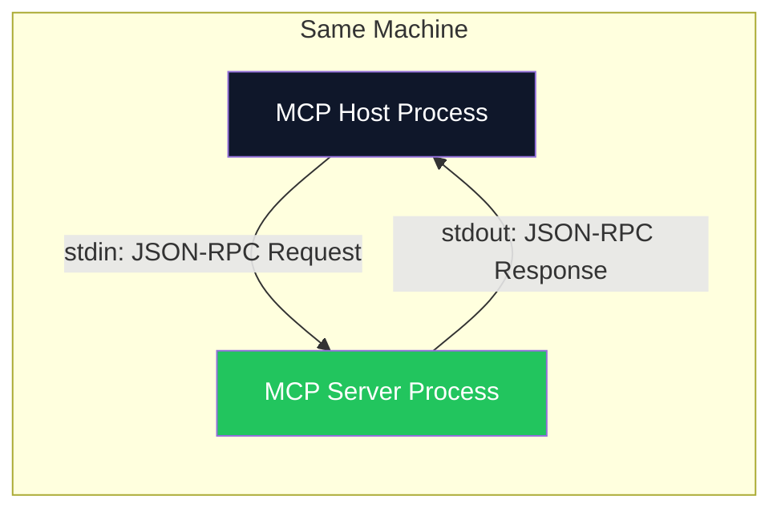
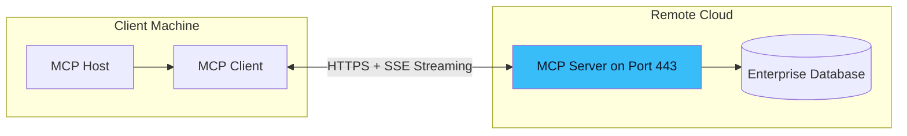

# 04. Transport Layers: stdio vs Streamable HTTP 🚀
> **How data physically moves between the MCP Client and Server — locally and across networks.**

---

## What is a Transport Layer?

The MCP specification defines *what* messages look like (JSON-RPC 2.0). The **Transport Layer** defines *how* those messages physically travel between the Client and the Server. Think of it as choosing between delivering a letter by hand (same building) or by mail (across the internet).

MCP currently supports two primary transports:

## 1. stdio (Standard Input/Output) — Local Transport

**stdio** is the default transport for local development. The MCP Host spawns the Server as a **child process** on the same machine. Communication happens through the process's standard input (stdin) and standard output (stdout) streams.



### When to Use stdio:
- **Local tools:** File system access, local database queries, running shell commands.
- **Developer IDEs:** Cursor, VS Code, and similar tools use stdio for local MCP servers.
- **Zero network overhead:** Communication happens at memory speed, no TCP/HTTP stack involved.

### Configuration Example (Claude Desktop):
```json
{
  "mcpServers": {
    "filesystem": {
      "command": "npx",
      "args": ["-y", "@modelcontextprotocol/server-filesystem", "/home/user/projects"],
      "transport": "stdio"
    }
  }
}
```

## 2. Streamable HTTP — Remote Transport

Introduced to replace the original HTTP+SSE transport, **Streamable HTTP** is designed for production-grade, remote server deployments where the MCP Server runs on a different machine (or cloud service).

It uses a single HTTP endpoint (typically `/mcp`) that supports both regular request-response patterns and streaming via Server-Sent Events (SSE).



### When to Use Streamable HTTP:
- **Remote/Cloud servers:** Your MCP server runs on AWS, GCP, or a company server.
- **Multi-user environments:** Multiple clients connecting to the same server simultaneously.
- **Long-running operations:** The server can stream progress updates back to the client while processing.

### Key Capabilities:
- **Session Management:** The server can assign a `Mcp-Session-Id` header, allowing stateful, multi-turn conversations over HTTP.
- **Resumability:** If a streaming connection drops, the client can reconnect and resume from the last received event using the `Last-Event-ID` header.
- **Firewall Friendly:** Uses standard HTTPS on port 443, passing through corporate proxies and firewalls without issues.

## Transport Comparison

| Feature | stdio | Streamable HTTP |
| :--- | :--- | :--- |
| **Deployment** | Local (same machine) | Remote (any network) |
| **Latency** | Near-zero (process pipe) | Network-dependent (ms) |
| **Multi-User** | ❌ Single user/process | ✅ Concurrent connections |
| **Security** | OS-level process isolation | OAuth 2.1 + HTTPS/TLS |
| **Streaming** | Native (stdout is a stream) | SSE over HTTP |
| **Best For** | IDE plugins, local dev tools | Enterprise SaaS, cloud services |

---

> [!NOTE]
> **The Deprecation of HTTP+SSE**  
> The original MCP spec (2024) used a two-endpoint HTTP+SSE transport (`/sse` for streaming, `/messages` for requests). This has been officially superseded by **Streamable HTTP**, which unifies everything into a single endpoint. New implementations should always use Streamable HTTP for remote deployments.

---
*Navigation: [← Previous: Primitives](03-primitives.md) | [📑 Table of Contents](README.md) | [Next: Building MCP Servers →](05-building-servers.md)*
