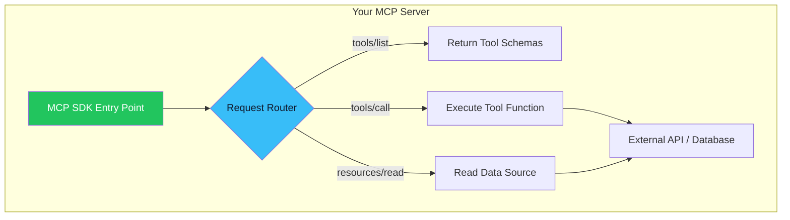

# 05. Building Your First MCP Server 🛠️
> **A practical engineering walkthrough for creating MCP servers in Python and TypeScript.**

---

## The Developer Experience

Building an MCP server is surprisingly straightforward. The SDKs abstract away all JSON-RPC serialization, transport handling, and protocol negotiation. You simply define your tools as decorated functions.

## Python: Using FastMCP

The Python SDK provides a high-level wrapper called **FastMCP** that makes server creation feel like writing a Flask or FastAPI app.

### Minimal Example: A Weather Server

```python
# weather_server.py
from mcp.server.fastmcp import FastMCP

# 1. Create the server instance
mcp = FastMCP("Weather Service")

# 2. Define a Tool (what the LLM can call)
@mcp.tool()
def get_weather(city: str) -> str:
    """Get the current weather for a given city.
    
    Args:
        city: The name of the city (e.g., 'Cairo', 'London')
    """
    # In production, this would call a real weather API
    return f"The weather in {city} is 28°C and sunny."

# 3. Define a Resource (data the app can read)
@mcp.resource("config://app-settings")
def get_settings() -> str:
    """Return application configuration."""
    return '{"units": "metric", "language": "en"}'

# 4. Run the server
if __name__ == "__main__":
    mcp.run(transport="stdio")
```

### What Happens Under the Hood:
1. The `@mcp.tool()` decorator reads the function's **type hints** and **docstring** to automatically generate the JSON Schema that gets advertised to the client.
2. When the LLM decides to call `get_weather`, the SDK receives the JSON-RPC request, deserializes it, calls your Python function, serializes the return value, and sends it back.
3. You write zero protocol code.

## TypeScript: Using the Official SDK

```typescript
// weather-server.ts
import { McpServer } from "@modelcontextprotocol/sdk/server/mcp.js";
import { StdioServerTransport } from "@modelcontextprotocol/sdk/server/stdio.js";
import { z } from "zod";

const server = new McpServer({
  name: "Weather Service",
  version: "1.0.0",
});

// Define a Tool
server.tool(
  "get_weather",
  "Get the current weather for a city",
  { city: z.string().describe("City name, e.g. 'Cairo'") },
  async ({ city }) => ({
    content: [{ type: "text", text: `Weather in ${city}: 28°C, sunny.` }],
  })
);

// Connect via stdio
const transport = new StdioServerTransport();
await server.connect(transport);
```

## Registering with Claude Desktop

Once your server is built, register it in Claude Desktop's config file:

```json
// ~/Library/Application Support/Claude/claude_desktop_config.json
{
  "mcpServers": {
    "weather": {
      "command": "python",
      "args": ["weather_server.py"]
    }
  }
}
```

When Claude Desktop launches, it spawns your Python script as a subprocess, discovers the `get_weather` tool, and makes it available to the LLM. The user can now ask: *"What's the weather in Cairo?"* and Claude will autonomously call your tool.

## Architecture of a Production Server



---

> [!TIP]
> **Debugging Tip**  
> Use the official **MCP Inspector** (`npx @modelcontextprotocol/inspector`) to test your server interactively before connecting it to a real AI host. It provides a web UI where you can list tools, call them manually, and inspect the JSON-RPC traffic.

---
*Navigation: [← Previous: Transport](04-transport.md) | [📑 Table of Contents](README.md) | [Next: Security & OAuth →](06-security.md)*
