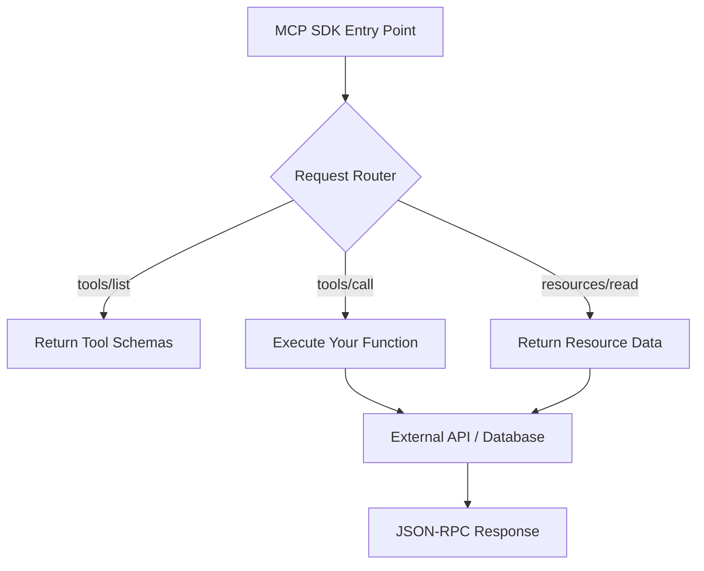

<div align="center">

# 🛠️ Part 5: Building Your First MCP Server

**From zero to a working MCP server in Python and TypeScript — with line-by-line explanations.**

`⏱ 12 min read` · `📊 Hands-On` · `🔌 MCP Masterclass 5/7`

</div>

---

## 📌 Quick Summary

> Building an MCP server is surprisingly easy. The official SDKs handle all JSON-RPC complexity. You just write decorated Python functions or TypeScript handlers, and the SDK turns them into MCP-compatible tools automatically.

---

## 🎯 What We're Building

We'll build a **Weather Service** MCP server that:
1. Exposes a `get_weather` **Tool** (the LLM can call it to get weather data)
2. Exposes an `app-settings` **Resource** (the app can read configuration)
3. Works with Claude Desktop, Cursor, or any MCP-compatible host

---

## 🐍 Python: The FastMCP Approach

The Python SDK provides **FastMCP** — a high-level wrapper that makes building servers feel like writing a Flask app. It's the fastest way to go from idea to working server.

### Step 1: Install the SDK

```bash
pip install mcp
```

### Step 2: Write Your Server

```python
# weather_server.py
from mcp.server.fastmcp import FastMCP

# ╔═══════════════════════════════════════════╗
# ║  1. Create the server instance            ║
# ║  The name appears in discovery responses  ║
# ╚═══════════════════════════════════════════╝
mcp = FastMCP("Weather Service")


# ╔═══════════════════════════════════════════╗
# ║  2. Define a TOOL                         ║
# ║  The @mcp.tool() decorator auto-reads     ║
# ║  your type hints and docstring to build   ║
# ║  the JSON Schema advertised to clients    ║
# ╚═══════════════════════════════════════════╝
@mcp.tool()
def get_weather(city: str, units: str = "celsius") -> str:
    """Get the current weather for a city.

    Args:
        city: The name of the city (e.g., 'Cairo', 'London', 'Tokyo')
        units: Temperature units — 'celsius' or 'fahrenheit'
    """
    # In production, this would call a real weather API
    # e.g., OpenWeatherMap, WeatherAPI, etc.
    weather_data = {
        "Cairo": {"temp": 32, "condition": "Sunny", "humidity": 25},
        "London": {"temp": 14, "condition": "Cloudy", "humidity": 78},
        "Tokyo": {"temp": 22, "condition": "Clear", "humidity": 55},
    }
    
    data = weather_data.get(city, {"temp": 20, "condition": "Unknown", "humidity": 50})
    return f"Weather in {city}: {data['temp']}°C, {data['condition']}, {data['humidity']}% humidity"


# ╔═══════════════════════════════════════════╗
# ║  3. Define a RESOURCE                     ║
# ║  Resources are read-only data sources     ║
# ║  identified by a URI                      ║
# ╚═══════════════════════════════════════════╝
@mcp.resource("config://app-settings")
def get_settings() -> str:
    """Return the application configuration."""
    return '{"units": "metric", "language": "en", "refresh_interval": 300}'


# ╔═══════════════════════════════════════════╗
# ║  4. Run the server                        ║
# ║  transport="stdio" for local use          ║
# ╚═══════════════════════════════════════════╝
if __name__ == "__main__":
    mcp.run(transport="stdio")
```

### What Happens Under the Hood:

| Line | What the SDK Does Automatically |
|:--|:--|
| `@mcp.tool()` | Reads `get_weather(city: str, units: str = "celsius")` → generates a JSON Schema with `city` (required, string) and `units` (optional, string, default "celsius") |
| Docstring | The docstring becomes the tool's `description` field that the LLM reads to decide when to use this tool |
| Return value | The SDK wraps your return string into a proper `tools/call` JSON-RPC response |
| `mcp.run()` | Starts listening on stdin/stdout, handles the handshake, and routes incoming JSON-RPC messages to your functions |

> [!TIP]
> **Zero protocol code.** You didn't write a single line of JSON-RPC, serialization, or transport handling. The SDK handles ALL of it.

---

## 📘 TypeScript: The Official SDK

```typescript
// weather-server.ts
import { McpServer } from "@modelcontextprotocol/sdk/server/mcp.js";
import { StdioServerTransport } from "@modelcontextprotocol/sdk/server/stdio.js";
import { z } from "zod";

// 1. Create server
const server = new McpServer({
  name: "Weather Service",
  version: "1.0.0",
});

// 2. Define a Tool (Zod for schema validation)
server.tool(
  "get_weather",
  "Get the current weather for a city",
  {
    city: z.string().describe("City name, e.g. 'Cairo'"),
    units: z.enum(["celsius", "fahrenheit"]).default("celsius"),
  },
  async ({ city, units }) => ({
    content: [{
      type: "text",
      text: `Weather in ${city}: 28°C, Sunny, 25% humidity`,
    }],
  })
);

// 3. Connect via stdio
const transport = new StdioServerTransport();
await server.connect(transport);
```

---

## 🔌 Connecting to Claude Desktop

Once your server is built, register it in Claude's config:

```json
{
  "mcpServers": {
    "weather": {
      "command": "python",
      "args": ["weather_server.py"]
    }
  }
}
```

**That's it.** Restart Claude Desktop, and the weather tool appears automatically. Ask *"What's the weather in Cairo?"* and Claude will call your server.

---

## 🧪 Testing with MCP Inspector

Before connecting to a real AI host, use the official **MCP Inspector** for interactive testing:

```bash
npx @modelcontextprotocol/inspector python weather_server.py
```

This opens a web UI where you can:
- ✅ See all discovered tools, resources, and prompts
- ✅ Manually call tools with test arguments
- ✅ Inspect the raw JSON-RPC request/response traffic
- ✅ Debug issues before they reach the LLM

---

## 🏗️ Architecture of a Production Server

In production, your server follows this internal flow:



---

<div align="center">

| Navigation | |
|:--|:--|
| ⬅️ **Previous** | [Part 4: Transport Layers](04-transport.md) |
| 📑 **Table of Contents** | [MCP Masterclass Home](README.md) |
| ➡️ **Next** | [Part 6: Security & OAuth →](06-security.md) |

</div>

---
<div align="center">
<sub>Part of the <a href="../README.md">AI Engineering Wiki</a> · Created by Youssef Ashraf · 2026</sub>
</div>
