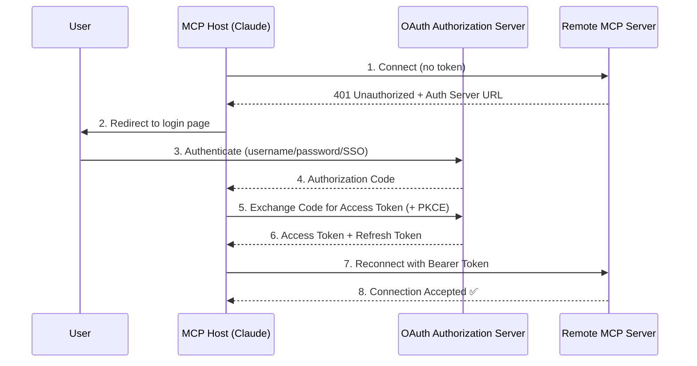

# 06. Security, OAuth & Enterprise Deployment 🛡️
> **Moving MCP from "localhost trust" to production-grade, authenticated enterprise infrastructure.**

---

## The Security Shift

When running MCP locally via stdio, security is simple: the server runs as a child process of the host, inheriting the user's operating system permissions. There is no network, no authentication, and implicit trust.

The moment you deploy an MCP server **remotely** (exposing it over HTTPS for multiple users or agents), everything changes. You need:
1. **Authentication:** Who is connecting?
2. **Authorization:** What are they allowed to access?
3. **Data Protection:** Is the traffic encrypted?

## OAuth 2.1: The Standard for Remote MCP

MCP adopts **OAuth 2.1** (with PKCE) as its standard authorization framework for remote servers.

### The Authorization Flow

### Key Concepts:
- **Access Tokens:** Short-lived tokens (e.g., 15 minutes) that grant access. Attached to every JSON-RPC request as a `Bearer` token.
- **Refresh Tokens:** Long-lived tokens used to silently obtain new access tokens without re-authentication.
- **PKCE (Proof Key for Code Exchange):** A security enhancement that prevents authorization code interception attacks. Essential for public clients (desktop apps, CLIs).
- **Scopes:** Fine-grained permissions. An MCP server can define scopes like `read:issues`, `write:files`, `admin:settings`, and the token will only allow the granted scopes.

## Principle of Least Privilege

In enterprise MCP deployments, every tool should operate under strict access control:

| Tool | Required Scope | Risk Level |
| :--- | :--- | :--- |
| `search_documents` | `read:docs` | 🟢 Low |
| `send_email` | `write:email` | 🟡 Medium |
| `delete_database_table` | `admin:database` | 🔴 Critical (requires HITL) |

The MCP Host should never grant a blanket `admin:*` scope. Each server connection should request only the minimum scopes required for its specific tools.

## Enterprise Deployment Checklist

For organizations deploying MCP servers in production:

1. **Transport:** Always use **Streamable HTTP over TLS** (HTTPS on port 443). Never expose stdio servers to the network.
2. **Authentication:** Integrate with your existing **SSO/SAML/OIDC** provider via OAuth 2.1. Never use API keys for user-facing flows.
3. **Rate Limiting:** Protect servers from runaway agentic loops (an agent stuck in a retry loop could make 1,000 tool calls per minute).
4. **Audit Logging:** Log every `tools/call` invocation with the calling user, timestamp, arguments, and result. This is critical for compliance (HIPAA, SOC 2, GDPR).
5. **Input Validation:** Validate all tool arguments server-side. Never trust data coming from the LLM — it can be manipulated via prompt injection.

---

> [!CAUTION]
> **Prompt Injection via Tools**  
> If your MCP server reads user-generated content (e.g., emails, web pages, documents) and returns it to the LLM, a malicious user could embed hidden prompt-injection instructions in that content. Always sanitize and, where possible, separate untrusted data from instructions using the protocol's content-type annotations.

---
*Navigation: [← Previous: Building Servers](05-building-servers.md) | [📑 Table of Contents](README.md) | [Next: Ecosystem & Future →](07-ecosystem.md)*
