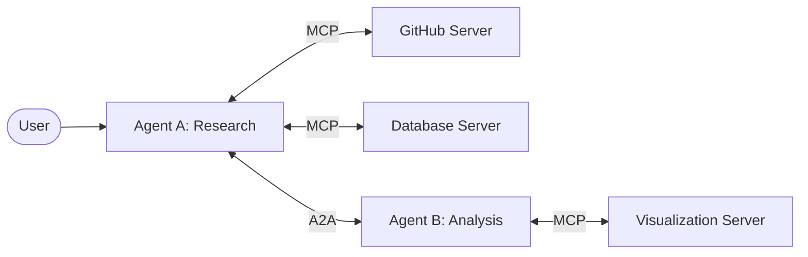

# 🌐 Part 7: The MCP Ecosystem & Future

**From a handful of prototype servers to the universal infrastructure layer for AI.**

`⏱ 8 min read` · `📊 All Levels` · `🔌 MCP Masterclass 7/7`

---

## 📌 Quick Summary

> MCP started with ~10 reference servers in 2024. By 2026, there are 500+ community servers, adoption by every major AI provider, and MCP is now the industry standard managed by the Linux Foundation. This article covers what's available, what's coming, and how MCP relates to A2A.

---

## 🌍 The Server Ecosystem (2026)

The MCP ecosystem has exploded. Here are the most notable production-ready servers:

### 🛠️ Development Tools
| Server | What It Exposes | Built By |
|:--|:--|:--|
| **GitHub** | Issues, PRs, code search, repo management, Actions | Community |
| **GitLab** | Merge requests, CI/CD pipelines, project wikis | Community |
| **Linear** | Issue tracking, sprint management | Community |
| **Sentry** | Error tracking, issue retrieval, stack traces | Official |

### 🗄️ Databases & Data
| Server | What It Exposes | Built By |
|:--|:--|:--|
| **PostgreSQL** | Schema inspection, SQL query execution | Official Reference |
| **MongoDB** | Document CRUD, aggregation pipelines | Community |
| **SQLite** | Local database queries | Official Reference |
| **Snowflake** | Data warehouse queries | Community |

### 💬 Communication & Productivity
| Server | What It Exposes | Built By |
|:--|:--|:--|
| **Slack** | Channel messages, user search, DMs | Official Reference |
| **Gmail** | Email search, read, draft, send | Community |
| **Google Drive** | File listing, content reading, creation | Official Reference |
| **Notion** | Page reading, database queries | Community |

### ☁️ Cloud & Infrastructure
| Server | What It Exposes | Built By |
|:--|:--|:--|
| **AWS** | S3, Lambda, CloudWatch logs | Community |
| **Docker** | Container management, logs | Community |
| **Kubernetes** | Pod management, deployment status | Community |

### 🔍 Search & Knowledge
| Server | What It Exposes | Built By |
|:--|:--|:--|
| **Brave Search** | Web search with result snippets | Official Reference |
| **Wikipedia** | Article lookup and summarization | Community |
| **Filesystem** | Local file read/write/search | Official Reference |

---

## 🤝 MCP vs. A2A — They're Complementary, Not Competitors

The most common confusion in 2026: *"Doesn't Google's A2A protocol replace MCP?"*

**No. They solve completely different problems and are designed to work together.**

| | 🔌 MCP | 🤝 A2A |
|:--|:--|:--|
| **What it connects** | Agent ↔ **Tool** | Agent ↔ **Agent** |
| **Analogy** | A worker using a screwdriver | Two workers coordinating a project |
| **Example** | Agent queries your PostgreSQL database | Agent A asks Agent B to analyze data it collected |
| **Who created it** | Anthropic (2024) → Linux Foundation | Google DeepMind (2025) |

### How They Work Together:

In a sophisticated system:
- **MCP** equips each individual agent with tools (screwdriver, wrench, drill)
- **A2A** allows the equipped agents to collaborate (the plumber calls the electrician)

---

## 🔮 Sampling: The Server-to-LLM Bridge

One of MCP's most powerful (and least understood) features is **Sampling**. Normally, the flow is one-directional: the Host's LLM calls tools on the Server.

With Sampling, the Server can **request the Host's LLM to generate text**:

### How It Works:
1. The Server receives a tool call: *"Summarize this 500-page legal document"*
2. The document is too large for a single LLM call
3. The Server chunks the document into 20 sections
4. For each chunk, the Server sends a `sampling/createMessage` request back to the Host
5. The Host's LLM summarizes each chunk and returns the summary to the Server
6. The Server aggregates all 20 summaries into a final report
7. The final report is returned as the tool's result

> [!TIP]
> **Why is this powerful?** The Server itself has **no LLM** — it borrows the Host's. This keeps servers lightweight, cheap, and model-agnostic. The same server works whether the Host is running Claude, GPT, Gemini, or a local Llama model.

---

## 🗺️ The Future Roadmap (2026+)

| Feature | Status | What It Does |
|:--|:--|:--|
| **Elicitation** | 🟡 In development | Servers can ask the user direct questions mid-execution. E.g., showing a dropdown: *"Which branch do you want to deploy?"* |
| **Namespacing** | 🟡 In development | Solves tool name collisions when a Host connects to 20+ servers simultaneously. E.g., GitHub's `search` vs. Brave's `search`. |
| **Stateful Sessions** | 🟢 Shipping | Multi-turn tool interactions where the server remembers context between calls |
| **Agent Infrastructure** | 🔵 Vision | MCP evolving from a tool connector into a **knowledge runtime** that manages retrieval, caching, and governance as a unified service |

---

## 🎓 What You've Learned — Complete MCP Masterclass Summary

Over these 7 articles, you've mastered:

| # | Article | Key Takeaway |
|:--|:--|:--|
| 1 | [What is MCP?](01-introduction.md) | MCP is USB-C for AI — one universal interface for all tools |
| 2 | [Core Architecture](02-architecture.md) | Host → Client → Server, always 1:1 client-server relationship |
| 3 | [Three Primitives](03-primitives.md) | Tools (LLM-controlled), Resources (app-controlled), Prompts (user-controlled) |
| 4 | [Transport Layers](04-transport.md) | stdio for local, Streamable HTTP for remote |
| 5 | [Building Servers](05-building-servers.md) | Python's FastMCP and TypeScript SDK make it trivial |
| 6 | [Security & OAuth](06-security.md) | OAuth 2.1 + PKCE for auth, least privilege for tools, HITL for destructive ops |
| 7 | [Ecosystem & Future](07-ecosystem.md) | 500+ servers, MCP + A2A complement each other |

**You now understand the protocol architecture that is becoming the universal standard for how AI interacts with the world.** 🚀

---

| Navigation | |
|:--|:--|
| ⬅️ **Previous** | [Part 6: Security & OAuth](06-security.md) |
| 📑 **Table of Contents** | [MCP Masterclass Home](README.md) |
| 🏠 **Main Wiki** | [AI Engineering Wiki Home](../README.md) |

---

Part of the <a href="../README.md">AI Engineering Wiki</a> · Created by Youssef Ashraf · 2026

