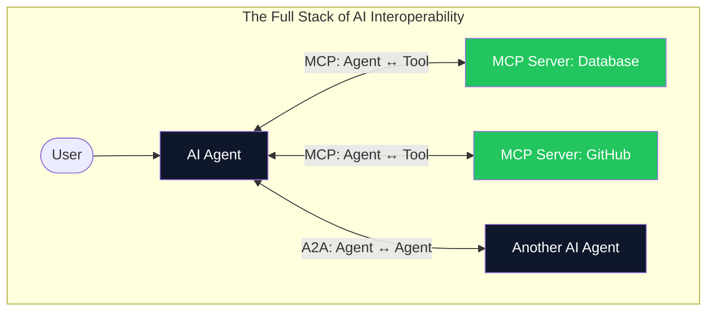

# 07. The MCP Ecosystem & Future 🌐
> **From a handful of prototype servers to a universal AI infrastructure layer.**

---

## The Ecosystem Explosion

When MCP launched in late 2024, it shipped with a small set of reference servers (Filesystem, GitHub, Slack, Google Drive). By mid-2026, the ecosystem has grown to hundreds of community and enterprise-built servers covering virtually every major platform.

### Notable Production MCP Servers

| Category | Server | What it Exposes |
| :--- | :--- | :--- |
| **Development** | GitHub | Issues, PRs, code search, repo management |
| **Development** | GitLab | CI/CD pipelines, merge requests, project wikis |
| **Databases** | PostgreSQL | Schema inspection, SQL query execution |
| **Databases** | MongoDB | Document CRUD, aggregation pipelines |
| **Communication** | Slack | Channel messages, user search, DMs |
| **Communication** | Gmail | Email search, drafting, sending |
| **Productivity** | Google Drive | File listing, content reading, creation |
| **Productivity** | Notion | Page reading, database queries |
| **Cloud** | AWS | S3, Lambda, CloudWatch logs |
| **Search** | Brave Search | Web search with result snippets |
| **Observability** | Sentry | Error tracking, issue retrieval |

## MCP vs. A2A (Agent-to-Agent Protocol)

A common question in 2026: *"Isn't A2A (Google's Agent-to-Agent protocol) a competitor to MCP?"*

**No. They solve different problems and are complementary.**

| Protocol | Purpose | Analogy |
| :--- | :--- | :--- |
| **MCP** | Connects an **Agent to a Tool** (database, API, filesystem). | A worker using a screwdriver. |
| **A2A** | Connects an **Agent to another Agent** for collaboration. | Two workers coordinating on a project. |

In practice, a sophisticated AI system uses MCP to equip each individual agent with tools, and A2A to allow those equipped agents to communicate and delegate tasks to each other.

## The Sampling Primitive (Server → LLM)

One of MCP's most powerful and underused features is **Sampling**. Standard MCP flow is one-directional: the Host's LLM calls tools on the Server. 

With Sampling, the **Server can request the Host's LLM to generate text**. This enables powerful recursive patterns:

1. An MCP Server receives a tool call to "summarize this 500-page document."
2. The Server chunks the document and sends each chunk back to the Host's LLM via a `sampling/createMessage` request.
3. The LLM summarizes each chunk, and the Server aggregates the summaries.
4. The final aggregate summary is returned as the tool's result.

The Server itself has no LLM — it borrows the Host's. This keeps servers lightweight and model-agnostic.

## The Future Roadmap (2026+)

- **Elicitation:** A formalized protocol for servers to ask the user direct questions during tool execution (e.g., "Which branch do you want to deploy?" as a dropdown selection).
- **Namespacing:** Solving tool name collisions when a Host is connected to 20+ servers simultaneously.
- **Agent Infrastructure Layer:** MCP evolving from a "tool connector" into a foundational **knowledge runtime** that manages retrieval, caching, and governance as a unified service layer.

---

**End of MCP Masterclass.**
*You now understand the protocol architecture that is becoming the universal infrastructure for how AI interacts with the external world.*

> *Created for the AI Engineering Community by Youssef Ashraf • 2026*

<a href="../README.md">Return to Main Wiki Directory</a>

