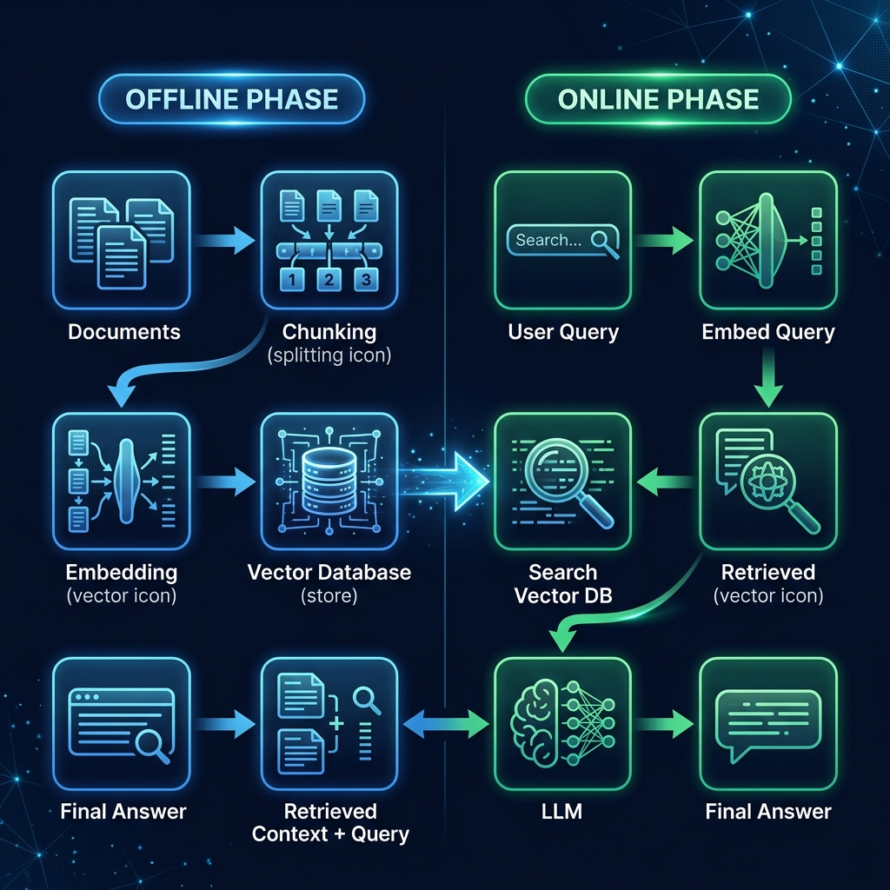

<div align="center">

# 📚 Part 1: What is RAG? — The End of Hallucinations

**RAG gives your AI a reference library instead of forcing it to answer from memory — and it changes everything.**

`⏱ 8 min read` · `📊 Beginner` · `📚 RAG Masterclass 1/8`

</div>

---

## 📌 Quick Summary

> **RAG (Retrieval-Augmented Generation)** is a technique where the LLM first *retrieves* relevant documents from an external knowledge base, then *generates* an answer grounded in those documents. Instead of relying on potentially outdated training data, the model uses real, cited sources — dramatically reducing hallucinations and making answers verifiable.

---

## 🧑‍🏫 The Open-Book Exam Analogy

> 📖 **Without RAG:** The LLM is taking a **closed-book exam**. It can only answer from what it memorized during training. If the question is about something that happened after its training cutoff, or about internal company data, it either makes up an answer (hallucinates) or says "I don't know."
>
> 📖 **With RAG:** The LLM is taking an **open-book exam**. It has access to a reference library — your documents, your database, your wiki. It looks up the relevant passages first, then writes an answer based on what it found. It can even *cite its sources*.

---

## 🔥 The Problem RAG Solves

LLMs have a fundamental limitation called the **knowledge cutoff**:

| Limitation | What Goes Wrong |
|:--|:--|
| 🕐 **Knowledge Cutoff** | GPT-4 was trained up to a certain date. It doesn't know about events after that date. |
| 🏢 **No Internal Knowledge** | The LLM has never seen your company's internal docs, policies, or data. |
| 🎭 **Hallucinations** | When the LLM doesn't know, it often makes up plausible-sounding but completely wrong answers — with full confidence. |
| 📦 **Context Limits** | You can't just paste your entire 10,000-page knowledge base into the prompt — there's a token limit. |

**RAG solves ALL of these** by giving the LLM a way to look up information on demand.

---

## ⚡ How RAG Works — The 30-Second Version

```
                             ┌──────────────────┐
User asks a question ──────► │  RETRIEVE         │
                             │  Search your docs │
                             │  for relevant     │
                             │  passages         │
                             └────────┬──────────┘
                                      │
                              Found 5 relevant
                              passages
                                      │
                             ┌────────▼──────────┐
                             │  GENERATE          │
                             │  Feed question +   │
                             │  retrieved passages│
                             │  to the LLM        │
                             └────────┬──────────┘
                                      │
                              LLM generates an
                              answer BASED on
                              the retrieved text
                                      │
                                      ▼
                            📝 Grounded, accurate
                               answer with sources
```

**That's it.** The genius of RAG is its simplicity: retrieve relevant information, then generate an answer using that information.

---

## 📚 Two Types of Knowledge

RAG bridges two fundamentally different types of knowledge:

| Type | Where It Lives | Examples | Updatable? |
|:--|:--|:--|:--|
| **Parametric Knowledge** | Inside the LLM's weights (learned during training) | General world knowledge, grammar, reasoning patterns | ❌ Only by retraining ($$$) |
| **Non-Parametric Knowledge** | External knowledge base (your documents, databases) | Company policies, product docs, latest research papers | ✅ Instantly — just update the source |

RAG augments parametric knowledge (what the LLM already knows) with non-parametric knowledge (what your documents contain).

> [!TIP]
> **This is why RAG is so cost-effective.** Fine-tuning an LLM on your data costs $10,000-$100,000+ and takes weeks. Setting up RAG costs nearly nothing and your knowledge base can be updated in real-time. When new company policies are released, you add them to the vector database and the AI immediately knows about them — zero retraining.

---

## 🏗️ The Big Picture Architecture

<div align="center">



</div>

RAG has two distinct phases:

### 1. 📦 Offline Phase (Indexing) — *"Build the Library"*
This happens once, before any user asks a question:
1. **Collect** your documents (PDFs, web pages, docs, database records)
2. **Chunk** them into smaller passages (paragraphs, sections)
3. **Embed** each chunk into a vector (a list of numbers representing its meaning)
4. **Store** the vectors in a vector database (Pinecone, Weaviate, ChromaDB)

### 2. ⚡ Online Phase (Retrieval) — *"Answer the Question"*
This happens in real-time when a user asks:
1. **Embed** the user's question into the same vector space
2. **Search** the vector database for the most similar chunks
3. **Combine** the retrieved chunks with the original question
4. **Generate** an answer using the LLM, grounded in the retrieved text

---

## ❌ When NOT to Use RAG

RAG is not the answer to everything:

| Scenario | Better Alternative |
|:--|:--|
| Changing the model's *personality* or *writing style* | Fine-tuning |
| Teaching the model a new *language* or *format* | Fine-tuning |
| Simple factoid lookup (no reasoning needed) | Direct database query |
| Real-time streaming data (stock prices, sensors) | Live API calls |

> [!NOTE]
> **RAG vs Fine-Tuning is not binary.** Many production systems use *both*: fine-tune the model for style/format, then use RAG for knowledge/facts. We'll cover this in detail in [Part 8](08-comparison.md).

---

<div align="center">

| Navigation | |
|:--|:--|
| 📑 **Table of Contents** | [RAG Masterclass Home](README.md) |
| ➡️ **Next** | [Part 2: Architecture Deep Dive →](02-architecture.md) |

</div>

---
<div align="center">
<sub>Part of the <a href="../README.md">AI Engineering Wiki</a> · Created by Youssef Ashraf · 2026</sub>
</div>
