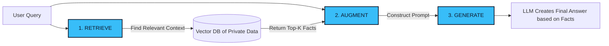
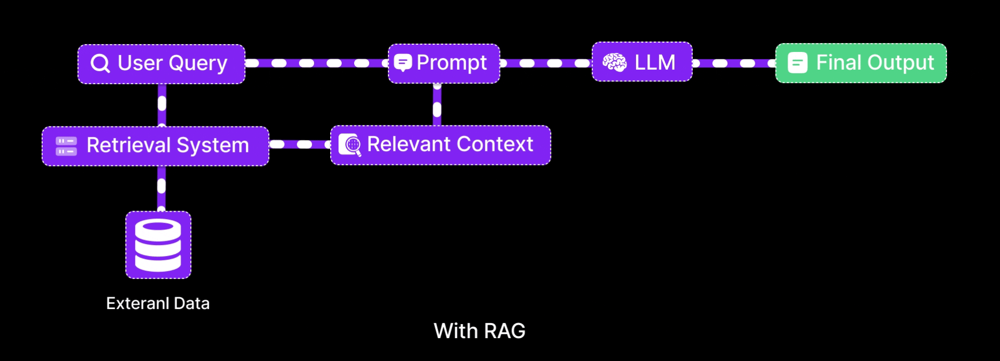

# 01. The LLM Dilemma: Why RAG Exists 🧠
> **The fundamental paradigm shift from an AI's Parametric Memory to Non-Parametric knowledge.**

---

## The Core Problem

Large Language Models (LLMs) like GPT-4, Llama 3, and Claude are incredible reasoning engines. However, they share two fatal flaws when deployed in enterprise environments:

1. **The Knowledge Cut-off:** Model parameters (weights) are frozen after training. An out-of-the-box LLM knows absolutely nothing about today's news, yesterday's meeting notes, or your internal HR policies.
2. **The Hallucination Problem:** When an LLM doesn't know an answer, it rarely admits ignorance. Instead, it confidently fabricates highly plausible—yet entirely incorrect—information.

## The "Open-Book Exam" Analogy

Imagine sending a brilliant student into an advanced physics exam they didn't study for. If forced to answer, they might write a very convincing, elegantly worded, but completely wrong essay (Hallucination).

Now, imagine sending the same student into the exam, but this time, you give them an **open book**. Before answering any question, the student is instructed to look up the relevant chapter, read the facts, and then write their answer based *only* on what they read.

**This is what RAG does.** It transforms the AI from a memorization engine into a reasoning engine that operates on your provided facts.

## How Basic RAG Works (The Happy Path)

In its simplest form, Retrieval-Augmented Generation (RAG) follows a strict three-step pipeline: **Retrieve → Augment → Generate**.

### Visualizing the Concept

  
   
  <em>Figure 1: The RAG Concept — Searching a private database to ground the LLM's response.</em>

## Parametric vs. Non-Parametric Memory

To truly understand RAG, we must understand how AI stores information:

| Memory Type | Definition | The Problem | The RAG Solution |
| :--- | :--- | :--- | :--- |
| **Parametric Memory** | Information baked into the model's trillions of weights during initial training. | Static, outdated, expensive to update, and prone to hallucinations. | We instruct the LLM to **ignore** this memory when factual accuracy is required. |
| **Non-Parametric Memory** | Information stored externally (like in a Vector Database or SQL database). | Fast, dynamic, easy to update, and 100% traceable. | **RAG relies entirely on this memory.** The LLM only uses its reasoning skills, not its factual memory. |

---

> [!CAUTION]
> **The Real-World Warning**  
> While the concept seems simple, building this in a Jupyter Notebook is vastly different from building it for production. In the real world, "bad retrieval is worse than no retrieval." If your system feeds the LLM the wrong paragraphs, the LLM will confidently hallucinate using the wrong facts.

---
*Navigation: [📑 Table of Contents](README.md) | [Next: Core Architecture Blueprint →](02-architecture.md)*
