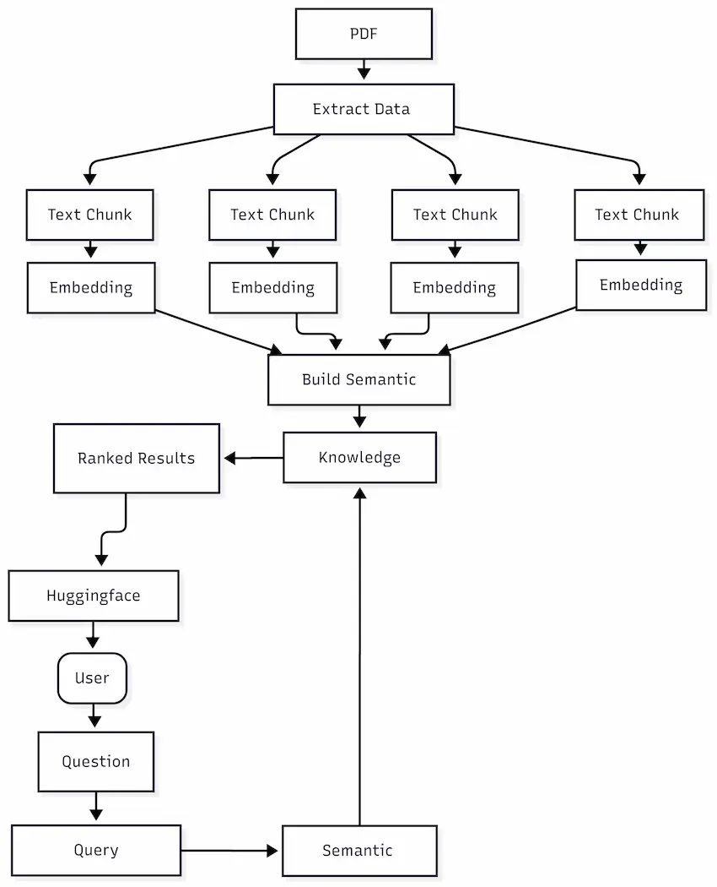
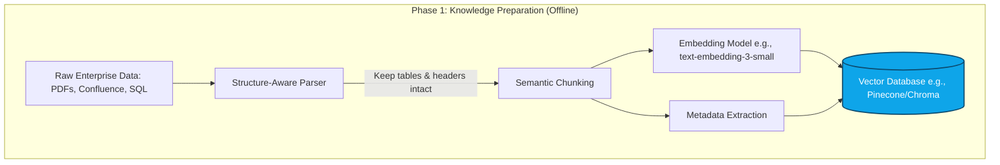
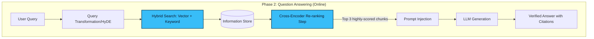

# 02. Core Architecture Blueprint 🏗️
> **Moving from simple Retrieval to a Dual-Pipeline Production Architecture.**

---

## The Production Reality Check

Many developers start their RAG journey by loading a PDF, splitting it into random 500-word chunks, throwing it into a vector database, and querying it via LangChain. This is called **Naive RAG**. 

While Naive RAG works perfectly for impressive 5-minute demos, it fails catastrophically in enterprise environments where data is messy, documents contain tables and code blocks, and users ask ambiguous questions.

To build a reliable system, we must separate the architecture into two distinct, highly-engineered lifecycles: **The Offline Pipeline** and **The Online Pipeline**.

## The Dual-Pipeline Architecture

  
   
  <em>Figure 1: The Production Lifecycle — Balancing Offline Indexing with Online Inference.</em>

### 1. The Offline Indexing Pipeline

This pipeline runs asynchronously in the background. Its sole job is to ingest raw data from your organization, clean it, understand its semantic meaning, and store it for rapid search.

**Key Responsibilities:**
- Parsing complex layouts without breaking context.
- Generating metadata (dates, authors, source URLs) to allow for SQL-like hard filtering later.
- Converting text into dense mathematical vectors (Embeddings).

### 2. The Online Inference Pipeline

This pipeline executes in milliseconds when a user actually asks a question. It must be blazing fast, highly accurate, and resilient to poorly phrased queries.

**Key Responsibilities:**
- Understanding the true intent of the user's question.
- Searching via both meaning (Semantic) and exact keywords (Sparse).
- Re-scoring and filtering the retrieved data to ensure only the absolute best context reaches the LLM.

## Comparing Naive vs. Advanced RAG

| Feature | Naive RAG (Level 1) | Advanced RAG (Level 2) |
| :--- | :--- | :--- |
| **Data Ingestion** | Blind character splitting. | Structure-aware and semantic chunking. |
| **Retrieval Strategy** | Dense Vector Search only. | Hybrid Search (Dense + Sparse/BM25). |
| **Query Handling** | Asks the exact user string. | Rewrites or expands the query (HyDE). |
| **Post-Processing** | Pastes Top-K chunks into prompt. | Passes chunks through a heavy Re-ranker model. |

---

> [!TIP]
> **The Golden Rule of Architecture**  
> Do not rely on the LLM to fix bad data. Most hallucinations in a RAG system are not the AI's fault—they are the fault of a poor retrieval pipeline feeding the AI irrelevant or broken sentences.

---
*Navigation: [← Previous: The LLM Dilemma](01-introduction.md) | [📑 Table of Contents](README.md) | [Next: Data Ingestion & Chunking →](03-chunking.md)*
