<div align="center">

# 🏗️ Part 2: RAG Architecture — The Dual Pipeline

**The two-phase system that transforms raw documents into instant, accurate answers.**

`⏱ 10 min read` · `📊 Intermediate` · `📚 RAG Masterclass 2/8`

</div>

---

## 📌 Quick Summary

> The RAG architecture consists of two independent pipelines: the **Indexing Pipeline** (offline, runs once to build your knowledge base) and the **Query Pipeline** (online, runs for every user question). The indexing pipeline transforms documents into searchable vectors. The query pipeline retrieves the most relevant vectors and generates answers.

---

## 🏭 The Factory Analogy

> 🏭 **Think of a factory with two production lines:**
>
> **Production Line 1 (Indexing):** Raw materials (documents) arrive → they're cut into standard-sized pieces (chunking) → each piece gets a barcode (embedding) → pieces are organized in a smart warehouse (vector database). This line runs in advance.
>
> **Production Line 2 (Query):** A customer order arrives (user question) → the order gets a barcode too → the warehouse robot finds the closest matching pieces → those pieces are assembled into the final product (LLM generates an answer). This line runs in real-time.

---

## 📦 Pipeline 1: Indexing (Offline)

This pipeline transforms raw documents into a searchable knowledge base:

```mermaid
graph LR
    A[📄 Raw Documents] --> B[✂️ Chunking]
    B --> C[🧮 Embedding]
    C --> D[(🗄️ Vector DB)]
    
    style A fill:#1e3a5f,stroke:#3B82F6
    style B fill:#1e3a5f,stroke:#3B82F6
    style C fill:#1e3a5f,stroke:#3B82F6
    style D fill:#1e3a5f,stroke:#3B82F6
```



### Step 1: Document Loading
```python
# Load documents from various sources
from langchain_community.document_loaders import (
    PyPDFLoader,
    TextLoader,
    WebBaseLoader,
)

# Load a PDF
pdf_docs = PyPDFLoader("company_handbook.pdf").load()

# Load a web page
web_docs = WebBaseLoader("https://docs.example.com/api").load()
```

### Step 2: Chunking
Split documents into smaller, semantically meaningful passages. (Covered in depth in [Part 3](03-chunking.md).)

### Step 3: Embedding 
Convert each chunk into a vector — a list of numbers that captures its meaning. (Covered in depth in [Part 4](04-embeddings.md).)

### Step 4: Storage
Store the vectors in a purpose-built vector database optimized for similarity search.

| Vector DB | Type | Best For |
|:--|:--|:--|
| **ChromaDB** | Embedded (local) | Prototyping, small datasets |
| **Pinecone** | Cloud (managed) | Production, large scale |
| **Weaviate** | Self-hosted/cloud | Hybrid search (vector + keyword) |
| **Qdrant** | Self-hosted/cloud | High performance, filtering |
| **pgvector** | PostgreSQL extension | Teams already using PostgreSQL |

---

## ⚡ Pipeline 2: Query (Online)

This pipeline runs every time a user asks a question:


### Step 1: Embed the Query
The user's question is converted into a vector using the **same embedding model** used during indexing. This is critical — different models produce incompatible vector spaces.

### Step 2: Similarity Search
The vector database finds the **Top-K** most similar chunks to the query vector. Common similarity metrics:

| Metric | Formula | When to Use |
|:--|:--|:--|
| **Cosine Similarity** | cos(θ) = (A·B) / (‖A‖·‖B‖) | Most common, works well for normalized embeddings |
| **Euclidean Distance** | √Σ(aᵢ - bᵢ)² | When magnitude matters |
| **Dot Product** | Σ(aᵢ × bᵢ) | Fast approximation, used by some cloud DBs |

### Step 3: Build the Augmented Prompt
The retrieved chunks are injected into the LLM's prompt as "context":

```
You are a helpful assistant. Answer the user's question ONLY based 
on the following context. If the context doesn't contain enough 
information, say "I don't have enough information to answer this."

CONTEXT:
---
[Chunk 1: "Company vacation policy allows 25 days per year..."]
[Chunk 2: "Unused vacation days can be carried over up to 5 days..."]
[Chunk 3: "Part-time employees receive pro-rated vacation..."]
---

USER QUESTION: "How many vacation days do I get?"
```

### Step 4: Generate the Answer
The LLM reads the context and generates an answer grounded in the retrieved documents — not from its training data.

---

## 🔑 Key Architecture Decisions

| Decision | Options | Recommendation |
|:--|:--|:--|
| **Chunk Size** | 256-2048 tokens | Start with 512 tokens, tune based on results |
| **Top-K** | 3-10 retrieved chunks | Start with 5, increase if answers miss relevant info |
| **Embedding Model** | OpenAI `text-embedding-3-small`, Cohere, Sentence Transformers | OpenAI for ease, open-source for cost |
| **Vector DB** | ChromaDB, Pinecone, Weaviate | ChromaDB for prototyping, Pinecone for production |
| **LLM** | GPT-4, Claude, Llama 3 | GPT-4 for quality, Llama for cost/privacy |

---

<div align="center">

| Navigation | |
|:--|:--|
| ⬅️ **Previous** | [Part 1: What is RAG?](01-introduction.md) |
| 📑 **Table of Contents** | [RAG Masterclass Home](README.md) |
| ➡️ **Next** | [Part 3: Chunking Strategies →](03-chunking.md) |

</div>

---
<div align="center">
<sub>Part of the <a href="../README.md">AI Engineering Wiki</a> · Created by Youssef Ashraf · 2026</sub>
</div>
