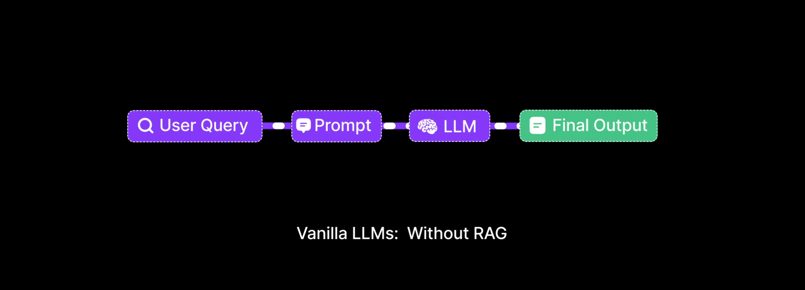

# 03. Data Ingestion & Smart Chunking ✂️
> **Garbage in, garbage out. The quality of your retrieval is determined by how you slice your data.**

---

## Why Do We Need to "Chunk" Data?

LLMs process information in "tokens" (roughly, words or sub-words). Every model has a **Context Window** (a strict limit on how many tokens it can read at once). Even if a model has a massive 1-million token context window, feeding it an entire 1000-page enterprise PDF just to answer a simple question is incredibly slow, insanely expensive, and often confuses the model (a phenomenon known as "Lost in the Middle").

To solve this, we must break our large documents into small, logical, highly-focused pieces of text called **Chunks**. 

When a user asks a question, we only retrieve the 3 to 5 chunks that specifically answer that question.

## Strategic Chunking Methods

How you split your data will make or break your RAG pipeline.

### 1. Fixed-Length Splitting (Basic)
The most primitive method. The script simply counts characters (e.g., 500 characters) and makes a cut, regardless of what the text says.
- **The Problem:** It blindly slices sentences in half. "The company's revenue grew by 15% due to the new CEO, John" might be split right after "John", leaving "Smith" in the next chunk. The context is destroyed.
- **Verdict:** Do not use in production.

### 2. Recursive Character Splitting (Standard)
This is the industry baseline. It tries to split text at natural boundaries. First, it looks for double line breaks (`\n\n`) to keep paragraphs whole. If a paragraph is still too big, it splits by single line breaks (`\n`), then by periods (`.`), and finally by spaces.
- **The Beneift:** It preserves the natural semantic flow of sentences and paragraphs.
- **The Golden Rule — Chunk Overlap:** We deliberately overlap chunks by 10-20%. If Chunk 1 ends with sentence X, Chunk 2 will *start* with sentence X. This acts as a safety net ensuring no context is lost exactly at the cut.

### 3. Structure-Aware Parsing (Advanced)
Enterprise documents are not just walls of text. They have Markdown headers (H1, H2), intricate tables, JSON blocks, and bulleted lists.
- **The Strategy:** Use parsers that "understand" the document layout. They ensure that a table is never split across two chunks (which would make it unreadable to an LLM). They also inject the Header title into every sub-chunk so the model knows the topic.

### 4. Semantic Chunking (Bleeding Edge)
Instead of looking at punctuation, this method uses AI embeddings to detect *topical changes*. When the topic shifts from "Q1 Revenues" to "Q2 Expenses", the chunk is split there.

## Visualizing Chunk Slicing

<p align="center">
  
  <br>
  <em>Figure 1: Slicing a document into overlapping, logically complete segments.</em>
</p>

## Metadata Enrichment: The Secret Weapon

Before saving a chunk to the database, we must attach **Metadata** to it. Metadata is just JSON data describing the chunk.

```json
{
  "chunk_text": "Employees receive 30 days of paid leave annually...",
  "metadata": {
    "source": "HR_Policy_2026.pdf",
    "page_number": 12,
    "last_updated": "2026-01-15",
    "department": "Human Resources"
  }
}
```

**Why Metadata Matters:**
When a user asks: *"What is the leave policy for the HR department this year?"*, we don't just rely on vector search. We use the database to strictly filter: `department == "Human Resources" AND last_updated > 2025`. This drastically reduces hallucinations by filtering out old or irrelevant documents *before* the vector search even begins.

---

> [!TIP]
> **Pro-Tip on Chunk Size**  
> Smaller chunks (256-512 tokens) usually yield higher retrieval accuracy because their "semantic meaning" is very dense and specific. Larger chunks (1000+ tokens) can dilute the meaning, making it harder for the vector database to find exact matches.

---
*Navigation: [← Previous: Dual-Pipeline Architecture](02-architecture.md) | [📑 Table of Contents](README.md) | [Next: Embeddings & Vector Maths →](04-embeddings.md)*
