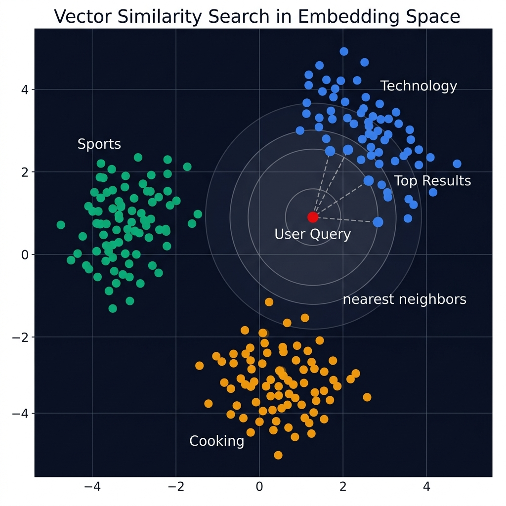

<div align="center">

# 🧮 Part 4: Embeddings & Vector Search

**Turning words into numbers that capture meaning — and searching them at the speed of light.**

`⏱ 10 min read` · `📊 Intermediate` · `📚 RAG Masterclass 4/8`

</div>

---

## 📌 Quick Summary

> **Embeddings** convert text into dense numerical vectors where semantically similar texts are close together in vector space. This enables **semantic search**: instead of matching keywords, you match *meaning*. A query about "automobile repair" will find documents about "car maintenance" even if they share zero words.

---

## 🗺️ The Map Analogy

> 🗺️ Imagine a world map where instead of countries, you plot **every sentence ever written**. Sentences about cooking cluster near Italy and France. Sentences about technology cluster near Silicon Valley. Sentences about football cluster near Europe and South America.
>
> When a user asks "How do I make pasta?", their question lands right in the Italian cooking cluster — and the nearest neighboring sentences are exactly the recipes they need.
>
> **That's vector search.** Texts with similar meanings are located near each other in a mathematical "meaning map."

---

## 🔢 What is an Embedding?

An embedding is a fixed-length list of numbers (a vector) that captures the semantic meaning of a piece of text. The vector is typically 384 to 3072 dimensions long.

```
"The cat sat on the mat"
    ↓ Embedding Model
[0.023, -0.156, 0.891, 0.445, ..., -0.034]  ← 1536 numbers
```

### The Key Property:
Texts with **similar meanings** produce **similar vectors** (close together in space). Texts with **different meanings** produce **different vectors** (far apart).

<div align="center">



</div>

### Word-Level vs Sentence-Level:
- **Word embeddings** (Word2Vec, GloVe): One vector per word. "bank" always has the same vector regardless of context. Outdated for RAG.
- **Sentence embeddings** (OpenAI, Cohere, Sentence Transformers): One vector for the entire passage. Context-aware — "bank" near "river" ≠ "bank" near "money". This is what RAG uses.

---

## 🔍 How Similarity Search Works

Once your chunks are embedded and stored, searching is a mathematical operation:

### Cosine Similarity (The Standard):

```
Similarity = cos(θ) = (A · B) / (||A|| × ||B||)

Where:
  A · B = sum of element-wise products
  ||A|| = magnitude (length) of vector A
```

| Cosine Score | Meaning | Example |
|:--|:--|:--|
| **1.0** | Identical meaning | "Happy dog" vs "Joyful canine" |
| **0.7-0.9** | Very similar | "Python programming" vs "Coding in Python" |
| **0.3-0.6** | Somewhat related | "Python programming" vs "Snake species" |
| **0.0** | Unrelated | "Python programming" vs "French cooking" |

---

## 📊 Embedding Model Comparison (2026)

| Model | Dimensions | Quality | Cost | Speed |
|:--|:--|:--|:--|:--|
| **OpenAI text-embedding-3-small** | 1536 | ⭐⭐⭐⭐ | $0.02/1M tokens | Fast |
| **OpenAI text-embedding-3-large** | 3072 | ⭐⭐⭐⭐⭐ | $0.13/1M tokens | Medium |
| **Cohere embed-v3** | 1024 | ⭐⭐⭐⭐ | $0.10/1M tokens | Fast |
| **Sentence Transformers (all-MiniLM)** | 384 | ⭐⭐⭐ | Free (local) | Very fast |
| **BGE-large** | 1024 | ⭐⭐⭐⭐ | Free (local) | Medium |
| **Voyage-3** | 1024 | ⭐⭐⭐⭐⭐ | $0.06/1M tokens | Fast |

> [!TIP]
> **For prototyping:** Use `all-MiniLM-L6-v2` (free, local, fast). **For production:** Use `text-embedding-3-small` (excellent quality-to-cost ratio). Only use `text-embedding-3-large` if you need maximum accuracy on nuanced content.

---

## ⚡ Approximate Nearest Neighbor (ANN) Search

Exact nearest-neighbor search compares your query against every single vector in the database. With 10 million vectors, this takes too long.

**ANN algorithms** trade a tiny amount of accuracy for massive speed gains:

| Algorithm | Used By | How It Works |
|:--|:--|:--|
| **HNSW** | Pinecone, Weaviate, Qdrant | Builds a multi-layer graph. Starts searching from the top layer (coarse) and narrows down to the bottom layer (precise). |
| **IVF** | Faiss | Divides vectors into clusters. Only searches the nearest clusters instead of the entire database. |
| **ScaNN** | Google | Quantizes vectors into compressed representations for ultra-fast comparison. |

In practice, HNSW achieves **99.5% recall** (finds 99.5% of the true nearest neighbors) while being **100x faster** than brute-force search.

---

## ⚠️ Critical Rule: Never Mix Embedding Models

> [!CAUTION]
> The vectors produced by different embedding models are **completely incompatible**. If you index your documents with `text-embedding-3-small` and search with `all-MiniLM`, the results will be garbage — even though both produce vectors.
>
> **Always use the SAME embedding model for indexing AND querying.** If you change models, you must re-embed your entire knowledge base.

---

<div align="center">

| Navigation | |
|:--|:--|
| ⬅️ **Previous** | [Part 3: Chunking](03-chunking.md) |
| 📑 **Table of Contents** | [RAG Masterclass Home](README.md) |
| ➡️ **Next** | [Part 5: Retrieval Strategies →](05-retrieval.md) |

</div>

---
<div align="center">
<sub>Part of the <a href="../README.md">AI Engineering Wiki</a> · Created by Youssef Ashraf · 2026</sub>
</div>
