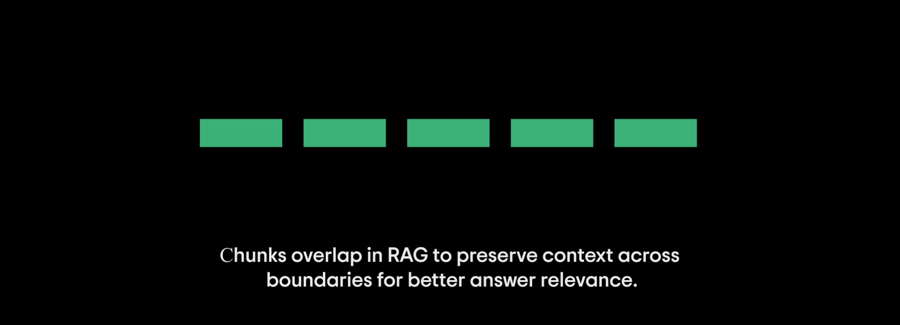
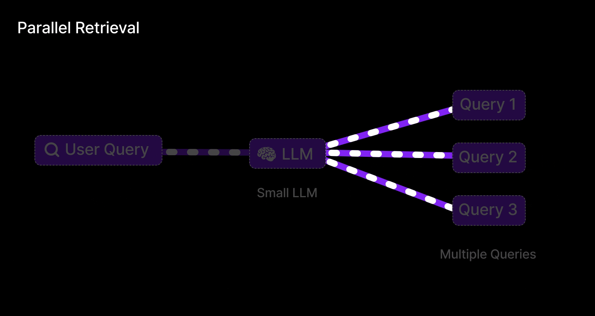

# 05. Advanced Retrieval Strategies 🔍
> **Vector search is not enough. Discover Hybrid Search, HyDE, and Cross-Encoder Re-ranking.**

---

## Why Pure Vector Search Fails

As powerful as embeddings are, they have a major blind spot: **Exact Term Matching**. 
Because vectors map "meaning", they might match the query "Error Code 404" with "Error Code 502" because both are network errors. If an engineer specifically needs the docs for "Server ID: Alpha-99X", pure semantic search might fail to find that exact string.

We solve this using **Multi-Stage Retrieval**.

## 1. Query Transformation (Pre-Retrieval)

Users often write terrible, vague queries like *"how do I fix the login?"*
If we embed that vague query, we get vague results.

*   **Query Rewrite:** We use a fast, cheap LLM to translate the user query into a highly specific technical query before searching.
*   **HyDE (Hypothetical Document Embeddings):** The LLM is asked to *invent* a fake answer to the user's question. We don't show this fake answer to the user. Instead, we **embed the fake answer** and search the database with it. 
    *   *Why?* Mathematically, searching "Answer-to-Answer" yields significantly higher accuracy in vector space than searching "Question-to-Answer".

## 2. Hybrid Search: The Best of Both Worlds

Hybrid search runs two entirely different algorithms simultaneously:

1.  **Dense Retrieval (Vector Search):** Finds semantic meaning (e.g., "vehicle" matches "car").
2.  **Sparse Retrieval (BM25 / Keyword Search):** Finds exact lexical overlaps (e.g., "Error Code X-992").

  
   
  <em>Figure 1: The architecture of Hybrid Search feeding into a Re-ranking node.</em>

### Fusion: Reciprocal Rank Fusion (RRF)
We now have two lists of Top-10 results. How do we merge them fairly? We use the RRF algorithm. 

RRF rewards documents that appear consistently high across both lists, effectively blending semantic context with keyword precision to create one master list.

$$ score(d) = \sum_{r \in R} \frac{1}{k + r(d)} $$

## 3. Re-Ranking (Post-Retrieval)

The master list generated by Hybrid Search is fast but can still be slightly noisy. To squeeze the absolute maximum accuracy out of our system (boosting accuracy from ~70% to >95%), we introduce a **Cross-Encoder Re-ranker**.

### How it Works:
1. We take the Top 20 results from our fast Hybrid Search.
2. We pass the User Query and these 20 chunks into a heavy, highly accurate model (like `Cohere Rerank` or `bge-reranker-large`).
3. Unlike vector search which calculates distance independently, the Cross-Encoder analyzes the Query and the Chunk *together*, paying deep attention to logical contradictions and deep linguistic connections.
4. It outputs an absolute relevance score (0.0 to 1.0), sorts the list, and we only send the absolute best Top 3 chunks to the final LLM.

  
   
  <em>Figure 2: The Re-ranker model acts as a highly intelligent filter, sorting the final context before it reaches the generation phase.</em>

---

> [!NOTE]
> **The Latency Trade-Off**  
> Cross-Encoders are incredibly computationally expensive. You cannot run a Cross-Encoder over your entire 1-million document database—it would take hours. That is why Re-ranking is strictly a *Post-Retrieval* step applied only to the Top 20 candidates selected by the fast Vector Search.

---
*Navigation: [← Previous: Vector Maths](04-embeddings.md) | [📑 Table of Contents](README.md) | [Next: Agentic RAG →](06-agentic-rag.md)*
