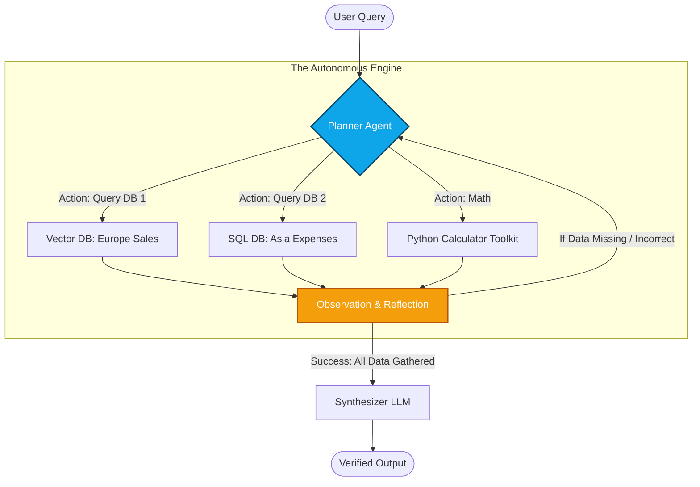
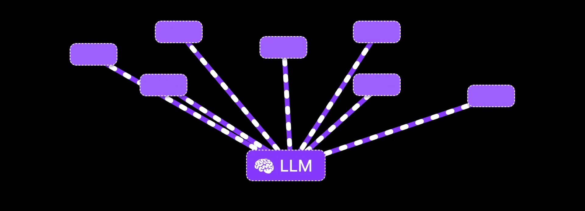

# 06. The Reasoning Engine: Agentic RAG 🤖
> **Transforming a static pipeline into an autonomous, self-correcting orchestrator.**

---

## What is Agentic RAG?

In standard Advanced RAG, the architecture is a rigid pipeline: `User Query -> Retrieve -> Inject -> Generate`. It assumes that one single retrieval pass will always yield the required information.

But what if a user asks a highly complex, multi-hop question?
*User: "Compare our Q1 Sales in Europe with our Q2 Expenses in Asia, and calculate the net variance."*

A standard RAG pipeline will fail miserably. It will try to retrieve chunks that mention both "Europe Sales" and "Asia Expenses" simultaneously, likely finding nothing.

**Agentic RAG** fixes this. It promotes the LLM from being a simple text generator to being the "Brain" (an **Agent**) that orchestrates the entire process.

## The Agent Loop

An Agent Operates on a continuous loop of: **Thought -> Action -> Observation -> Reflection.**

## Core Capabilities of an Agent

To build Agentic RAG, you equip the LLM with three superpowers:

### 1. Advanced Routing
Instead of hardcoding a connection to one Pinecone database, you give the Agent an array of **Tools**. Each tool has a description. The Agent reads the user query and decides *which* database to query.
- *Query:* "What is my remaining vacation balance?"
- *Agent Logic:* "This is personal data. I will route this to the HR SQL database via API, not the public Notion Vector DB."

### 2. Multi-Hop Reasoning
The Agent breaks down complex queries into sequential steps:
1. Search for Q1 Europe Sales. (Save to memory).
2. Search for Q2 Asia Expenses. (Save to memory).
3. Use the Calculator tool to find the variance between the two saved numbers.

### 3. Self-Reflection (Self-RAG / Corrective RAG)
This is the most critical feature to eliminate hallucinations.
Before the Agent shows the final answer to the user, an internal "Critic Agent" evaluates the drafted answer against the retrieved documents.
- If the Critic finds a hallucination, or realizes the retrieved chunk doesn't actually answer the question, it throws an error.
- The Planner Agent catches the error, reformulates a completely new search query, and tries again.

  
   
  <em>Figure 1: The Agentic Reasoning Loop — Tools, Memory, and Action.</em>

## The Challenge: Latency

Agentic RAG is incredibly powerful, but it comes at a cost: **Latency**.
Because the LLM is "thinking", requesting data, reflecting, and requesting again... an Agentic RAG response can take 5 to 15 seconds to generate, compared to 1 second for standard RAG. Use Agents only for highly complex analytical workflows, not simple FAQ bots.

---

> [!TIP]
> **Tooling Frameworks**  
> Writing raw Agent loops from scratch in Python is tedious and prone to infinite loops. Use orchestration frameworks like **LangGraph** (by LangChain) or **AutoGen** (by Microsoft) which manage state, memory, and error handling natively.

---
*Navigation: [← Previous: Advanced Retrieval](05-retrieval.md) | [📑 Table of Contents](README.md) | [Next: LLMOps Evaluation →](07-evaluation.md)*
