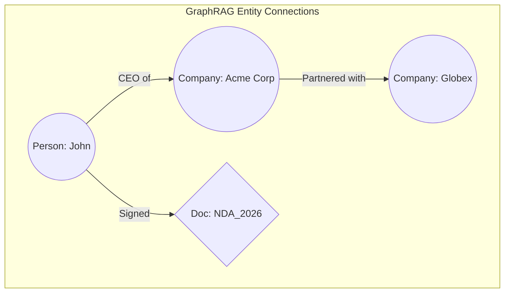

# 08. RAG vs. Fine-Tuning & Future Horizons 🚀
> **Making the right architectural decision and preparing for the next generation of AI search.**

---

## 1. The Great Misconception: RAG vs. Fine-Tuning

When companies want "ChatGPT trained on our private data," leadership often assumes the solution is **Fine-Tuning** (altering the mathematical weights of an open-source model like Llama 3). 

**This is a fundamental architectural error.**

Fine-tuning is excellent for teaching a model *how* to speak (tone, formatting, syntax). It is terrible for teaching a model *facts*. If you fine-tune a model on your 2026 benefits policy, what happens when the policy changes tomorrow? You have to execute another massively expensive, weeks-long GPU training run to "overwrite" the old knowledge encoded in the weights.

**RAG is the industry standard for factual retrieval.**

### Strategic Comparison Matrix

| Feature | 🔎 RAG (Retrieval-Augmented) | 🧠 Fine-Tuning (FT) |
| :--- | :--- | :--- |
| **Mechanism** | Dynamically injects context at runtime. | Alters the internal neural network weights. |
| **Data Freshness** | **Instant:** Update the Vector DB, and the model knows it immediately. | **Slow/Costly:** Requires a completely new training cycle. |
| **Traceability** | **100% Transparent:** Can definitively cite real document URLs and exact page numbers. | **Opaque:** Knowledge is diffused across billions of black-box parameters. |
| **Hallucination Risk** | Low (if Grounded/Evaluated properly). | High (Network might mix old/new conflicting facts). |
| **Best Used For** | Enterprise Knowledge Bases, ODQA, Fact-checking. | Enforcing strict JSON outputs, mimicking brand tone, coding syntax. |

*(Pro-Tip: The ultimate enterprise system often uses both. A company fine-tunes Llama 3 to strictly output medical API JSON structures exclusively, then uses RAG to feed it the actual patient medical history).*

---

## 2. The Future Horizons

As RAG architecture matures, we are seeing three massive shifts in how retrieval operates at scale.

### A. GraphRAG (Knowledge Graphs)
Standard RAG struggles with complex, long-range relationships across documents (e.g., *"Company X is a subsidiary of Y, whose CEO is mentioned in document Z"*). 

GraphRAG combines vector databases with **Neo4j / Knowledge Graphs**. It extracts entities (People, Companies, Locations) and draws interconnecting relationship lines between them. When a user queries a complex network, the engine retrieves not just semantic chunks, but entire connected sub-graphs, yielding vastly superior answers for legal and investigative AI.

### B. Multi-Modal RAG (Vision & Audio)
Text is only part of the enterprise. Modern manuals contain diagrams. Spreadsheets contain charts. 
Multi-Modal RAG uses models like **CLIP** to generate embeddings for *Images*. If an engineer asks, *"How do I assemble the turbo-prop?"*, the database retrieves the text instructions AND the specific CAD diagram image showing the assembly, feeding both directly into a multimodal LLM like GPT-4o.

### C. The Long-Context Debate
Models like Gemini 1.5 Pro now boast a **2 Million+ Token Context Window**. Some argue this kills RAG: *"Why chunk and retrieve? Just paste the entire 10,000 page library into the prompt every single time!"*

**Why RAG Survives:**
1. **Cost:** Sending 2 million tokens per query is astronomically expensive ($10+ per question vs fractions of a cent for RAG).
2. **Latency:** Processing massive context takes minutes per query. RAG takes milliseconds.
3. **Accuracy:** Even models with massive windows suffer from retrieving highly specific facts buried in the middle of a million words. RAG isolates the highest-signal text first.

---
**End of RAG Masterclass.** 
*You now possess the foundational engineering blueprints required to move beyond basic prompts and architect production-grade, highly reliable AI systems.*

> *Created for the AI Engineering Community by Youssef Ashraf • 2026*

<a href="../../README.md">Return to Main Wiki Directory</a>

