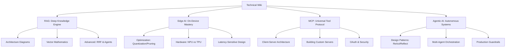

# 🚀 AI Engineering Wiki
**The Comprehensive Technical Knowledge Base for AI Engineers**

*Architecting the Intelligent World through Deep Technical Documentation.*

---

## 🎯 Mission Statement

Welcome to the **AI Engineering Wiki**. This repository is engineered to be the "Gold Standard" for technical AI documentation. We move beyond superficial definitions to provide **Deep Architectural Insights**, **Mathematical Foundations**, and **Visual Proofs** of how cutting-edge AI technologies operate in production environments.

Whether you are a data scientist, a software engineer, or a technical leader, this wiki provides the fundamental patterns required to build reliable, hallucination-free, and highly optimized AI systems.

---

## 📚 Knowledge Domains

This wiki is organized into focused, deeply comprehensive technical tracks. 

### 1️⃣ [Retrieval-Augmented Generation (RAG)](./RAG/README.md)
*Connecting Language Models to private, real-time enterprise data.*
- **Level:** Beginner to Expert
- **Core Topics:** Vector Embeddings, Semantic Search, Hybrid Chunking, Agentic Workflows, and the RAG Triad.
- **Status:** 🟢 **Active Development**

### 2️⃣ [Edge AI & Small Language Models (SLMs)](./Edge_AI/README.md)
*Moving AI computation from the Cloud to resource-constrained devices.*
- **Level:** Intermediate to Expert
- **Core Topics:** Quantization (INT4/INT8), Model Pruning, TinyML, Hardware Accelerators (NPU/TPU), and On-Device Privacy.
- **Status:** 🟢 **Active Development**

### 3️⃣ [Model Context Protocol (MCP)](./MCP/README.md)
*The universal standard for connecting AI models to external tools, data, and systems.*
- **Level:** Beginner to Expert
- **Core Topics:** Client-Server Architecture, JSON-RPC, Tools/Resources/Prompts, Transport Layers (stdio/HTTP), OAuth 2.1, and Building Custom Servers.
- **Status:** 🟢 **Active Development**

### 4️⃣ [Agentic AI & Multi-Agent Systems](./Agentic_AI/README.md)
*Building autonomous AI agents that plan, reason, use tools, and self-correct.*
- **Level:** Intermediate to Expert
- **Core Topics:** ReAct, Plan-and-Execute, Reflection, Multi-Agent Orchestration, LangGraph, CrewAI, and Production Guardrails.
- **Status:** 🟢 **Active Development**

---

## 🛠️ Repository Architecture

Our documentation is structured around a **visual and architectural-first** approach:

---

## ✨ Features of this Wiki

1. **Architecture-First:** Every core concept is introduced with a high-level system diagram.
2. **Visual Learning:** Complex data flows are illustrated using animations and Mermaid.js diagrams.
3. **Mathematical Precision:** We explain the math behind the magic (e.g., Cosine Similarity, Reciprocal Rank Fusion).
4. **Enterprise Focus:** Our methodologies prioritize high-scale production trade-offs, security, and LLMOps evaluation.

---

## 📖 How to Use This Wiki
- Navigate to a specific domain (e.g., [RAG](./RAG/README.md)) using the links above.
- Each domain contains a sequenced series of articles. We highly recommend reading them in order to follow the technical progression.
- The reference visual assets are stored within the `assets/` directory of each topic.

---

## 🤝 Contributing
This wiki is built for the community. If you find architectural errors, typos, or wish to propose a new advanced AI topic, please submit an issue or a Pull Request following our standard format.

<i>Created with ❤️ for the AI Engineering Community • 2026</i>

